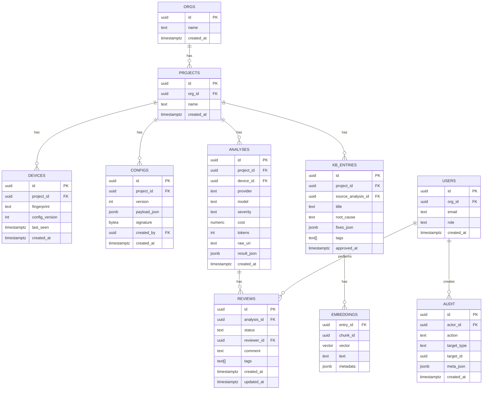
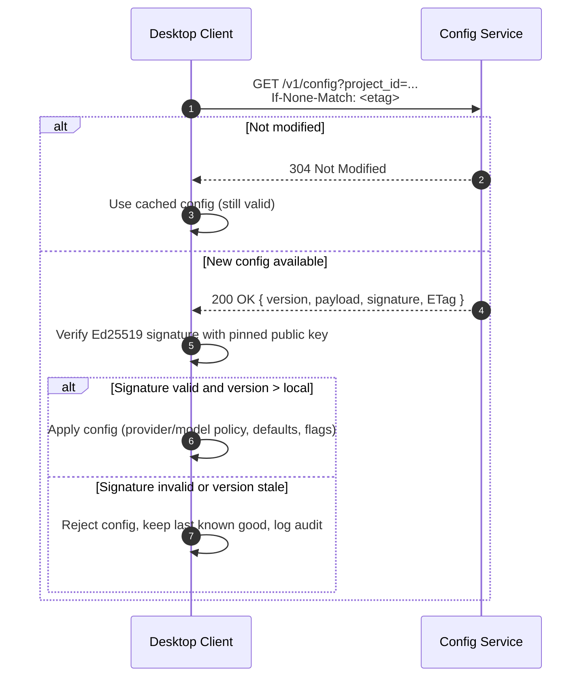
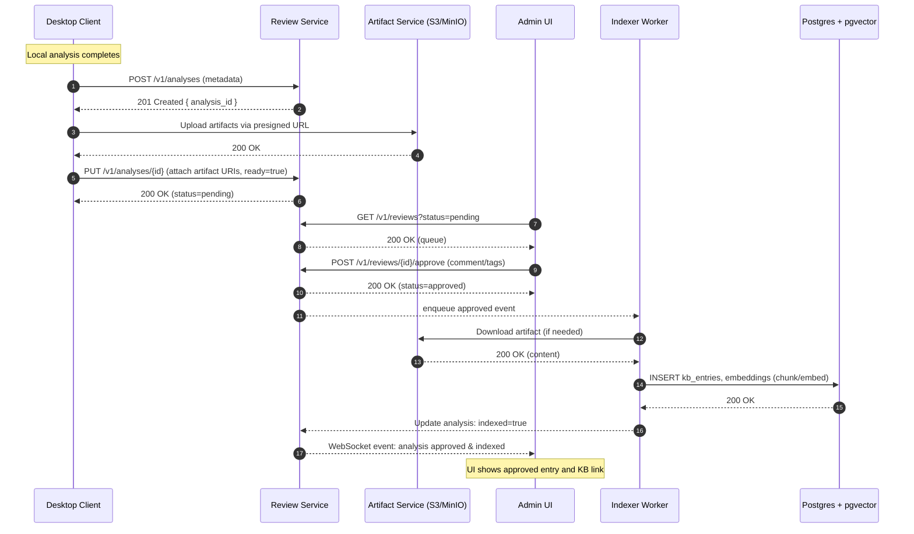

# Hadron Enterprise Admin Control Plane

Status: Draft for review and brainstorming
Audience: Engineering, Product, DevOps, Security

## Executive Summary

Introduce a small, secure “control plane” admin web application that centrally manages:
- Organization policy and configuration distributed to all desktop clients (data plane)
- Human-in-the-loop validation of AI‑generated analyses and solutions
- A durable knowledge base backed by Postgres + pgvector (RAG), populated only with approved content

The desktop client continues to run analysis locally (and/or via providers), while the admin app enforces policy, coordinates validation, and curates the knowledge base.

Benefits:
- Central control of providers/models/prompts/limits without redeploying clients
- Better security posture (server-signed config, optional central secrets)
- Auditable, searchable knowledge base of validated outcomes

Non‑Goals (initially):
- Running analysis on the server (keep client‑side for performance and offline use). Leave a future flag for server‑proxy analysis if needed.

---

## Architecture Overview

Two planes:
- Control Plane (new): Admin web app + APIs that manage config, validation workflows, storage, and the KB.
- Data Plane (existing): Tauri desktop clients that fetch signed config, analyze locally, and submit results for review.

High‑level components:
- Config Service (signed, versioned org/project config)
- Validation/Review Service (queues, approvals, comments)
- Artifact Service (S3/MinIO + presigned upload/download)
- Indexer Worker (ingests approved content into pgvector)
- Search/RAG API (retrieval for admin UI and optionally clients)
- AuthN/Z (OIDC with roles and tenant scoping)
- Admin UI (React) for policy and review

ASCII view:
```
Desktop Client(s)  <--pull signed config-->  Config Service
      |                  (submit results)           |
   Upload ----> Artifact Service (S3/MinIO) <----- Indexer Worker
      |                       |                        |
   Review ----> Validation/Review Service  ----->  Postgres + pgvector
      ^                       |                        ^
      |                       v                        |
     Admin UI  <---------  Search/RAG API   -----------+
```

### Architecture Diagram (Mermaid)

```mermaid
flowchart LR
  subgraph Clients
    C1[Desktop Client]
    AU[Admin UI]
  end

  subgraph ControlPlane[Control Plane]
    CFG[Config Service\n(signed configs)]
    REV[Validation/Review Service]
    SRCH[Search / RAG API]
  end

  subgraph Data[Data Layer]
    S3[(S3/MinIO Artifacts)]
    PG[(Postgres + pgvector)]
    IDX[[Indexer Worker]]
  end

  C1 -- GET signed config --> CFG
  CFG -- versioned JSON --> C1

  C1 -- submit analysis metadata --> REV
  C1 -- presigned upload --> S3

  REV -- approved event --> IDX
  IDX -- chunk/embed --> PG

  AU -- review queue / actions --> REV
  AU -- search KB --> SRCH
  SRCH -- ANN + metadata --> PG

  REV -- link artifacts --> S3
```

---

## Core Services

### 1) Config Service
- REST: `GET /v1/config?project_id=...`
- Signed JSON payload via Ed25519 (server private key). Clients pin the public key and verify.
- Versioned (monotonic integer) with ETag for caching. Scoped per org/project.
- Content:
  - provider_policy: allowed providers, fallback order
  - model_policy: allowlist/denylist per provider
  - analysis_defaults: default analysis type, timeout, retries
  - feature_flags: enable/disable translation, streaming, etc.
  - prompts/version pins (optional)

### 2) Validation/Review Service
- Accepts submissions (`POST /v1/analyses`) with metadata and presigned artifact URIs.
- States: pending → approved/rejected (with comments and tags). Includes reviewers and timestamps.
- WebSocket events for live updates to the admin UI.

### 3) Artifact Service
- S3/MinIO bucket for raw crash logs and generated reports.
- Presigned URLs for upload/download; optional antivirus/PII scrubbing pipeline.

### 4) Indexer Worker
- Watches approved reviews, chunks text, generates embeddings, and upserts into pgvector.
- Stores searchable metadata (severity, provider, model, components, tags).

### 5) Search/RAG API
- `POST /v1/kb/search` → returns passages + metadata. Filters by tags/severity/approved.
- Optionally provides reranking with a local or hosted reranker.

### 6) AuthN/Z
- OIDC (Auth0/Okta/Keycloak). Roles: admin, reviewer, viewer, device.
- Tenant/Project scoping; device tokens scoped to projects only.

---

## Data Model (Postgres)

Tables (sketch):
- `orgs(id, name, created_at)`
- `projects(id, org_id, name, created_at)`
- `configs(id, project_id, version, payload_json, signature, created_by, created_at)`
- `devices(id, project_id, fingerprint, last_seen, config_version, created_at)`
- `analyses(id, project_id, device_id, content_hash, provider, model, severity, cost, tokens, raw_uri, result_json, created_at)`
- `reviews(id, analysis_id, status, reviewer_id, comment, tags, created_at, updated_at)`
- `kb_entries(id, project_id, source_analysis_id, title, root_cause, fixes_json, tags, approved_at)`
- `embeddings(entry_id, chunk_id, vector, text, metadata)` (pgvector)
- `users(id, org_id, email, role, created_at)`
- `audit(id, actor_id, action, target_type, target_id, meta_json, created_at)`

Indexes:
- GIN/BTREE on tags/severity/provider
- pgvector index on `embeddings(vector)`

### ERD (Mermaid)



---

## API Sketch (REST)

Config
- `GET /v1/config?project_id=...` → `{ version, payload, signature }`

Submissions
- `POST /v1/analyses` → returns `analysis_id` and presigned upload URL (if needed)
- `PUT /v1/analyses/{id}` to attach metadata or mark ready for review

Reviews
- `GET /v1/reviews?status=pending&project_id=...`
- `POST /v1/reviews/{id}/approve` → `{approved_by, approved_at}`
- `POST /v1/reviews/{id}/reject` → `{rejected_by, reason}`

Artifacts
- `POST /v1/artifacts/presign` → `{ upload_url, download_url }`

Search/RAG
- `POST /v1/kb/search` → `{ results: [ {entry_id, text, score, metadata} ] }`

Auth
- OIDC login for admin UI; device enrollment endpoint for clients

---

## Config Signing & Verification

- Server signs each config JSON using Ed25519; signature stored with record.
- Client pins server public key in app bundle; verifies signature before apply.
- Rotate keys by shipping a new pinned public key with app updates or via a "trust-on-first-use" provisioning flow (for managed environments).
- Clients cache last good config and apply only monotonic `version`.

Example config (payload):
```json
{
  "version": 12,
  "provider_policy": {
    "allowed": ["openai", "anthropic", "zai", "ollama"],
    "fallback_order": ["openai", "anthropic", "zai", "ollama"]
  },
  "model_policy": {
    "openai": { "allow": ["gpt-4-turbo-preview", "gpt-4o*", "gpt-5*"] },
    "anthropic": { "allow": ["claude-3-5-sonnet-20241022", "claude-3-haiku-20240307"] },
    "zai": { "allow": ["glm-4.6"] },
    "ollama": { "allow": ["llama3*", "qwen*"] }
  },
  "analysis_defaults": { "type": "complete", "timeout_ms": 30000, "retries": 3 },
  "feature_flags": { "translation": true, "streaming": false }
}
```

---

## Desktop Client Integration

Enrollment
- Device registers once (device token or user auth); scoped to a project.

Config Pull
- On startup + every 60s: `GET /v1/config` with `If-None-Match` ETag.
- Validate signature; apply only if `version` > local.
- Surface config version + timestamp in Settings.

Submissions
- After local analysis: `POST /v1/analyses` with metadata; upload artifacts via presigned URL.
- Optional “Submit for review” button in client.

Offline/Resilience
- Keep last‑known good config; warn when stale.
- Queue submissions for retry when offline.

Security
- Secrets remain in client by default; optional future mode to proxy AI calls via server.
- Device token stored in encrypted storage; rotated on revocation.

---

## Validation Workflow

1) Client submits analysis + artifacts (status=pending)
2) Reviewer inspects, comments, and approves/rejects
3) Approved content is chunked and embedded; stored in KB
4) Search returns only approved content by default

Signals to track:
- Review latency, approval rate, top tags, components with highest failure rate
- Cost per provider/model per project

---

## RAG Pipeline (Approved‑only)

1) Chunk: 1–3k token chunks with overlap; store chunk metadata (source file, component)
2) Embed: hosted or local embedding model (e.g., OpenAI text-embedding-3-large, or local Instructor)
3) Store: pgvector + metadata JSONB
4) Retrieve: top‑k ANN, optional rerank; filters (tags, severity, time, component)

---

## Security & Compliance

- Config signing + pinned public key
- Tenant/project isolation on every endpoint
- Optional PII scrubbing for artifacts before indexing
- Audit events for config changes, reviews, downloads, search queries
- Rate limiting + two‑bucket memory store for O(1) TTL caches

---

## Observability

- Metrics: ingest rate, review latency, approval %, search QPS, index freshness, provider error rates
- Logs: structured (request_id, device_id, project_id); redact keys
- SLOs: e.g., 99% config fetch < 250ms; 99% review actions < 500ms

---

## Scaling & Reliability

- Stateless API services; run in containers (Kubernetes/Nomad)
- Postgres 15+ with pgvector; read replicas if needed; periodic VACUUM/REINDEX
- Artifact store: S3/MinIO with lifecycle policies
- Idempotency keys on submissions; dedup by content hash
- Backpressure: queue depth limits; client retry with backoff + jitter

---

## Roadmap & Phases

Phase 1 (Config + Uploads)
- Config Service with signing; client pull & display version
- `POST /v1/analyses` + artifact presign & upload

Phase 2 (Validation + KB)
- Review UI and status transitions
- Indexer worker; basic KB search

Phase 3 (Realtime + Policies)
- WebSocket pushes for config/queue updates
- Model/provider allowlists enforced by clients; advanced analytics dashboard

---

## Sequence Diagrams

### Client Config Fetch + Signature Verification



### Client Submission → Human Review → Indexing



---

## Drafts & Patterns to Adopt

### A) Smart Configuration Parsing (TS)
```ts
type PartialSettings = Partial<{
  provider: string;
  model: string;
  defaultAnalysisType: 'complete' | 'specialized';
  retries: number;
  timeoutMs: number;
}>;

type Settings = Required<PartialSettings>;

export function parseSettings(input: PartialSettings): Settings {
  const defaults: Settings = {
    provider: 'openai',
    model: 'gpt-4-turbo-preview',
    defaultAnalysisType: 'complete',
    retries: 3,
    timeoutMs: 30000,
  };
  const s = { ...defaults, ...input };
  if (!['openai', 'anthropic', 'zai', 'ollama'].includes(s.provider)) {
    throw new AppError('E_CFG_INVALID_PROVIDER', `Unknown provider: ${s.provider}`);
  }
  if (s.retries < 0 || s.retries > 5) {
    throw new AppError('E_CFG_INVALID_RETRIES', 'retries must be 0..5');
  }
  return s;
}
```

### B) Structured Errors with Help URLs (TS)
```ts
export class AppError extends Error {
  code: string;
  help?: string;
  constructor(code: string, message: string) {
    const help = `https://docs.hadron.dev/errors/${code}`;
    super(`${message} (see ${help})`);
    this.code = code;
    this.help = help;
  }
}
```

### C) O(1) Expiration Cache (Two‑bucket)
```ts
class RotatingCache<K, V> {
  prev = new Map<K, V>();
  curr = new Map<K, V>();
  timer?: any;
  constructor(private windowMs: number) {}
  start() {
    this.timer = setInterval(() => {
      this.prev = this.curr;
      this.curr = new Map();
    }, this.windowMs);
  }
  get(key: K) { return this.curr.get(key) ?? this.prev.get(key); }
  set(key: K, val: V) { this.curr.set(key, val); }
  stop() { if (this.timer) clearInterval(this.timer); }
}
```

---

## Example Payloads

Submission (client → server):
```json
{
  "project_id": "proj_123",
  "device_id": "dev_abc",
  "provider": "openai",
  "model": "gpt-4-turbo-preview",
  "severity": "HIGH",
  "cost": 0.0123,
  "tokens": 1845,
  "raw_uri": "s3://hadron-artifacts/.../WCR_5-2_11-23-15.txt",
  "result_json": { "error_type": "MessageNotUnderstood", "root_cause": "...", "suggested_fixes": ["..."] }
}
```

Review transition:
```json
{ "status": "approved", "tags": ["db", "performance"], "comment": "Looks good" }
```

KB search:
```json
{ "project_id": "proj_123", "query": "MessageNotUnderstood OrderedCollection", "top_k": 10 }
```

---

## Desktop Changes Needed

- Add device enrollment + token storage (encrypted)
- Config fetch + signature verification; show version & freshness
- “Submit for review” action (with opt‑in artifact upload)
- Optional: receive “hints” from KB for similar past issues (read‑only)

---

## Open Questions

- Do we want to support server‑proxy analysis (central secrets, stricter audit) as a toggle later?
- PII scrubbing rules per project — static regex vs ML entity detection?
- Config key rotation UX for pinned public keys
- Embeddings provider: hosted vs local for air‑gapped installs

---

## Implementation Plan (MVP)

Week 1
- Bootstrap Postgres + pgvector + S3/MinIO + API skeleton (Fastify/NestJS)
- Implement Config Service with signing and client pull
- Implement submissions + artifact presign & upload

Week 2
- Admin UI for review queue & review actions
- Indexer worker + KB search endpoint
- Client “Submit for review” + show config version

Week 3
- AuthN/Z (OIDC), tenant/project scoping, audit logs
- Observability (metrics/logs), rate limits, basic docs/errors pages

---

## Appendix: Trade‑offs

Client‑run analysis (default)
- Pros: fast, offline, less server load
- Cons: client holds provider keys (unless restricted via policy)

Server‑proxy analysis (future option)
- Pros: keys never leave DC; uniform audit; consistent throttling
- Cons: latency, cost, complexity
