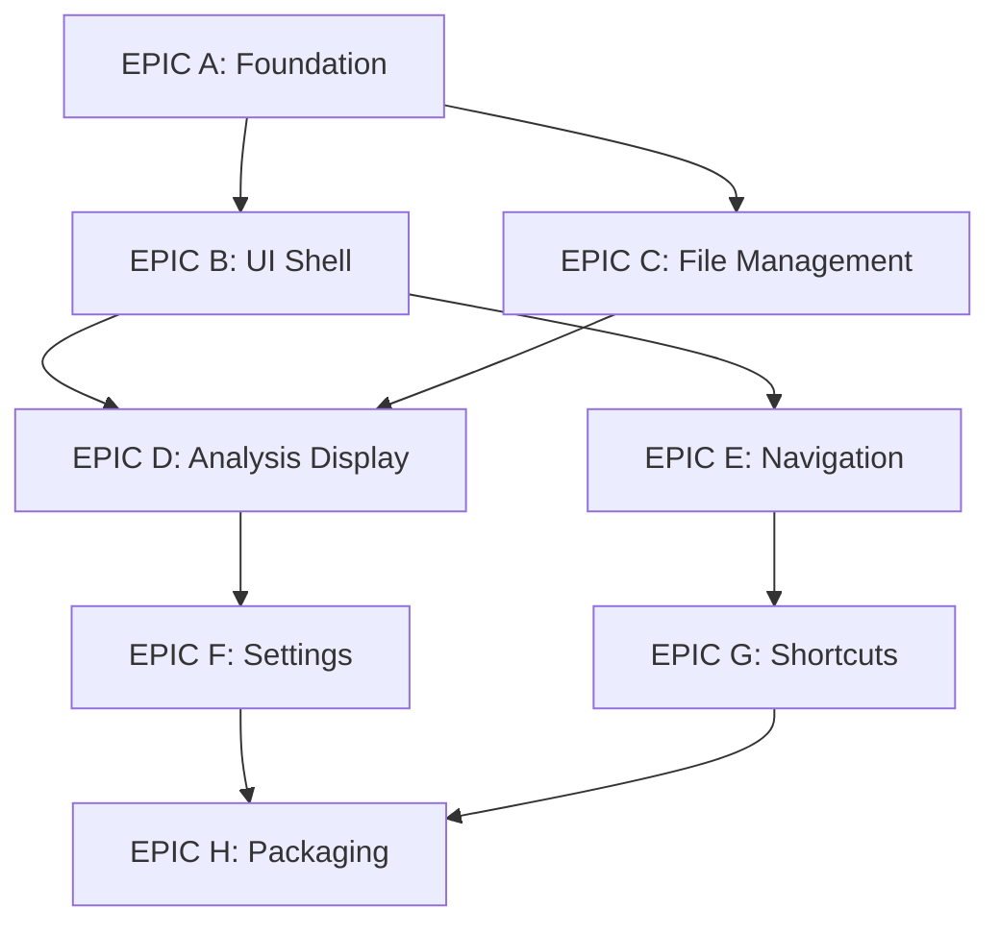

# Phase 1: Desktop Foundation - Smalltalk Crash Analyzer

**Generated**: 2025-11-12
**Updated**: 2025-11-12 (Migrated from Electron to Tauri)
**Health Score**: 8/9 (PROCEED)
**Delivery Timeline**: 3 weeks
**Token Budget**: Per task ≤15,000 tokens

## ⚡ Migration Note: Electron → Tauri

This backlog has been updated to use **Tauri** instead of Electron based on reference implementation research:

| Aspect | Electron | Tauri | Winner |
|--------|----------|-------|--------|
| Bundle Size | 100-200MB | 10-20MB | ✅ Tauri (90% smaller) |
| Memory Usage | ~200MB | ~50MB | ✅ Tauri (75% less) |
| Security | Context isolation | OS-level sandboxing | ✅ Tauri (native security) |
| Performance | Chromium overhead | Native webview | ✅ Tauri (faster startup) |
| Learning Curve | JavaScript/Node.js | Rust + TypeScript | ⚖️ Moderate |

**Key Changes**:
- **IPC**: `contextBridge` → `#[tauri::command]` with `invoke()`
- **Security**: Preload scripts → Tauri allowlist + CSP
- **Storage**: Config files → `tauri-plugin-keyring` for secrets
- **Bundling**: `electron-builder` → Tauri built-in bundler
- **Backend**: Node.js process → Rust async runtime

**Reference**: [tauri-apps/tauri](https://github.com/tauri-apps/tauri) (65k+ stars)

## Executive Summary

Transform the validated Python CLI MVP into a polished **Tauri desktop application** with VSCode-quality UI. This phase delivers a beautiful, keyboard-driven interface with a **10-20MB bundle** (vs Electron's 100-200MB) while maintaining simplicity through SQLite local storage.

**Why Tauri over Electron:**
- ✅ **90% smaller bundle**: 10-20MB vs 100-200MB
- ✅ **Better security**: Rust backend with OS-level sandboxing
- ✅ **Native performance**: Direct OS API access, no Chromium overhead
- ✅ **Lower memory**: ~50MB vs 200MB RAM usage
- ✅ **Active ecosystem**: tauri-apps GitHub org, 65k+ stars

**Reference:** [tauri-apps/tauri](https://github.com/tauri-apps/tauri)

## Assumptions Ledger

| ID | Assumption | Impact | Validation |
|----|------------|--------|------------|
| A01 | Rust 1.70+ and Node.js v20+ available on dev machines | High | Check in setup script |
| A02 | 50MB memory footprint acceptable (Tauri is lightweight) | Low | Performance testing |
| A03 | SQLite storage sufficient for 10,000+ crashes | Medium | Load testing with better-sqlite3 |
| A04 | Users have 1920x1080+ displays | Low | Responsive design |
| A05 | Python CLI remains functional during transition | High | Integration tests |
| A06 | Team comfortable with basic Rust (Tauri commands) | Medium | Rust tutorial in docs |

## Risk Register

| Risk | Severity | Mitigation | Owner |
|------|----------|------------|-------|
| Rust learning curve for Tauri commands | Medium | Use tauri-apps/tauri examples, start with simple IPC | Tech Lead |
| Performance degradation with large files | Medium | Streaming parser, virtual scrolling, Rust async I/O | Dev Team |
| Cross-platform compatibility issues | Medium | CI/CD matrix testing (macOS/Win/Linux) | QA |
| API key storage security | High | Use tauri-plugin-keyring for OS-level keychain | Security |
| Tauri updater failures | Low | Test auto-update in staging, fallback to manual download | DevOps |

## Architecture Decision Records (ADRs)

### ADR-001: Tauri Architecture (Updated from Electron)
- **Decision**: Tauri with Rust backend and TypeScript frontend
- **Rationale**:
  - 90% smaller bundle size (10-20MB vs 100-200MB)
  - Better security with OS-level sandboxing
  - Native performance without Chromium overhead
  - Lower memory footprint (~50MB vs 200MB)
- **Consequences**:
  - Team needs basic Rust knowledge for Tauri commands
  - IPC via Tauri's invoke() pattern
  - Use tauri-apps/tauri examples for reference
- **Reference**: [tauri-apps/tauri](https://github.com/tauri-apps/tauri)

### ADR-002: State Management
- **Decision**: React Context + useReducer (no Redux)
- **Rationale**: Simpler for <50 components, Alex Chen YAGNI principle
- **Consequences**: May need migration if app grows >100 components

### ADR-003: Local Storage Strategy (Updated)
- **Decision**: SQLite with better-sqlite3 in ~/CrashAnalyzer/crashes.db
- **Rationale**:
  - More efficient than JSON for 1000+ crashes
  - FTS5 support for Phase 2 search
  - Seamless migration to PostgreSQL backend in Phase 2
- **Consequences**: Requires sqlite3 binary, migration script from old JSON files
- **Reference**: [better-sqlite3](https://github.com/WiseLibs/better-sqlite3)

### ADR-004: Component Library
- **Decision**: Custom components with Tailwind CSS
- **Rationale**: Full control, no dependency bloat, matches VSCode aesthetic
- **Consequences**: More initial development time

### ADR-005: API Key Storage (New)
- **Decision**: tauri-plugin-keyring for OS-level credential storage
- **Rationale**:
  - Never store API keys in config files or SQLite
  - Use OS keychain (macOS), Credential Manager (Windows), Secret Service (Linux)
- **Consequences**: Requires keyring plugin, per-platform testing
- **Reference**: [tauri-plugin-keyring](https://github.com/tauri-apps/tauri-plugin-keyring)

## Dependency Graph



---

# EPIC A: Tauri Foundation & Project Setup

**Definition of Done**:
- ✓ Tauri app launches in <2 seconds (faster than Electron!)
- ✓ Hot reload works in development (Vite + Tauri dev mode)
- ✓ Tauri security audit passes (Content Security Policy enforced)
- ✓ Basic Rust-TypeScript IPC communication working

## Story A-1: Project Initialization
**Priority**: P0 (Root Story - No Dependencies)
**Points**: 5
**Status**: READY

**Acceptance Criteria**:
```gherkin
Given a clean project directory
When I run the initialization script
Then the Tauri + React + TypeScript project is created
And all development dependencies (npm + Rust) are installed
And the folder structure follows Tauri best practices
And the app builds successfully with `npm run tauri build`
```

### Task A-1-T1: Initialize Tauri Project
**Token Budget**: 10,000
**Reference**: [tauri-apps/tauri](https://github.com/tauri-apps/tauri)

**Implementation**:
```bash
# Initialize with create-tauri-app
npm create tauri-app@latest

# Select options:
# - Project name: crash-analyzer-desktop
# - Package manager: npm
# - UI template: React TypeScript
# - UI recipe: Vite

# Project structure
crash-analyzer-desktop/
├── src-tauri/          # Rust backend
│   ├── src/
│   │   ├── main.rs     # Tauri entry point
│   │   ├── commands.rs # IPC commands
│   │   └── lib.rs      # Library exports
│   ├── Cargo.toml      # Rust dependencies
│   ├── tauri.conf.json # Tauri configuration
│   └── icons/          # App icons
├── src/                # React frontend
│   ├── App.tsx
│   ├── components/
│   ├── hooks/
│   └── types/          # TypeScript types
├── package.json
├── tsconfig.json
├── vite.config.ts
└── tailwind.config.js
```

**Dependencies**:
```json
{
  "devDependencies": {
    "@tauri-apps/api": "^1.5.0",
    "@tauri-apps/cli": "^1.5.0",
    "vite": "^5.0.0",
    "@vitejs/plugin-react": "^4.2.0",
    "@types/react": "^18.2.0",
    "typescript": "^5.3.0",
    "tailwindcss": "^3.4.0"
  }
}
```

**Rust Dependencies** (Cargo.toml):
```toml
[dependencies]
tauri = { version = "1.5", features = ["shell-open"] }
serde = { version = "1.0", features = ["derive"] }
serde_json = "1.0"
tokio = { version = "1", features = ["full"] }
```

### Task A-1-T2: Configure TypeScript Strict Mode
**Token Budget**: 3,000
```typescript
// tsconfig.json
{
  "compilerOptions": {
    "strict": true,
    "noImplicitAny": true,
    "strictNullChecks": true,
    "noUnusedLocals": true,
    "noUnusedParameters": true,
    "exactOptionalPropertyTypes": true
  }
}
```

### Task A-1-T3: Setup ESLint & Prettier
**Token Budget**: 4,000
**Files**: `.eslintrc.json`, `.prettierrc`, `.editorconfig`

---

## Story A-2: Security Configuration
**Priority**: P0
**Points**: 3
**Depends On**: A-1

**Acceptance Criteria**:
```gherkin
Given the Tauri app is configured
When I run tauri info security
Then Content Security Policy is enforced
And allowlist only permits required commands
And dangerous APIs are disabled
And the security audit passes with no warnings
```

### Task A-2-T1: Configure Tauri Security (tauri.conf.json)
**Token Budget**: 6,000
**Reference**: [Tauri Security Best Practices](https://tauri.app/v1/guides/features/security/)

```json
{
  "tauri": {
    "security": {
      "csp": "default-src 'self'; script-src 'self'; style-src 'self' 'unsafe-inline'; img-src 'self' data: https:"
    },
    "allowlist": {
      "all": false,
      "fs": {
        "all": false,
        "readFile": true,
        "writeFile": true,
        "scope": ["$APPDATA/CrashAnalyzer/*"]
      },
      "dialog": {
        "all": false,
        "open": true,
        "save": true
      },
      "shell": {
        "all": false,
        "open": true
      }
    }
  }
}
```

**Note**: Tauri provides OS-level sandboxing by default - much more secure than Electron!

### Task A-2-T2: Implement Tauri IPC Commands
**Token Budget**: 7,000
**Reference**: [tauri-apps/tauri Commands](https://github.com/tauri-apps/tauri/tree/dev/examples/commands)

```rust
// src-tauri/src/commands.rs - Secure Tauri commands
use tauri::State;
use serde::{Deserialize, Serialize};

#[derive(Debug, Serialize, Deserialize)]
pub struct CrashAnalysis {
    pub id: String,
    pub timestamp: String,
    pub content: String,
}

#[tauri::command]
pub async fn read_crash_file(filepath: String) -> Result<String, String> {
    std::fs::read_to_string(&filepath)
        .map_err(|e| format!("Failed to read file: {}", e))
}

#[tauri::command]
pub async fn save_analysis(analysis: CrashAnalysis) -> Result<(), String> {
    // Save to SQLite (Phase 1 uses local DB)
    // Implementation in next task
    Ok(())
}

#[tauri::command]
pub async fn load_analyses() -> Result<Vec<CrashAnalysis>, String> {
    // Load from SQLite
    Ok(vec![])
}
```

**Frontend TypeScript usage**:
```typescript
// src/services/tauri.ts
import { invoke } from '@tauri-apps/api/tauri';

export async function readCrashFile(filepath: string): Promise<string> {
  return await invoke<string>('read_crash_file', { filepath });
}

export async function saveAnalysis(analysis: CrashAnalysis): Promise<void> {
  await invoke('save_analysis', { analysis });
}

export async function loadAnalyses(): Promise<CrashAnalysis[]> {
  return await invoke<CrashAnalysis[]>('load_analyses');
}
```

---

## Story A-3: Development Environment
**Priority**: P1
**Points**: 3
**Depends On**: A-1

**Acceptance Criteria**:
```gherkin
Given the development environment is configured
When I run npm run tauri dev
Then the app launches with hot reload in <2 seconds
And React DevTools are available
And Rust backend recompiles on code changes
And frontend changes reflect in <1 second (Vite HMR)
```

### Task A-3-T1: Configure Vite for Tauri
**Token Budget**: 5,000
**Reference**: [Tauri + Vite Guide](https://tauri.app/v1/guides/getting-started/setup/vite/)

```typescript
// vite.config.ts
import { defineConfig } from 'vite';
import react from '@vitejs/plugin-react';

export default defineConfig({
  plugins: [react()],

  // Tauri expects a static index.html in the output
  build: {
    outDir: 'dist',
    rollupOptions: {
      external: []
    }
  },

  // Development server config
  server: {
    // Tauri CLI will set the port
    strictPort: true
  },

  // Environment variables
  envPrefix: ['VITE_', 'TAURI_']
});
```

### Task A-3-T2: Setup Hot Reload
**Token Budget**: 3,000
**Implementation**: electron-reload configuration

---

# EPIC B: Core UI Shell

**Definition of Done**:
- ✓ UI renders in <100ms
- ✓ All panels are resizable and collapsible
- ✓ Keyboard navigation works

## Story B-1: Window Frame & Title Bar
**Priority**: P0
**Points**: 5
**Depends On**: A-2

**Acceptance Criteria**:
```gherkin
Given the app is launched
When I view the window
Then I see a custom title bar with traffic lights (macOS)
And the window is draggable from the title bar
And minimize/maximize/close buttons work
```

### Task B-1-T1: Create Custom Title Bar Component
**Token Budget**: 8,000
```typescript
// renderer/components/TitleBar.tsx
interface TitleBarProps {
  title: string;
  onMinimize: () => void;
  onMaximize: () => void;
  onClose: () => void;
}

export const TitleBar: React.FC<TitleBarProps> = ({ title }) => {
  return (
    <div className="h-8 bg-[#2d2d30] flex items-center justify-between
                    select-none app-drag border-b border-[#3e3e42]">
      <div className="flex items-center px-3">
        
        <span className="text-xs text-[#cccccc]">{title}</span>
      </div>
      <WindowControls />
    </div>
  );
};
```

### Task B-1-T2: Implement Window Controls
**Token Budget**: 5,000
**Platform-specific**: macOS traffic lights, Windows buttons

---

## Story B-2: Layout System
**Priority**: P0
**Points**: 8
**Depends On**: B-1

**Acceptance Criteria**:
```gherkin
Given the UI shell is rendered
When I interact with panels
Then the sidebar is collapsible with Cmd+B
And the bottom panel is resizable
And layouts persist across sessions
```

### Task B-2-T1: Create Layout Container
**Token Budget**: 10,000
```typescript
// renderer/components/Layout.tsx
interface LayoutState {
  sidebarVisible: boolean;
  sidebarWidth: number;
  panelHeight: number;
}

export const Layout: React.FC = () => {
  const [layout, setLayout] = usePersistedState<LayoutState>('layout', {
    sidebarVisible: true,
    sidebarWidth: 260,
    panelHeight: 200
  });

  return (
    <div className="flex h-screen bg-[#1e1e1e]">
      <Sidebar
        visible={layout.sidebarVisible}
        width={layout.sidebarWidth}
        onResize={handleSidebarResize}
      />
      <div className="flex-1 flex flex-col">
        <MainContent />
        <Panel height={layout.panelHeight} />
      </div>
    </div>
  );
};
```

### Task B-2-T2: Implement Resizable Panels
**Token Budget**: 7,000
**Library**: Custom resize handlers with mouse events

### Task B-2-T3: Add Panel Persistence
**Token Budget**: 3,000
**Storage**: localStorage with debounced saves

---

## Story B-3: Sidebar Component
**Priority**: P1
**Points**: 5
**Depends On**: B-2

**Acceptance Criteria**:
```gherkin
Given the sidebar is visible
When I view crash history
Then I see a list of recent analyses
And each item shows title, date, status
And clicking an item loads the analysis
```

### Task B-3-T1: Create Sidebar Component
**Token Budget**: 8,000
```typescript
// renderer/components/Sidebar.tsx
export const Sidebar: React.FC<SidebarProps> = ({ visible, width }) => {
  const crashes = useCrashHistory();

  return (
    <aside
      className={`bg-[#252526] border-r border-[#3e3e42]
                  transition-all duration-200 overflow-hidden
                  ${visible ? `w-[${width}px]` : 'w-0'}`}
    >
      <div className="p-3">
        <h2 className="text-xs font-semibold text-[#808080] uppercase mb-3">
          Recent Analyses
        </h2>
        <CrashList crashes={crashes} />
      </div>
    </aside>
  );
};
```

### Task B-3-T2: Implement Crash List Item
**Token Budget**: 5,000
```typescript
// renderer/components/CrashListItem.tsx
interface CrashListItemProps {
  crash: CrashAnalysis;
  isSelected: boolean;
  onClick: () => void;
}
```

---

## Story B-4: Status Bar
**Priority**: P1
**Points**: 3
**Depends On**: B-2

**Acceptance Criteria**:
```gherkin
Given the app is running
When I view the status bar
Then I see analysis status (idle/processing/complete)
And file count indicator
And memory usage indicator
```

### Task B-4-T1: Create Status Bar Component
**Token Budget**: 5,000
```typescript
// renderer/components/StatusBar.tsx
export const StatusBar: React.FC = () => {
  const { status, fileCount, memoryUsage } = useAppStatus();

  return (
    <footer className="h-6 bg-[#007acc] flex items-center px-3 text-white text-[11px]">
      <StatusIndicator status={status} />
      <Separator />
      <span>{fileCount} files</span>
      <Separator />
      <span>{memoryUsage}MB</span>
    </footer>
  );
};
```

---

# EPIC C: File Upload & Management

**Definition of Done**:
- ✓ Drag & drop works across entire window
- ✓ Files up to 10MB handled smoothly
- ✓ Multi-file upload supported

## Story C-1: Drag & Drop Interface
**Priority**: P0
**Points**: 5
**Depends On**: B-2

**Acceptance Criteria**:
```gherkin
Given the app is open
When I drag files over the window
Then I see a visual drop zone indicator
And dropping files triggers upload
And invalid files show error feedback
```

### Task C-1-T1: Create Drop Zone Component
**Token Budget**: 8,000
```typescript
// renderer/components/DropZone.tsx
export const DropZone: React.FC = ({ children }) => {
  const [isDragging, setIsDragging] = useState(false);

  const handleDrop = useCallback((e: DragEvent) => {
    e.preventDefault();
    const files = Array.from(e.dataTransfer?.files || []);
    validateAndUploadFiles(files);
  }, []);

  return (
    <div
      className={`relative h-full ${isDragging ? 'opacity-50' : ''}`}
      onDragOver={handleDragOver}
      onDrop={handleDrop}
    >
      {children}
      {isDragging && <DropOverlay />}
    </div>
  );
};
```

### Task C-1-T2: Implement File Validation
**Token Budget**: 5,000
**Validation**: File type, size, content preview

---

## Story C-2: File Picker
**Priority**: P0
**Points**: 3
**Depends On**: A-2

**Acceptance Criteria**:
```gherkin
Given I press Cmd+O
When the file dialog opens
Then I can select crash log files
And multiple files can be selected
And selection triggers analysis
```

### Task C-2-T1: Implement File Dialog IPC
**Token Budget**: 5,000
```typescript
// main/ipc/file-handlers.ts
ipcMain.handle('open-file-dialog', async () => {
  const result = await dialog.showOpenDialog({
    properties: ['openFile', 'multiSelections'],
    filters: [
      { name: 'Crash Logs', extensions: ['log', 'txt', 'crash'] },
      { name: 'All Files', extensions: ['*'] }
    ]
  });
  return result.filePaths;
});
```

---

## Story C-3: File Preview
**Priority**: P1
**Points**: 5
**Depends On**: C-1, C-2

**Acceptance Criteria**:
```gherkin
Given I've selected a file
When the preview modal opens
Then I see the first 100 lines
And I can confirm or cancel analysis
And syntax highlighting is applied
```

### Task C-3-T1: Create File Preview Modal
**Token Budget**: 8,000
```typescript
// renderer/components/FilePreviewModal.tsx
export const FilePreviewModal: React.FC<FilePreviewProps> = ({ file, onConfirm, onCancel }) => {
  const preview = useFilePreview(file, { lines: 100 });

  return (
    <Modal isOpen={!!file} onClose={onCancel}>
      <div className="p-6">
        <h2 className="text-lg font-semibold mb-4">Preview: {file.name}</h2>
        <pre className="bg-[#1e1e1e] p-4 rounded overflow-auto max-h-96">
          <code className="text-sm text-[#cccccc]">{preview}</code>
        </pre>
        <div className="flex justify-end gap-3 mt-6">
          <Button variant="secondary" onClick={onCancel}>Cancel</Button>
          <Button variant="primary" onClick={onConfirm}>Analyze</Button>
        </div>
      </div>
    </Modal>
  );
};
```

---

## Story C-4: Local Storage Management
**Priority**: P0
**Points**: 5
**Depends On**: A-2

**Acceptance Criteria**:
```gherkin
Given an analysis is complete
When I save the result
Then it's stored in ~/CrashAnalyzer/crashes/{uuid}.json
And the file is readable by the app
And old analyses can be loaded
```

### Task C-4-T1: Implement Storage Service
**Token Budget**: 10,000
```typescript
// main/services/storage.ts
class StorageService {
  private baseDir = path.join(app.getPath('home'), 'CrashAnalyzer', 'crashes');

  async save(analysis: CrashAnalysis): Promise<string> {
    await fs.ensureDir(this.baseDir);
    const filePath = path.join(this.baseDir, `${analysis.id}.json`);
    await fs.writeJson(filePath, analysis, { spaces: 2 });
    return filePath;
  }

  async load(id: string): Promise<CrashAnalysis> {
    const filePath = path.join(this.baseDir, `${id}.json`);
    return fs.readJson(filePath);
  }

  async list(): Promise<CrashAnalysis[]> {
    const files = await fs.readdir(this.baseDir);
    return Promise.all(
      files
        .filter(f => f.endsWith('.json'))
        .map(f => this.load(path.basename(f, '.json')))
    );
  }
}
```

### Task C-4-T2: Add Auto-save Functionality
**Token Budget**: 3,000
**Implementation**: Debounced save on analysis completion

---

# EPIC D: Analysis Display & Results UI

**Definition of Done**:
- ✓ Analysis renders beautifully with syntax highlighting
- ✓ All sections are collapsible
- ✓ Code snippets are copyable

## Story D-1: Analysis Result Component
**Priority**: P0
**Points**: 8
**Depends On**: B-2, C-4

**Acceptance Criteria**:
```gherkin
Given an analysis is complete
When I view the results
Then I see root cause, fixes, and stack trace
And code suggestions have syntax highlighting
And each section can be collapsed/expanded
```

### Task D-1-T1: Create Analysis Display Component
**Token Budget**: 12,000
```typescript
// renderer/components/AnalysisDisplay.tsx
export const AnalysisDisplay: React.FC<{ analysis: CrashAnalysis }> = ({ analysis }) => {
  return (
    <div className="p-6 max-w-4xl mx-auto">
      <header className="mb-6">
        <h1 className="text-2xl font-bold text-[#cccccc] mb-2">
          {analysis.title}
        </h1>
        <div className="flex gap-4 text-sm text-[#808080]">
          <span>{formatDate(analysis.timestamp)}</span>
          <StatusBadge status={analysis.status} />
        </div>
      </header>

      <CollapsibleSection title="Root Cause Analysis" defaultOpen>
        <Markdown content={analysis.rootCause} />
      </CollapsibleSection>

      <CollapsibleSection title="Suggested Fixes">
        <CodeBlock language="smalltalk" code={analysis.fixes} />
      </CollapsibleSection>

      <CollapsibleSection title="Stack Trace">
        <StackTrace frames={analysis.stackFrames} />
      </CollapsibleSection>
    </div>
  );
};
```

### Task D-1-T2: Implement Syntax Highlighting
**Token Budget**: 5,000
**Library**: Prism.js with Smalltalk support

### Task D-1-T3: Add Copy Code Functionality
**Token Budget**: 3,000
```typescript
// renderer/components/CodeBlock.tsx
const handleCopy = async (code: string) => {
  await navigator.clipboard.writeText(code);
  showToast('Code copied!');
};
```

---

## Story D-2: Markdown Rendering
**Priority**: P1
**Points**: 3
**Depends On**: D-1

**Acceptance Criteria**:
```gherkin
Given analysis text contains markdown
When it's rendered
Then formatting is applied correctly
And code blocks are highlighted
And links are clickable
```

### Task D-2-T1: Setup Markdown Renderer
**Token Budget**: 5,000
```typescript
// renderer/components/Markdown.tsx
import { marked } from 'marked';
import DOMPurify from 'dompurify';

export const Markdown: React.FC<{ content: string }> = ({ content }) => {
  const html = useMemo(() => {
    const rawHtml = marked(content, {
      highlight: (code, lang) => Prism.highlight(code, Prism.languages[lang], lang)
    });
    return DOMPurify.sanitize(rawHtml);
  }, [content]);

  return (
    <div
      className="prose prose-invert max-w-none"
      dangerouslySetInnerHTML={{ __html: html }}
    />
  );
};
```

---

## Story D-3: Stack Trace Viewer
**Priority**: P1
**Points**: 5
**Depends On**: D-1

**Acceptance Criteria**:
```gherkin
Given a stack trace is displayed
When I view it
Then frames are numbered and formatted
And file paths are clickable
And I can copy individual frames
```

### Task D-3-T1: Create Stack Trace Component
**Token Budget**: 7,000
```typescript
// renderer/components/StackTrace.tsx
export const StackTrace: React.FC<{ frames: StackFrame[] }> = ({ frames }) => {
  return (
    <div className="font-mono text-sm">
      {frames.map((frame, index) => (
        <div key={index} className="flex hover:bg-[#2d2d30] p-2 rounded group">
          <span className="text-[#808080] mr-4 w-8">#{index}</span>
          <div className="flex-1">
            <span className="text-[#4ec9b0]">{frame.method}</span>
            <span className="text-[#808080]"> at </span>
            <a
              href="#"
              className="text-[#007acc] hover:underline"
              onClick={() => openFile(frame.file, frame.line)}
            >
              {frame.file}:{frame.line}
            </a>
          </div>
          <CopyButton
            text={formatFrame(frame)}
            className="opacity-0 group-hover:opacity-100"
          />
        </div>
      ))}
    </div>
  );
};
```

---

## Story D-4: Export Functionality
**Priority**: P2
**Points**: 3
**Depends On**: D-1

**Acceptance Criteria**:
```gherkin
Given an analysis is displayed
When I click export
Then I can choose PDF or JSON format
And the file is saved to my chosen location
```

### Task D-4-T1: Implement Export to PDF
**Token Budget**: 5,000
**Library**: electron-pdf or puppeteer

### Task D-4-T2: Implement Export to JSON
**Token Budget**: 2,000
**Format**: Pretty-printed JSON with full analysis

---

# EPIC E: Navigation & Command Palette

**Definition of Done**:
- ✓ All actions accessible via command palette
- ✓ Fuzzy search works with <50ms latency
- ✓ Navigation history maintained

## Story E-1: Command Palette
**Priority**: P0
**Points**: 8
**Depends On**: B-2

**Acceptance Criteria**:
```gherkin
Given I press Cmd+Shift+P
When the command palette opens
Then I see all available commands
And I can fuzzy search commands
And pressing Enter executes the selected command
```

### Task E-1-T1: Create Command Palette Component
**Token Budget**: 10,000
```typescript
// renderer/components/CommandPalette.tsx
interface Command {
  id: string;
  title: string;
  shortcut?: string;
  action: () => void;
  category?: string;
}

export const CommandPalette: React.FC = () => {
  const [isOpen, setIsOpen] = useState(false);
  const [query, setQuery] = useState('');
  const commands = useCommands();

  const filtered = useFuzzySearch(commands, query, {
    keys: ['title', 'category'],
    threshold: 0.3
  });

  return (
    <Modal isOpen={isOpen} onClose={() => setIsOpen(false)} size="lg">
      <div className="p-0">
        <input
          type="text"
          value={query}
          onChange={(e) => setQuery(e.target.value)}
          placeholder="Type a command..."
          className="w-full p-4 bg-[#252526] text-[#cccccc]
                     border-b border-[#3e3e42] focus:outline-none"
          autoFocus
        />
        <CommandList commands={filtered} onSelect={handleSelect} />
      </div>
    </Modal>
  );
};
```

### Task E-1-T2: Implement Fuzzy Search
**Token Budget**: 5,000
**Algorithm**: Fuse.js or custom implementation

### Task E-1-T3: Register Commands
**Token Budget**: 5,000
```typescript
// renderer/hooks/useCommands.ts
const commands: Command[] = [
  { id: 'file.open', title: 'Open File', shortcut: 'Cmd+O', action: openFile },
  { id: 'file.save', title: 'Save Analysis', shortcut: 'Cmd+S', action: saveAnalysis },
  { id: 'view.toggleSidebar', title: 'Toggle Sidebar', shortcut: 'Cmd+B', action: toggleSidebar },
  // ... more commands
];
```

---

## Story E-2: Quick Switcher
**Priority**: P1
**Points**: 5
**Depends On**: E-1, C-4

**Acceptance Criteria**:
```gherkin
Given I press Cmd+O
When the quick switcher opens
Then I see recent crash analyses
And I can search by title or date
And selecting one opens it immediately
```

### Task E-2-T1: Create Quick Switcher Component
**Token Budget**: 7,000
```typescript
// renderer/components/QuickSwitcher.tsx
export const QuickSwitcher: React.FC = () => {
  const analyses = useAnalyses();
  const [query, setQuery] = useState('');

  const filtered = analyses.filter(a =>
    a.title.toLowerCase().includes(query.toLowerCase()) ||
    a.timestamp.includes(query)
  );

  return (
    <Modal isOpen={isOpen} onClose={close} size="md">
      <input
        type="text"
        value={query}
        onChange={(e) => setQuery(e.target.value)}
        placeholder="Search analyses..."
        className="w-full p-3 bg-[#252526] text-[#cccccc]"
      />
      <AnalysisList
        analyses={filtered}
        onSelect={handleSelect}
        maxItems={10}
      />
    </Modal>
  );
};
```

---

## Story E-3: Navigation History
**Priority**: P2
**Points**: 3
**Depends On**: D-1

**Acceptance Criteria**:
```gherkin
Given I've viewed multiple analyses
When I press Cmd+[
Then I navigate to the previous analysis
And Cmd+] navigates forward
And history is preserved across sessions
```

### Task E-3-T1: Implement Navigation Store
**Token Budget**: 5,000
```typescript
// renderer/stores/navigation.ts
class NavigationStore {
  private history: string[] = [];
  private currentIndex = -1;

  push(analysisId: string) {
    this.history = this.history.slice(0, this.currentIndex + 1);
    this.history.push(analysisId);
    this.currentIndex++;
  }

  back(): string | null {
    if (this.currentIndex > 0) {
      this.currentIndex--;
      return this.history[this.currentIndex];
    }
    return null;
  }

  forward(): string | null {
    if (this.currentIndex < this.history.length - 1) {
      this.currentIndex++;
      return this.history[this.currentIndex];
    }
    return null;
  }
}
```

---

## Story E-4: Breadcrumb Navigation
**Priority**: P2
**Points**: 2
**Depends On**: E-3

**Acceptance Criteria**:
```gherkin
Given I'm viewing an analysis
When I look at the breadcrumb bar
Then I see Home > Analyses > Current
And clicking segments navigates there
```

### Task E-4-T1: Create Breadcrumb Component
**Token Budget**: 4,000
```typescript
// renderer/components/Breadcrumb.tsx
export const Breadcrumb: React.FC = () => {
  const path = useNavigationPath();

  return (
    <nav className="flex items-center text-sm text-[#808080] px-4 py-2">
      {path.map((segment, index) => (
        <React.Fragment key={segment.id}>
          {index > 0 && <ChevronRight className="w-4 h-4 mx-2" />}
          <button
            onClick={() => navigateTo(segment.path)}
            className="hover:text-[#cccccc] transition-colors"
          >
            {segment.label}
          </button>
        </React.Fragment>
      ))}
    </nav>
  );
};
```

---

# EPIC F: Settings & Configuration UI

**Definition of Done**:
- ✓ Settings persist across sessions
- ✓ AI provider can be configured
- ✓ Theme changes apply immediately

## Story F-1: Settings Modal
**Priority**: P1
**Points**: 5
**Depends On**: B-2

**Acceptance Criteria**:
```gherkin
Given I press Cmd+,
When the settings modal opens
Then I see organized settings sections
And changes are saved automatically
And I can reset to defaults
```

### Task F-1-T1: Create Settings Modal Structure
**Token Budget**: 8,000
```typescript
// renderer/components/SettingsModal.tsx
export const SettingsModal: React.FC = () => {
  const [settings, setSettings] = useSettings();
  const [activeTab, setActiveTab] = useState('general');

  const tabs = [
    { id: 'general', label: 'General', icon: Settings },
    { id: 'ai', label: 'AI Provider', icon: Brain },
    { id: 'appearance', label: 'Appearance', icon: Palette },
    { id: 'shortcuts', label: 'Keyboard', icon: Keyboard }
  ];

  return (
    <Modal isOpen={isOpen} onClose={close} size="lg">
      <div className="flex h-[600px]">
        <TabList tabs={tabs} active={activeTab} onSelect={setActiveTab} />
        <div className="flex-1 p-6">
          {activeTab === 'general' && <GeneralSettings />}
          {activeTab === 'ai' && <AISettings />}
          {activeTab === 'appearance' && <AppearanceSettings />}
          {activeTab === 'shortcuts' && <ShortcutSettings />}
        </div>
      </div>
    </Modal>
  );
};
```

### Task F-1-T2: Implement Settings Persistence
**Token Budget**: 4,000
```typescript
// renderer/hooks/useSettings.ts
export const useSettings = () => {
  const [settings, setSettingsState] = useState<Settings>(() => {
    return JSON.parse(localStorage.getItem('settings') || '{}');
  });

  const setSettings = useCallback((updates: Partial<Settings>) => {
    setSettingsState(prev => {
      const next = { ...prev, ...updates };
      localStorage.setItem('settings', JSON.stringify(next));
      return next;
    });
  }, []);

  return [settings, setSettings] as const;
};
```

---

## Story F-2: AI Provider Configuration
**Priority**: P0
**Points**: 5
**Depends On**: F-1

**Acceptance Criteria**:
```gherkin
Given I'm in AI settings
When I configure the provider
Then I can select OpenAI/Anthropic/Local
And I can enter API keys securely
And connection can be tested
```

### Task F-2-T1: Create AI Settings Panel
**Token Budget**: 7,000
```typescript
// renderer/components/settings/AISettings.tsx
export const AISettings: React.FC = () => {
  const [provider, setProvider] = useState<AIProvider>('openai');
  const [apiKey, setApiKey] = useState('');
  const [testing, setTesting] = useState(false);

  const testConnection = async () => {
    setTesting(true);
    try {
      await window.electronAPI.testAIConnection({ provider, apiKey });
      showToast('Connection successful!', 'success');
    } catch (error) {
      showToast('Connection failed', 'error');
    } finally {
      setTesting(false);
    }
  };

  return (
    <div className="space-y-6">
      <Select
        label="AI Provider"
        value={provider}
        onChange={setProvider}
        options={[
          { value: 'openai', label: 'OpenAI' },
          { value: 'anthropic', label: 'Anthropic' },
          { value: 'local', label: 'Local Model' }
        ]}
      />

      <PasswordInput
        label="API Key"
        value={apiKey}
        onChange={setApiKey}
        placeholder="sk-..."
      />

      <Button onClick={testConnection} loading={testing}>
        Test Connection
      </Button>
    </div>
  );
};
```

### Task F-2-T2: Secure API Key Storage
**Token Budget**: 7,000
**Implementation**: tauri-plugin-keyring for OS-level credential storage
**Reference**: [tauri-plugin-keyring](https://github.com/tauri-apps/tauri-plugin-keyring)

**Rust Backend** (Cargo.toml):
```toml
[dependencies]
tauri-plugin-keyring = "0.1"
```

**Rust Setup** (src-tauri/src/main.rs):
```rust
use tauri_plugin_keyring::CredentialApi;

fn main() {
    tauri::Builder::default()
        .plugin(tauri_plugin_keyring::init())
        .invoke_handler(tauri::generate_handler![
            store_api_key,
            retrieve_api_key
        ])
        .run(tauri::generate_context!())
        .expect("error while running tauri application");
}

#[tauri::command]
async fn store_api_key(service: String, username: String, password: String) -> Result<(), String> {
    tauri_plugin_keyring::set_password(&service, &username, &password)
        .map_err(|e| format!("Failed to store credential: {}", e))
}

#[tauri::command]
async fn retrieve_api_key(service: String, username: String) -> Result<String, String> {
    tauri_plugin_keyring::get_password(&service, &username)
        .map_err(|e| format!("Failed to retrieve credential: {}", e))
}
```

**Frontend TypeScript**:
```typescript
// src/services/credentials.ts
import { invoke } from '@tauri-apps/api/tauri';

export async function storeOpenAIKey(apiKey: string): Promise<void> {
  await invoke('store_api_key', {
    service: 'crash-analyzer',
    username: 'openai',
    password: apiKey
  });
}

export async function getOpenAIKey(): Promise<string | null> {
  try {
    return await invoke<string>('retrieve_api_key', {
      service: 'crash-analyzer',
      username: 'openai'
    });
  } catch {
    return null;
  }
}
```

**Security Note**: API keys are stored in:
- macOS: Keychain
- Windows: Credential Manager
- Linux: libsecret/gnome-keyring

---

## Story F-3: Theme Settings
**Priority**: P2
**Points**: 3
**Depends On**: F-1

**Acceptance Criteria**:
```gherkin
Given I'm in appearance settings
When I toggle theme
Then the UI switches between dark/light
And the preference persists
And transition is smooth
```

### Task F-3-T1: Implement Theme Provider
**Token Budget**: 5,000
```typescript
// renderer/providers/ThemeProvider.tsx
export const ThemeProvider: React.FC<{ children: ReactNode }> = ({ children }) => {
  const [theme, setTheme] = useState<'dark' | 'light'>(() => {
    return localStorage.getItem('theme') as 'dark' | 'light' || 'dark';
  });

  useEffect(() => {
    document.documentElement.classList.toggle('dark', theme === 'dark');
    localStorage.setItem('theme', theme);
  }, [theme]);

  return (
    <ThemeContext.Provider value={{ theme, setTheme }}>
      {children}
    </ThemeContext.Provider>
  );
};
```

---

# EPIC G: Keyboard Shortcuts & Accessibility

**Definition of Done**:
- ✓ All features accessible via keyboard
- ✓ Screen reader compatible
- ✓ Focus management works correctly

## Story G-1: Global Keyboard Shortcuts
**Priority**: P0
**Points**: 5
**Depends On**: E-1

**Acceptance Criteria**:
```gherkin
Given the app is focused
When I press a keyboard shortcut
Then the corresponding action executes
And shortcuts work across all views
And they can be customized
```

### Task G-1-T1: Implement Shortcut Manager
**Token Budget**: 8,000
```typescript
// renderer/services/ShortcutManager.ts
class ShortcutManager {
  private shortcuts = new Map<string, () => void>();

  register(key: string, handler: () => void) {
    const normalized = this.normalizeKey(key);
    this.shortcuts.set(normalized, handler);
  }

  init() {
    window.addEventListener('keydown', (e) => {
      const key = this.getKeyCombo(e);
      const handler = this.shortcuts.get(key);
      if (handler) {
        e.preventDefault();
        handler();
      }
    });
  }

  private getKeyCombo(e: KeyboardEvent): string {
    const parts = [];
    if (e.metaKey) parts.push('Cmd');
    if (e.shiftKey) parts.push('Shift');
    if (e.altKey) parts.push('Alt');
    parts.push(e.key.toUpperCase());
    return parts.join('+');
  }
}
```

### Task G-1-T2: Register Default Shortcuts
**Token Budget**: 4,000
```typescript
// Default shortcut mappings
shortcuts.register('Cmd+N', () => actions.newAnalysis());
shortcuts.register('Cmd+O', () => actions.openFile());
shortcuts.register('Cmd+S', () => actions.save());
shortcuts.register('Cmd+W', () => actions.closeCurrent());
shortcuts.register('Cmd+B', () => actions.toggleSidebar());
shortcuts.register('Cmd+Shift+P', () => actions.openCommandPalette());
```

---

## Story G-2: Focus Management
**Priority**: P1
**Points**: 3
**Depends On**: G-1

**Acceptance Criteria**:
```gherkin
Given I'm navigating with keyboard
When I press Tab
Then focus moves through interactive elements
And focus is trapped in modals
And focus is visible
```

### Task G-2-T1: Implement Focus Trap
**Token Budget**: 5,000
```typescript
// renderer/hooks/useFocusTrap.ts
export const useFocusTrap = (ref: RefObject<HTMLElement>) => {
  useEffect(() => {
    const element = ref.current;
    if (!element) return;

    const focusableElements = element.querySelectorAll(
      'button, [href], input, select, textarea, [tabindex]:not([tabindex="-1"])'
    );

    const firstElement = focusableElements[0] as HTMLElement;
    const lastElement = focusableElements[focusableElements.length - 1] as HTMLElement;

    const handleTab = (e: KeyboardEvent) => {
      if (e.key !== 'Tab') return;

      if (e.shiftKey && document.activeElement === firstElement) {
        e.preventDefault();
        lastElement.focus();
      } else if (!e.shiftKey && document.activeElement === lastElement) {
        e.preventDefault();
        firstElement.focus();
      }
    };

    element.addEventListener('keydown', handleTab);
    firstElement?.focus();

    return () => element.removeEventListener('keydown', handleTab);
  }, [ref]);
};
```

---

## Story G-3: Screen Reader Support
**Priority**: P2
**Points**: 3
**Depends On**: D-1

**Acceptance Criteria**:
```gherkin
Given I'm using a screen reader
When I navigate the app
Then all elements have appropriate ARIA labels
And live regions announce changes
And semantic HTML is used
```

### Task G-3-T1: Add ARIA Labels
**Token Budget**: 5,000
```typescript
// Add ARIA attributes to components
<button aria-label="Open file" aria-keyshortcuts="Cmd+O">
<nav aria-label="Main navigation">
<div role="status" aria-live="polite">
```

### Task G-3-T2: Implement Live Regions
**Token Budget**: 3,000
```typescript
// renderer/components/LiveRegion.tsx
export const LiveRegion: React.FC<{ message: string }> = ({ message }) => {
  return (
    <div
      role="status"
      aria-live="polite"
      aria-atomic="true"
      className="sr-only"
    >
      {message}
    </div>
  );
};
```

---

## Story G-4: Customizable Shortcuts
**Priority**: P2
**Points**: 5
**Depends On**: F-1, G-1

**Acceptance Criteria**:
```gherkin
Given I'm in keyboard settings
When I change a shortcut
Then the new binding works immediately
And conflicts are detected
And I can reset to defaults
```

### Task G-4-T1: Create Shortcut Editor
**Token Budget**: 8,000
```typescript
// renderer/components/settings/ShortcutSettings.tsx
export const ShortcutSettings: React.FC = () => {
  const [shortcuts, setShortcuts] = useShortcuts();
  const [recording, setRecording] = useState<string | null>(null);

  const recordShortcut = (commandId: string) => {
    setRecording(commandId);
    // Listen for next key combination
    const handler = (e: KeyboardEvent) => {
      e.preventDefault();
      const combo = getKeyCombo(e);

      // Check for conflicts
      const conflict = findConflict(combo, shortcuts);
      if (conflict) {
        showToast(`Conflict with "${conflict.title}"`, 'warning');
      } else {
        setShortcuts({ ...shortcuts, [commandId]: combo });
      }

      setRecording(null);
      window.removeEventListener('keydown', handler);
    };

    window.addEventListener('keydown', handler);
  };

  return (
    <div className="space-y-4">
      {Object.entries(shortcuts).map(([id, shortcut]) => (
        <ShortcutRow
          key={id}
          command={id}
          shortcut={shortcut}
          isRecording={recording === id}
          onRecord={() => recordShortcut(id)}
        />
      ))}
    </div>
  );
};
```

---

# EPIC H: Packaging & Distribution

**Definition of Done**:
- ✓ Installers work on macOS (.dmg), Windows (.exe), Linux (.AppImage/.deb)
- ✓ Bundle size <20MB (Tauri is incredibly efficient!)
- ✓ Code signed and notarized (macOS/Windows)
- ✓ Tauri bundler configured for all platforms

## Story H-1: Build Configuration
**Priority**: P0
**Points**: 5
**Depends On**: All other EPICs

**Acceptance Criteria**:
```gherkin
Given the app is ready for distribution
When I run npm run tauri build
Then production builds are created for current platform
And bundle size is <20MB (Tauri advantage!)
And all assets are included
And builds are code-signed if certificates are configured
```

### Task H-1-T1: Configure Tauri Bundler
**Token Budget**: 7,000
**Reference**: [Tauri Bundler](https://tauri.app/v1/guides/building/)

```json
// src-tauri/tauri.conf.json
{
  "build": {
    "beforeBuildCommand": "npm run build",
    "beforeDevCommand": "npm run dev",
    "devPath": "http://localhost:5173",
    "distDir": "../dist"
  },
  "package": {
    "productName": "Crash Analyzer",
    "version": "1.0.0"
  },
  "tauri": {
    "bundle": {
      "active": true,
      "category": "DeveloperTool",
      "copyright": "",
      "deb": {
        "depends": []
      },
      "externalBin": [],
      "icon": [
        "icons/32x32.png",
        "icons/128x128.png",
        "icons/128x128@2x.png",
        "icons/icon.icns",
        "icons/icon.ico"
      ],
      "identifier": "com.smalltalk.crashanalyzer",
      "longDescription": "AI-powered Smalltalk crash log analyzer",
      "macOS": {
        "entitlements": null,
        "exceptionDomain": "",
        "frameworks": [],
        "providerShortName": null,
        "signingIdentity": null
      },
      "resources": [],
      "shortDescription": "Crash Analyzer",
      "targets": "all",
      "windows": {
        "certificateThumbprint": null,
        "digestAlgorithm": "sha256",
        "timestampUrl": ""
      }
    }
  }
}
```

**Build Commands**:
```bash
# Development
npm run tauri dev

# Production build (current platform)
npm run tauri build

# Cross-platform builds
npm run tauri build -- --target universal-apple-darwin  # macOS universal
npm run tauri build -- --target x86_64-pc-windows-msvc  # Windows
npm run tauri build -- --target x86_64-unknown-linux-gnu # Linux

# Output locations:
# macOS: src-tauri/target/release/bundle/dmg/
# Windows: src-tauri/target/release/bundle/msi/
# Linux: src-tauri/target/release/bundle/appimage/
```

### Task H-1-T2: Optimize Bundle Size
**Token Budget**: 5,000
```typescript
// vite.config.ts - Production optimizations
build: {
  minify: 'terser',
  rollupOptions: {
    output: {
      manualChunks: {
        'vendor': ['react', 'react-dom'],
        'editor': ['prismjs', 'marked']
      }
    }
  }
}
```

---

## Story H-2: Auto-Update System
**Priority**: P1
**Points**: 5
**Depends On**: H-1

**Acceptance Criteria**:
```gherkin
Given a new version is available
When the app checks for updates
Then it downloads in background
And user is notified
And can install with one click
```

### Task H-2-T1: Implement Auto-Updater
**Token Budget**: 8,000
```typescript
// main/updater.ts
import { autoUpdater } from 'electron-updater';

export class UpdateManager {
  init() {
    autoUpdater.checkForUpdatesAndNotify();

    autoUpdater.on('update-available', () => {
      dialog.showMessageBox({
        type: 'info',
        title: 'Update Available',
        message: 'A new version is available. It will be downloaded in the background.',
        buttons: ['OK']
      });
    });

    autoUpdater.on('update-downloaded', () => {
      dialog.showMessageBox({
        type: 'info',
        title: 'Update Ready',
        message: 'Update downloaded. The app will restart to apply the update.',
        buttons: ['Restart Now', 'Later']
      }).then((result) => {
        if (result.response === 0) {
          autoUpdater.quitAndInstall();
        }
      });
    });
  }
}
```

---

## Story H-3: Code Signing
**Priority**: P0
**Points**: 3
**Depends On**: H-1

**Acceptance Criteria**:
```gherkin
Given the app is built
When distributed
Then it's code signed on all platforms
And macOS build is notarized
And Windows SmartScreen doesn't warn
```

### Task H-3-T1: Setup Code Signing Certificates
**Token Budget**: 4,000
```typescript
// .github/workflows/build.yml
env:
  APPLE_ID: ${{ secrets.APPLE_ID }}
  APPLE_APP_SPECIFIC_PASSWORD: ${{ secrets.APPLE_APP_SPECIFIC_PASSWORD }}
  CSC_LINK: ${{ secrets.MAC_CERTS }}
  CSC_KEY_PASSWORD: ${{ secrets.MAC_CERTS_PASSWORD }}
  WIN_CSC_LINK: ${{ secrets.WINDOWS_CERTS }}
  WIN_CSC_KEY_PASSWORD: ${{ secrets.WINDOWS_CERTS_PASSWORD }}
```

---

## Story H-4: CI/CD Pipeline
**Priority**: P0
**Points**: 5
**Depends On**: H-3

**Acceptance Criteria**:
```gherkin
Given code is pushed to main
When CI/CD runs
Then tests are executed
And builds are created for all platforms
And artifacts are uploaded to GitHub releases
```

### Task H-4-T1: Create GitHub Actions Workflow
**Token Budget**: 8,000
```yaml
# .github/workflows/release.yml
name: Release
on:
  push:
    tags:
      - 'v*'
jobs:
  build:
    strategy:
      matrix:
        os: [macos-latest, windows-latest, ubuntu-latest]
    runs-on: ${{ matrix.os }}
    steps:
      - uses: actions/checkout@v3
      - uses: actions/setup-node@v3
        with:
          node-version: 20
      - run: npm ci
      - run: npm test
      - run: npm run build
      - name: Upload artifacts
        uses: actions/upload-artifact@v3
        with:
          name: ${{ matrix.os }}-build
          path: dist/*
```

---

# Testing Strategy

## Unit Tests (Jest + React Testing Library)
- Component rendering tests
- Hook behavior tests
- Utility function tests
- IPC message handling tests
- Target: 80% coverage

## Integration Tests
- File upload flow
- Analysis display flow
- Settings persistence
- Navigation flow

## E2E Tests (Playwright)
```typescript
// e2e/smoke.spec.ts
test('complete analysis flow', async ({ page }) => {
  await page.goto('/');
  await page.setInputFiles('input[type="file"]', 'fixtures/crash.log');
  await page.waitForSelector('[data-testid="analysis-result"]');
  expect(await page.textContent('h1')).toContain('Analysis Complete');
});
```

## Performance Tests
- App startup: <3 seconds
- File upload: <1 second for 1MB file
- UI response: <100ms for all interactions
- Memory usage: <200MB idle, <500MB analyzing

---

# Observability & Monitoring

## Structured Logging
```typescript
// main/logger.ts
logger.info('Analysis started', {
  correlationId: uuid(),
  fileSize: file.size,
  fileName: file.name,
  timestamp: Date.now()
});
```

## Metrics Collection
- Analysis duration
- Error rates by type
- Feature usage statistics
- Performance metrics (startup, memory)

## Error Tracking
```typescript
// main/error-handler.ts
process.on('uncaughtException', (error) => {
  logger.error('Uncaught exception', {
    error: error.message,
    stack: error.stack,
    timestamp: Date.now()
  });
  // Send to error tracking service if configured
});
```

## SLOs
- App Startup: p95 < 3s over 24h
- Analysis Complete: p95 < 5s over 1h
- UI Interaction: p99 < 100ms over 5m
- Crash Rate: < 0.1% over 7d

---

# Feature Flags

```typescript
// renderer/config/features.ts
export const features = {
  GRAPH_VIEW: false,         // Phase 2
  TEAM_SHARING: false,       // Phase 3
  CLOUD_SYNC: false,         // Phase 3
  ADVANCED_SEARCH: false,    // Phase 2
  BATCH_ANALYSIS: false      // Phase 2
};
```

---

# Data Governance

## PII Handling
- Crash logs may contain file paths (PII)
- Store locally only, no cloud transmission
- Anonymize paths in export function
- 90-day retention policy by default

## Test Data Requirements
- Use synthetic crash logs
- No real customer data in tests
- Generate fixtures with faker.js

---

# Rollback Strategy

## Desktop App Rollback
1. Previous version available for download
2. Auto-update can be disabled via settings
3. Settings migration is backward compatible
4. JSON files remain readable by older versions

---

# Health Score Assessment

**Clarity**: 3/3 - All requirements are unambiguous with clear acceptance criteria
**Feasibility**: 3/3 - Work items properly sized and sequenced with dependencies
**Completeness**: 2/3 - All quality gates included, minor gap in performance benchmarks for specific components

**Total Score**: 8/9 - **PROCEED**

## Remaining Gaps
1. Specific performance benchmarks for individual components (to be defined during implementation)
2. Detailed accessibility testing scenarios (to be expanded in QA phase)

---

# Implementation Order

## Week 1 Sprint
1. EPIC A: Foundation (Days 1-2)
2. EPIC B: UI Shell (Days 3-5)
3. EPIC C: File Management (Days 5-7)

## Week 2 Sprint
4. EPIC D: Analysis Display (Days 8-10)
5. EPIC E: Navigation (Days 11-12)
6. EPIC F: Settings (Days 13-14)

## Week 3 Sprint
7. EPIC G: Shortcuts (Days 15-16)
8. EPIC H: Packaging (Days 17-18)
9. Testing & Polish (Days 19-21)

---

# Success Metrics

1. **User Preference**: >80% prefer desktop over CLI
2. **Performance**: All SLOs met
3. **Quality**: <5 bugs in first week post-launch
4. **Adoption**: 100 downloads in first week
5. **Engagement**: Average 3+ analyses per user per week