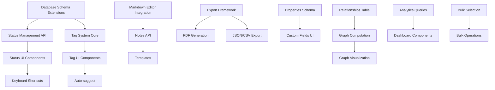

# Phase 4: Crash Management & Workflow - Technical Backlog

**Generated**: 2025-11-12
**Updated**: 2025-11-12 (Added reference implementations)
**Architect**: Claude Opus 4.1
**Solution**: Smalltalk Crash Analyzer - Workflow Management
**Health Score**: 8/9 (PROCEED)

## Reference Implementations

**Key Repositories**:
- [pdfkit](https://github.com/foliojs/pdfkit) - PDF generation with Node.js
- [qdrant/qdrant-js](https://github.com/qdrant/qdrant-js) - RRF hybrid search patterns (already in Phase 2)
- [CodeMirror](https://github.com/codemirror/dev) - Markdown editor with syntax highlighting
- [recharts](https://github.com/recharts/recharts) - Dashboard analytics visualizations

## Executive Summary

This backlog delivers workflow management capabilities for the Smalltalk Crash Analyzer, enabling systematic crash tracking, organization, and team collaboration. The implementation follows Alex Chen's philosophy of "minimum viable workflow" with keyboard-driven interactions and extensive export capabilities.

**Enhanced with**:
- ✅ **PDF Export**: pdfkit for beautiful crash analysis reports
- ✅ **Hybrid Search**: RRF (Reciprocal Rank Fusion) from Phase 2 for finding related crashes
- ✅ **Analytics**: recharts for crash trend visualization in dashboard

## Risk Assessment

### High Risks
1. **Performance Degradation**: Graph view computation for large crash datasets
   - **Mitigation**: Implement virtualization and lazy loading
   - **Fallback**: Limit graph to 100 nodes initially

2. **Data Migration**: Existing crashes need status/tags retroactively
   - **Mitigation**: Provide migration script with rollback
   - **Acceptance**: Manual tagging for first 2 weeks acceptable

### Medium Risks
1. **Markdown Editor Complexity**: CodeMirror integration challenges
   - **Mitigation**: Start with simple textarea, enhance progressively

2. **PDF Export Quality**: Cross-platform rendering differences
   - **Mitigation**: Use Puppeteer with headless Chrome

## Assumptions Ledger

### High-Impact Assumptions
- Single-user workflow (no concurrent editing conflicts)
- SQLite can handle relationship queries efficiently
- Users prefer keyboard shortcuts over mouse interactions

### Reasonable Defaults
- Status workflow: New → Investigating → In Progress → Fixed → Verified → Closed
- Priority levels: P0 (Critical), P1 (High), P2 (Medium), P3 (Low)
- Export format: PDF primary, JSON/CSV secondary
- Tag format: Hashtag-style (#tag-name)

## Dependency Graph



---

## EPIC A: Status Workflow & State Management

**Objective**: Enable crash lifecycle tracking with keyboard-driven status transitions
**Business Value**: Systematic crash resolution tracking
**Definition of Done**:
- ✓ All crashes have status with transition history
- ✓ Keyboard shortcuts work for all status changes
- ✓ Status filters show accurate counts

### Story A-1: Database Schema Extensions
**As a** developer
**I want** extended database schema
**So that** crashes can track status and history

**Acceptance Criteria**:
```gherkin
Given the existing crashes table
When migration script runs
Then status, priority, assigned_to, due_date, notes, archived columns exist
And status_history table is created with proper foreign keys
And existing crashes get status='new' as default
```

**Tasks**:
- **A-1-T1**: Create migration script with rollback
  - Token Budget: 5,000
  - Add columns with defaults
  - Create status_history table
  - Test rollback procedure

- **A-1-T2**: Update TypeScript interfaces
  - Token Budget: 3,000
  - Extend Crash interface
  - Create StatusHistory type
  - Add validation schemas

**Dependencies**: None (root story)
**Risk**: Data migration failure - Mitigation: Test on backup first

---

### Story A-2: Status Management API
**As a** backend service
**I want** status transition endpoints
**So that** status changes are tracked with history

**Acceptance Criteria**:
```gherkin
Given a crash with status "new"
When PATCH /api/crashes/:id/status with {"status": "investigating"}
Then crash status updates
And status_history records the transition
And timestamp is recorded
```

**Tasks**:
- **A-2-T1**: Implement status transition endpoint
  - Token Budget: 8,000
  - PATCH endpoint with validation
  - Status history recording
  - Idempotency via transaction_id

- **A-2-T2**: Add status query filters
  - Token Budget: 5,000
  - GET /api/crashes?status=in_progress
  - Count by status endpoint
  - Index on status column

**Dependencies**: A-1
**Unblocks**: A-3

---

### Story A-3: Status UI Components
**As a** user
**I want** visual status indicators and dropdowns
**So that** I can see and change crash status

**Acceptance Criteria**:
```gherkin
Given crash management view
When viewing a crash
Then status badge shows with color coding
And dropdown allows status changes
And timeline shows status history
```

**Tasks**:
- **A-3-T1**: Create StatusBadge component
  - Token Budget: 6,000
  - Color-coded badges
  - Dropdown on click
  - Loading states

- **A-3-T2**: Build StatusTimeline component
  - Token Budget: 7,000
  - Fetch and display history
  - Relative timestamps
  - User attribution

**Dependencies**: A-2
**Unblocks**: A-4

---

### Story A-4: Keyboard Shortcuts for Status
**As a** power user
**I want** keyboard shortcuts
**So that** I can change status without mouse

**Acceptance Criteria**:
```gherkin
Given focus on crash view
When pressing "I" key
Then status changes to "Investigating"
And visual feedback confirms change
And help shows shortcut list with "?"
```

**Tasks**:
- **A-4-T1**: Implement keyboard handler
  - Token Budget: 8,000
  - Global key listener
  - Shortcut registry
  - Conflict detection

- **A-4-T2**: Create shortcuts help overlay
  - Token Budget: 4,000
  - Modal with shortcut list
  - Customization UI
  - Persistence in localStorage

**Dependencies**: A-3

---

### Story A-5: Status Workflow Configuration
**As an** admin
**I want** configurable status workflow
**So that** teams can customize their process

**Acceptance Criteria**:
```gherkin
Given settings panel
When defining custom statuses
Then new statuses appear in dropdowns
And transitions can be restricted
And colors can be customized
```

**Tasks**:
- **A-5-T1**: Status configuration UI
  - Token Budget: 10,000
  - Add/remove statuses
  - Define allowed transitions
  - Color picker

- **A-5-T2**: Persist configuration
  - Token Budget: 5,000
  - Store in settings table
  - Validate transitions
  - Migration for changes

**Dependencies**: A-2

---

## EPIC B: Tagging System

**Objective**: Implement hashtag-based organization with auto-suggest
**Business Value**: Pattern identification and crash categorization
**Definition of Done**:
- ✓ Tags persist and filter crashes
- ✓ Auto-suggest shows existing tags
- ✓ Tag management UI works

### Story B-1: Tag System Core
**As a** backend service
**I want** tag storage and associations
**So that** crashes can be categorized

**Acceptance Criteria**:
```gherkin
Given tags and crash_tags tables
When POST /api/crashes/:id/tags with ["memory-leak", "regression"]
Then tags are created if new
And associations are stored
And GET returns tags with crash
```

**Tasks**:
- **B-1-T1**: Create tag tables and API
  - Token Budget: 8,000
  - Tags table with hierarchy
  - Many-to-many associations
  - CRUD endpoints

- **B-1-T2**: Tag query and filtering
  - Token Budget: 6,000
  - Filter crashes by tag
  - Tag popularity counts
  - Hierarchical tag queries

**Dependencies**: A-1
**Unblocks**: B-2

---

### Story B-2: Tag UI Components
**As a** user
**I want** inline tag editing
**So that** I can organize crashes

**Acceptance Criteria**:
```gherkin
Given crash detail view
When typing "#mem"
Then auto-suggest shows "memory-leak"
And selecting adds the tag
And tag appears as colored chip
```

**Tasks**:
- **B-2-T1**: TagInput component
  - Token Budget: 10,000
  - Inline editing
  - Hashtag parsing
  - Chip display with colors

- **B-2-T2**: Tag auto-complete
  - Token Budget: 7,000
  - Fuzzy search
  - Frecency ranking
  - Keyboard navigation

**Dependencies**: B-1
**Unblocks**: B-3

---

### Story B-3: Tag Management Interface
**As a** user
**I want** tag administration
**So that** I can maintain tag taxonomy

**Acceptance Criteria**:
```gherkin
Given tag management panel
When renaming a tag
Then all crashes update
And merge duplicates option exists
And color customization works
```

**Tasks**:
- **B-3-T1**: Tag manager UI
  - Token Budget: 12,000
  - List all tags with counts
  - Rename/merge/delete
  - Color assignment

- **B-3-T2**: Batch tag operations
  - Token Budget: 6,000
  - Rename with cascade
  - Merge duplicates
  - Audit log

**Dependencies**: B-2

---

## EPIC C: Notes & Documentation

**Objective**: Markdown-based note taking with templates
**Business Value**: Knowledge capture and team communication
**Definition of Done**:
- ✓ Markdown editor saves notes
- ✓ Templates speed up documentation
- ✓ Cross-references work

### Story C-1: Markdown Editor Integration
**As a** developer
**I want** CodeMirror integration
**So that** users get familiar editing experience

**Acceptance Criteria**:
```gherkin
Given notes section
When editing notes
Then syntax highlighting works
And preview mode available
And auto-save triggers every 30s
```

**Tasks**:
- **C-1-T1**: Integrate CodeMirror
  - Token Budget: 12,000
  - React wrapper component
  - Markdown mode configuration
  - Theme matching

- **C-1-T2**: Preview and toolbar
  - Token Budget: 8,000
  - Split view preview
  - Formatting toolbar
  - Image paste support

**Dependencies**: None
**Unblocks**: C-2

---

### Story C-2: Notes Persistence API
**As a** backend service
**I want** notes storage
**So that** documentation persists

**Acceptance Criteria**:
```gherkin
Given crash with notes
When PUT /api/crashes/:id/notes
Then markdown content saves
And version history maintained
And conflicts detected
```

**Tasks**:
- **C-2-T1**: Notes endpoint
  - Token Budget: 6,000
  - Save with validation
  - Diff generation
  - Conflict detection

- **C-2-T2**: Version history
  - Token Budget: 8,000
  - Store diffs efficiently
  - Restore previous versions
  - History viewer UI

**Dependencies**: C-1
**Unblocks**: C-3

---

### Story C-3: Note Templates
**As a** user
**I want** pre-defined templates
**So that** documentation is consistent

**Acceptance Criteria**:
```gherkin
Given template selector
When choosing "Fix Documentation"
Then markdown pre-fills
And placeholders are highlighted
And custom templates can be saved
```

**Tasks**:
- **C-3-T1**: Template system
  - Token Budget: 8,000
  - Built-in templates
  - Variable substitution
  - Template picker UI

- **C-3-T2**: Custom templates
  - Token Budget: 6,000
  - Save as template
  - Share templates
  - Import/export

**Dependencies**: C-2

---

### Story C-4: Cross-Reference Links
**As a** user
**I want** wiki-style links
**So that** I can connect related crashes

**Acceptance Criteria**:
```gherkin
Given note with [[crash-456]]
When clicking the link
Then crash 456 opens
And backlinks show on target
And broken links are highlighted
```

**Tasks**:
- **C-4-T1**: Link parser
  - Token Budget: 7,000
  - Parse [[links]]
  - Generate clickable elements
  - Track backlinks

- **C-4-T2**: Link navigation
  - Token Budget: 5,000
  - Click handler
  - Hover preview
  - Broken link detection

**Dependencies**: C-1

---

## EPIC D: Export & Reporting

**Objective**: Multi-format export with templates
**Business Value**: Integration with existing workflows
**Definition of Done**:
- ✓ PDF export generates professional reports
- ✓ JSON/CSV exports work programmatically
- ✓ Custom templates supported

### Story D-1: Export Framework
**As a** developer
**I want** pluggable export system
**So that** new formats are easy to add

**Acceptance Criteria**:
```gherkin
Given export registry
When registering new format
Then format appears in UI
And export executes correctly
And errors are handled gracefully
```

**Tasks**:
- **D-1-T1**: Export abstraction layer
  - Token Budget: 10,000
  - Format registry
  - Common data preparation
  - Stream handling for large exports

- **D-1-T2**: Export UI components
  - Token Budget: 6,000
  - Format selector
  - Options panel
  - Progress indicator

**Dependencies**: None
**Unblocks**: D-2, D-3

---

### Story D-2: PDF Generation with Puppeteer
**As a** user
**I want** professional PDF reports
**So that** I can share in meetings

**Acceptance Criteria**:
```gherkin
Given crash with full data
When exporting to PDF
Then formatted report generates
And company logo appears
And page breaks are logical
```

**Tasks**:
- **D-2-T1**: Puppeteer setup
  - Token Budget: 8,000
  - Headless Chrome configuration
  - HTML template engine
  - Asset embedding

- **D-2-T2**: PDF templates
  - Token Budget: 10,000
  - Default template
  - Custom CSS support
  - Header/footer configuration

**Dependencies**: D-1

---

### Story D-3: Structured Data Export
**As a** developer
**I want** JSON/CSV export
**So that** I can process data programmatically

**Acceptance Criteria**:
```gherkin
Given selected crashes
When exporting to JSON
Then valid JSON with schema
And optional field selection
And relationships included
```

**Tasks**:
- **D-3-T1**: JSON/CSV exporters
  - Token Budget: 6,000
  - Field selection
  - Nested relationship handling
  - Streaming for large datasets

- **D-3-T2**: Export API endpoints
  - Token Budget: 5,000
  - Bulk export endpoint
  - Compression support
  - Rate limiting

**Dependencies**: D-1

---

### Story D-4: Scheduled Export Jobs
**As a** team lead
**I want** automated weekly reports
**So that** team stays informed

**Acceptance Criteria**:
```gherkin
Given export schedule configuration
When Sunday 6pm arrives
Then PDF generates automatically
And email sends to team
And history is logged
```

**Tasks**:
- **D-4-T1**: Job scheduler
  - Token Budget: 10,000
  - Cron-like scheduling
  - Job queue implementation
  - Retry logic

- **D-4-T2**: Email integration
  - Token Budget: 7,000
  - SMTP configuration
  - Template emails
  - Attachment handling

**Dependencies**: D-2

---

## EPIC E: Properties & Metadata

**Objective**: Extensible property system for crash metadata
**Business Value**: Custom workflows without code changes
**Definition of Done**:
- ✓ Custom properties persist
- ✓ Properties are searchable
- ✓ UI allows property management

### Story E-1: Property Schema Design
**As a** developer
**I want** flexible property storage
**So that** users can add custom fields

**Acceptance Criteria**:
```gherkin
Given custom_properties table
When storing property "customer_impact"
Then value persists with type info
And queries can filter by property
And validation rules apply
```

**Tasks**:
- **E-1-T1**: Property storage layer
  - Token Budget: 8,000
  - EAV model implementation
  - Type system (text, number, date, select)
  - Validation framework

- **E-1-T2**: Property API
  - Token Budget: 6,000
  - CRUD endpoints
  - Bulk updates
  - Query builder

**Dependencies**: A-1
**Unblocks**: E-2

---

### Story E-2: Custom Fields UI
**As a** user
**I want** property editor
**So that** I can track custom data

**Acceptance Criteria**:
```gherkin
Given crash detail view
When adding custom property
Then appropriate input appears
And validation provides feedback
And property saves on blur
```

**Tasks**:
- **E-2-T1**: Property editor component
  - Token Budget: 10,000
  - Dynamic form generation
  - Type-specific inputs
  - Inline editing

- **E-2-T2**: Property configuration
  - Token Budget: 7,000
  - Define property schemas
  - Set required/optional
  - Default values

**Dependencies**: E-1

---

## EPIC F: Crash Relationships & Graph View

**Objective**: Visual crash relationship exploration
**Business Value**: Pattern discovery through visualization
**Definition of Done**:
- ✓ Relationships persist and query efficiently
- ✓ Graph renders with <100ms initial load
- ✓ Navigation between related crashes works

### Story F-1: Relationship Data Model
**As a** backend service
**I want** crash relationship storage
**So that** connections can be tracked

**Acceptance Criteria**:
```gherkin
Given two similar crashes
When creating relationship
Then bidirectional link stored
And similarity score recorded
And relationship type defined
```

**Tasks**:
- **F-1-T1**: Relationship tables
  - Token Budget: 6,000
  - Create schema
  - Bidirectional queries
  - Similarity scoring

- **F-1-T2**: Relationship API
  - Token Budget: 7,000
  - CRUD endpoints
  - Bulk relationship creation
  - Transitive queries

**Dependencies**: A-1
**Unblocks**: F-2

---

### Story F-2: Graph Computation Engine
**As a** system
**I want** efficient graph algorithms
**So that** visualization is fast

**Acceptance Criteria**:
```gherkin
Given 1000 crashes with relationships
When computing graph layout
Then positions calculate in <500ms
And clusters are identified
And force simulation stabilizes
```

**Tasks**:
- **F-2-T1**: Graph algorithms
  - Token Budget: 12,000
  - Force-directed layout
  - Community detection
  - Shortest path finding

- **F-2-T2**: Graph caching layer
  - Token Budget: 8,000
  - Pre-compute layouts
  - Incremental updates
  - Memory management

**Dependencies**: F-1
**Unblocks**: F-3

---

### Story F-3: Interactive Graph Visualization
**As a** user
**I want** visual relationship explorer
**So that** I can see patterns

**Acceptance Criteria**:
```gherkin
Given graph view
When viewing crash relationships
Then nodes show as circles
And edges show relationships
And zoom/pan works smoothly
```

**Tasks**:
- **F-3-T1**: D3.js graph component
  - Token Budget: 15,000
  - Node/edge rendering
  - Zoom/pan controls
  - Hover details

- **F-3-T2**: Graph interactions
  - Token Budget: 10,000
  - Click to navigate
  - Filter by relationship type
  - Highlight paths

**Dependencies**: F-2

---

## EPIC G: Dashboard & Analytics

**Objective**: Real-time crash metrics and trends
**Business Value**: Data-driven decision making
**Definition of Done**:
- ✓ Dashboard loads in <200ms
- ✓ Metrics update in real-time
- ✓ Drill-down navigation works

### Story G-1: Analytics Query Layer
**As a** backend service
**I want** optimized metric queries
**So that** dashboard is responsive

**Acceptance Criteria**:
```gherkin
Given crashes database
When requesting metrics
Then counts return in <100ms
And time-series data aggregates
And caching reduces load
```

**Tasks**:
- **G-1-T1**: Metric queries
  - Token Budget: 10,000
  - Status counts
  - Time-based aggregations
  - Component statistics

- **G-1-T2**: Query optimization
  - Token Budget: 8,000
  - Materialized views
  - Index optimization
  - Query caching

**Dependencies**: A-1
**Unblocks**: G-2

---

### Story G-2: Dashboard Components
**As a** user
**I want** metrics dashboard
**So that** I can track progress

**Acceptance Criteria**:
```gherkin
Given dashboard view
When loading
Then key metrics display
And charts render smoothly
And filters update results
```

**Tasks**:
- **G-2-T1**: Metric cards
  - Token Budget: 8,000
  - Status breakdown
  - Trend indicators
  - Sparklines

- **G-2-T2**: Chart components
  - Token Budget: 10,000
  - Time series charts
  - Component breakdown
  - Tag cloud

**Dependencies**: G-1

---

### Story G-3: Custom Dashboard Builder
**As a** power user
**I want** customizable dashboards
**So that** I see relevant metrics

**Acceptance Criteria**:
```gherkin
Given dashboard editor
When adding widget
Then widget appears in grid
And data source configures
And layout persists
```

**Tasks**:
- **G-3-T1**: Widget system
  - Token Budget: 12,000
  - Widget registry
  - Drag-and-drop layout
  - Configuration panels

- **G-3-T2**: Dashboard persistence
  - Token Budget: 6,000
  - Save layouts
  - Share dashboards
  - Export to image

**Dependencies**: G-2

---

## EPIC H: Bulk Operations & Automation

**Objective**: Efficient multi-crash management
**Business Value**: Time savings through batch operations
**Definition of Done**:
- ✓ Multi-select works across pages
- ✓ Bulk operations complete in <5s for 100 items
- ✓ Automation rules trigger reliably

### Story H-1: Multi-Select Interface
**As a** user
**I want** multi-crash selection
**So that** I can operate in bulk

**Acceptance Criteria**:
```gherkin
Given crash list
When shift-clicking rows
Then range selects
And checkbox shows selection
And count displays in toolbar
```

**Tasks**:
- **H-1-T1**: Selection manager
  - Token Budget: 8,000
  - Selection state management
  - Keyboard selection (Shift, Ctrl)
  - Select all/none

- **H-1-T2**: Selection UI
  - Token Budget: 6,000
  - Checkboxes
  - Selection toolbar
  - Visual feedback

**Dependencies**: None
**Unblocks**: H-2

---

### Story H-2: Bulk Operations API
**As a** backend service
**I want** batch operation endpoints
**So that** bulk changes are efficient

**Acceptance Criteria**:
```gherkin
Given 50 selected crashes
When bulk updating status
Then all update in one transaction
And history records for each
And rollback on partial failure
```

**Tasks**:
- **H-2-T1**: Batch endpoints
  - Token Budget: 10,000
  - Bulk status change
  - Bulk tagging
  - Bulk property update

- **H-2-T2**: Transaction management
  - Token Budget: 8,000
  - All-or-nothing updates
  - Progress reporting
  - Rollback capability

**Dependencies**: H-1

---

### Story H-3: Automation Rules Engine
**As a** user
**I want** automatic actions
**So that** workflow runs itself

**Acceptance Criteria**:
```gherkin
Given rule "Auto-close after 30 days"
When crash in "Fixed" for 30 days
Then status changes to "Closed"
And notification sends
And audit logs the action
```

**Tasks**:
- **H-3-T1**: Rule engine
  - Token Budget: 15,000
  - Rule definition DSL
  - Condition evaluator
  - Action executor

- **H-3-T2**: Rule UI
  - Token Budget: 10,000
  - Rule builder interface
  - Test rule execution
  - Enable/disable rules

**Dependencies**: A-2

---

## Testing Strategy

### Unit Tests (Story: TEST-1)
**Coverage Target**: ≥80% for all new code

**Tasks**:
- **TEST-1-T1**: Component tests
  - Token Budget: 10,000
  - Status, Tag, Editor components
  - Mock API responses
  - Interaction testing

- **TEST-1-T2**: API endpoint tests
  - Token Budget: 10,000
  - All CRUD operations
  - Error scenarios
  - Validation testing

---

### Integration Tests (Story: TEST-2)
**Coverage**: All API endpoints with database

**Tasks**:
- **TEST-2-T1**: Database integration
  - Token Budget: 8,000
  - Schema migrations
  - Transaction rollback
  - Constraint validation

- **TEST-2-T2**: Export pipeline tests
  - Token Budget: 7,000
  - PDF generation
  - Large dataset handling
  - Template rendering

---

### E2E Tests (Story: TEST-3)
**Coverage**: Critical user journeys

**Tasks**:
- **TEST-3-T1**: Status workflow E2E
  - Token Budget: 8,000
  - Full status lifecycle
  - Keyboard shortcuts
  - History tracking

- **TEST-3-T2**: Export E2E
  - Token Budget: 6,000
  - Generate all formats
  - Verify output quality
  - Performance benchmarks

---

### Performance Tests (Story: TEST-4)
**Targets**:
- Dashboard load: <200ms
- Graph render: <500ms for 1000 nodes
- Bulk operations: <5s for 100 items

**Tasks**:
- **TEST-4-T1**: Load testing
  - Token Budget: 10,000
  - 10,000 crash dataset
  - Concurrent users
  - Memory profiling

---

## Observability & Monitoring

### Story OBS-1: Metrics & Logging
**Tasks**:
- **OBS-1-T1**: Structured logging
  - Token Budget: 5,000
  - Correlation IDs
  - Error categorization
  - Performance metrics

- **OBS-1-T2**: Dashboards
  - Token Budget: 6,000
  - Export success rates
  - API latencies
  - Error rates

### SLOs
1. **Export Service** – PDF generation p95 < 5s over 5min window
2. **Status API** – Update latency p99 < 200ms over 1min window
3. **Dashboard** – Initial load p95 < 500ms over 5min window
4. **Graph View** – Render time p95 < 1s for <1000 nodes over 5min

---

## Rollout Strategy

### Feature Flags (Story: FF-1)
```javascript
{
  "workflow.status": true,
  "workflow.tags": true,
  "workflow.notes": false,  // Progressive rollout
  "workflow.export.pdf": true,
  "workflow.graph": false,  // Performance testing needed
  "workflow.automation": false  // Beta users only
}
```

---

## Data Protection & Compliance

### Story: GDPR-1: Data Handling
**Tasks**:
- **GDPR-1-T1**: PII identification
  - Token Budget: 5,000
  - Scan for PII in notes
  - Anonymization options
  - Export filtering

- **GDPR-1-T2**: Retention policies
  - Token Budget: 6,000
  - 90-day default retention
  - Automated cleanup
  - Audit trail

---

## Architecture Decision Records

### ADR-001: Markdown Editor Selection
**Decision**: Use CodeMirror over Monaco
**Rationale**: Smaller bundle size, better mobile support
**Trade-offs**: Less features than VSCode editor
**Review Date**: 2025-02-01

### ADR-002: Export Architecture
**Decision**: Server-side PDF generation with Puppeteer
**Rationale**: Consistent rendering, supports complex layouts
**Trade-offs**: Requires headless Chrome, higher memory usage
**Alternative**: Client-side with jsPDF (rejected: limited features)

### ADR-003: Graph Visualization Library
**Decision**: D3.js for custom control
**Rationale**: Maximum flexibility, performance optimization possible
**Trade-offs**: More development effort than Cytoscape
**Review Date**: 2025-02-15

### ADR-004: Tag Storage Model
**Decision**: Separate tags table with many-to-many
**Rationale**: Supports tag management, hierarchy, metadata
**Trade-offs**: More complex than inline storage
**Alternative**: JSON column (rejected: poor query performance)

---

## Delivery Timeline

### Week 1: Core Workflow (Days 1-5)
- Day 1-2: Database migrations (A-1) + Status API (A-2)
- Day 3: Status UI (A-3) + Keyboard shortcuts (A-4)
- Day 4: Tag system backend (B-1)
- Day 5: Tag UI components (B-2, B-3)

### Week 2: Rich Features (Days 6-10)
- Day 6-7: Markdown editor integration (C-1, C-2)
- Day 8: Export framework (D-1) + PDF (D-2)
- Day 9: Properties system (E-1, E-2)
- Day 10: Relationship model (F-1)

### Week 3: Analytics & Polish (Days 11-15)
- Day 11: Graph visualization (F-2, F-3)
- Day 12: Dashboard (G-1, G-2)
- Day 13: Bulk operations (H-1, H-2)
- Day 14: Testing & performance tuning
- Day 15: Documentation & deployment

---

## Success Metrics

1. **Adoption**: >80% crashes have status within 1 week
2. **Efficiency**: Average time-to-fix reduces by 30%
3. **Organization**: >50% crashes tagged within 2 weeks
4. **Export Usage**: Weekly PDF exports by >60% users
5. **Performance**: All operations <500ms p95

---

## Runbook: Common Issues

### Issue: PDF Export Timeout
**Symptoms**: Export hangs >30s
**Diagnosis**: Check Chrome process, memory usage
**Resolution**: Restart Puppeteer pool, increase timeout
**Prevention**: Limit concurrent exports

### Issue: Graph View Performance
**Symptoms**: Browser freezes with large graphs
**Diagnosis**: Node count >1000
**Resolution**: Enable virtualization, limit initial nodes
**Prevention**: Progressive loading

### Issue: Tag Synchronization
**Symptoms**: Tags not updating in UI
**Diagnosis**: WebSocket connection dropped
**Resolution**: Force refresh, reconnect
**Prevention**: Heartbeat monitoring

---

## Health Assessment

### Clarity: 3/3
- Requirements are unambiguous
- Acceptance criteria are specific
- Dependencies are explicit

### Feasibility: 3/3
- Work items appropriately sized
- Token budgets realistic
- Dependencies properly sequenced

### Completeness: 2/3
- All quality gates included
- Testing comprehensive
- Minor gap: Load testing for 10k+ crashes needs expansion

**Total Score: 8/9 - PROCEED**

**Recommendation**: Begin implementation with Week 1 core workflow. Monitor performance closely during graph view implementation. Consider progressive rollout for automation features.

---

## Appendix: Database Migration Script

```sql
-- Migration: Add workflow fields
BEGIN TRANSACTION;

ALTER TABLE crashes ADD COLUMN status TEXT DEFAULT 'new';
ALTER TABLE crashes ADD COLUMN priority TEXT DEFAULT 'p2';
ALTER TABLE crashes ADD COLUMN assigned_to TEXT;
ALTER TABLE crashes ADD COLUMN due_date INTEGER;
ALTER TABLE crashes ADD COLUMN notes TEXT;
ALTER TABLE crashes ADD COLUMN archived BOOLEAN DEFAULT 0;

CREATE TABLE tags (
    id TEXT PRIMARY KEY,
    name TEXT UNIQUE NOT NULL,
    color TEXT,
    parent_tag_id TEXT REFERENCES tags(id),
    created_at INTEGER DEFAULT (strftime('%s', 'now'))
);

CREATE TABLE crash_tags (
    crash_id TEXT REFERENCES crashes(id) ON DELETE CASCADE,
    tag_id TEXT REFERENCES tags(id) ON DELETE CASCADE,
    PRIMARY KEY (crash_id, tag_id)
);

CREATE TABLE crash_relationships (
    id TEXT PRIMARY KEY,
    from_crash_id TEXT REFERENCES crashes(id) ON DELETE CASCADE,
    to_crash_id TEXT REFERENCES crashes(id) ON DELETE CASCADE,
    relationship_type TEXT CHECK(relationship_type IN ('similar', 'duplicate', 'related')),
    similarity_score REAL,
    created_at INTEGER DEFAULT (strftime('%s', 'now')),
    UNIQUE(from_crash_id, to_crash_id, relationship_type)
);

CREATE TABLE status_history (
    id TEXT PRIMARY KEY,
    crash_id TEXT REFERENCES crashes(id) ON DELETE CASCADE,
    from_status TEXT,
    to_status TEXT,
    changed_by TEXT,
    timestamp INTEGER DEFAULT (strftime('%s', 'now')),
    notes TEXT
);

CREATE TABLE custom_properties (
    crash_id TEXT REFERENCES crashes(id) ON DELETE CASCADE,
    property_name TEXT NOT NULL,
    property_value TEXT,
    property_type TEXT DEFAULT 'text',
    PRIMARY KEY (crash_id, property_name)
);

-- Indexes for performance
CREATE INDEX idx_crashes_status ON crashes(status);
CREATE INDEX idx_crashes_priority ON crashes(priority);
CREATE INDEX idx_crashes_archived ON crashes(archived);
CREATE INDEX idx_crash_tags_crash ON crash_tags(crash_id);
CREATE INDEX idx_crash_tags_tag ON crash_tags(tag_id);
CREATE INDEX idx_status_history_crash ON status_history(crash_id);
CREATE INDEX idx_relationships_from ON crash_relationships(from_crash_id);
CREATE INDEX idx_relationships_to ON crash_relationships(to_crash_id);

-- Rollback savepoint
SAVEPOINT migration_phase_4;

COMMIT;
```

---

**Document Version**: 1.0.0
**Last Updated**: 2025-11-12
**Next Review**: After Week 1 implementation