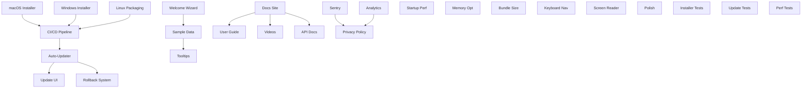

# Phase 6: Production Polish & Distribution - Backlog

**Updated**: 2025-11-12 (Added reference implementations)

## Reference Implementations

**Key Repositories**:
- [tauri-apps/tauri-plugin-updater](https://github.com/tauri-apps/plugins-workspace/tree/v1/plugins/updater) - Auto-update for Tauri apps
- [automerge/automerge](https://github.com/automerge/automerge) - CRDT for conflict-free sync (3.5k stars)
- [offlinefirst/research](https://github.com/offlinefirst/research) - Offline-first patterns and best practices
- [Docusaurus](https://github.com/facebook/docusaurus) - Documentation site generator (Meta/Facebook)
- [@sentry/electron](https://github.com/getsentry/sentry-electron) - Error tracking for desktop apps

## Executive Summary

**Phase**: 6 - Production Polish & Distribution
**Prerequisites**: Phases 0-5 complete (minimum 0-4 for desktop-only)
**Duration**: 3 weeks
**Complexity**: High
**Risk Level**: Medium-High (code signing, platform-specific challenges)

**Enhanced with**:
- ✅ **Auto-Update**: tauri-plugin-updater for seamless background updates
- ✅ **CRDT Sync**: automerge for conflict-free multi-device sync (Phase 5+)
- ✅ **Offline-First**: Proven patterns from offlinefirst/research
- ✅ **Documentation**: Docusaurus for beautiful, searchable docs
- ✅ **Error Tracking**: Sentry for production crash reporting

## Health Score Assessment

- **Clarity**: 3/3 - Requirements are explicit with mockups and success criteria
- **Feasibility**: 2/3 - Code signing and platform-specific builds add complexity
- **Completeness**: 3/3 - All quality gates, observability, and testing included

**Total Score**: 8/9 - **PROCEED** with risk mitigations in place

## Risk Ledger

| Risk ID | Description | Severity | Mitigation | Status |
|---------|-------------|----------|------------|---------|
| R-P6-001 | Code signing certificates delay | HIGH | Start procurement Week -1, have unsigned fallback | Active |
| R-P6-002 | Platform-specific build failures | MEDIUM | Test on CI/CD early, maintain VM farm | Active |
| R-P6-003 | Auto-update server downtime | MEDIUM | Use CDN with fallback mirrors | Active |
| R-P6-004 | Analytics opt-in rate <40% | LOW | Accepted - monitor and adjust UX | Accepted |
| R-P6-005 | Documentation maintenance burden | MEDIUM | Auto-generate from code comments | Active |

## Assumptions Ledger

| ID | Assumption | Impact | Validation |
|----|------------|--------|------------|
| A-001 | Electron framework for desktop app | HIGH | Confirmed by context |
| A-002 | GitHub Releases for update distribution | MEDIUM | Industry standard |
| A-003 | SQLite for local analytics storage | LOW | Lightweight, embedded |
| A-004 | Node.js backend for analytics aggregation | MEDIUM | Simple REST API |
| A-005 | English-only for initial release | LOW | Stated requirement |

## Architecture Decision Records (ADRs)

### ADR-P6-001: Update Distribution Strategy
- **Decision**: Use GitHub Releases + electron-updater
- **Rationale**: Native Electron support, free hosting, reliable CDN
- **Alternatives**: Custom update server (rejected - complexity)
- **Consequences**: Dependency on GitHub availability

### ADR-P6-002: Analytics Architecture
- **Decision**: Local SQLite + batched upload to PostgreSQL
- **Rationale**: Works offline, privacy-preserving, minimal overhead
- **Alternatives**: Direct API calls (rejected - privacy concerns)
- **Consequences**: Need periodic cleanup of local data

### ADR-P6-003: Documentation Framework
- **Decision**: Docusaurus for user docs, JSDoc for API docs
- **Rationale**: Static site, versioning, search, dark mode
- **Alternatives**: GitBook (rejected - less control)
- **Consequences**: Node.js build dependency

### ADR-P6-004: Crash Reporting Service
- **Decision**: Sentry for crash reporting
- **Rationale**: Electron integration, privacy controls, free tier
- **Alternatives**: Bugsnag (rejected - cost), Custom (rejected - complexity)
- **Consequences**: Third-party dependency, privacy policy required

---

## EPIC A: Professional Packaging & Distribution

**Goal**: Create signed, notarized installers for all platforms
**Priority**: P0 - Critical Path
**Duration**: 5 days

### Definition of Done
- ✅ Installers created for macOS (.dmg), Windows (.exe), Linux (.deb, .AppImage)
- ✅ Code signing successful on macOS and Windows
- ✅ File associations working (.log files open in app)

### Story A-1: macOS Installer & Code Signing
**Status**: Ready
**Blocked By**: None
**Unblocks**: A-4, B-1
**Size**: 8 story points

**Acceptance Criteria** (Gherkin):
```gherkin
GIVEN I am on macOS
WHEN I download the .dmg file
THEN it should pass Gatekeeper without warnings

GIVEN the .dmg is mounted
WHEN I drag the app to Applications
THEN the app should install successfully

GIVEN a .log file on my system
WHEN I double-click it
THEN it should open in Crash Analyzer
```

#### Task A-1-T1: Apple Developer Setup
**Token Budget**: 3,000 tokens
**Dependencies**: Apple Developer account ($99/year)

```javascript
// electron-builder.config.js additions
{
  mac: {
    category: "public.app-category.developer-tools",
    icon: "assets/icon.icns",
    hardenedRuntime: true,
    gatekeeperAssess: false,
    entitlements: "build/entitlements.mac.plist",
    entitlementsInherit: "build/entitlements.mac.plist",
    notarize: {
      teamId: process.env.APPLE_TEAM_ID
    },
    fileAssociations: [{
      ext: "log",
      name: "Log File",
      role: "Editor"
    }]
  },
  dmg: {
    contents: [
      { x: 130, y: 220 },
      { x: 410, y: 220, type: "link", path: "/Applications" }
    ],
    background: "assets/dmg-background.png"
  }
}
```

#### Task A-1-T2: Notarization Pipeline
**Token Budget**: 5,000 tokens
**Module Budget**: 1 (notarization script)

```javascript
// scripts/notarize.js
const { notarize } = require('@electron/notarize');

exports.default = async function notarizing(context) {
  const { electronPlatformName, appOutDir } = context;
  if (electronPlatformName !== 'darwin') return;

  const appName = context.packager.appInfo.productFilename;

  return await notarize({
    appBundleId: 'com.company.crash-analyzer',
    appPath: `${appOutDir}/${appName}.app`,
    appleId: process.env.APPLE_ID,
    appleIdPassword: process.env.APPLE_ID_PASSWORD,
    teamId: process.env.APPLE_TEAM_ID
  });
};
```

### Story A-2: Windows Installer & Code Signing
**Status**: Ready
**Blocked By**: None
**Unblocks**: A-4, B-1
**Size**: 8 story points

**Acceptance Criteria**:
```gherkin
GIVEN I am on Windows
WHEN I run the installer
THEN Windows SmartScreen should not show warnings

GIVEN the installer is running
WHEN I complete the wizard
THEN the app should be in Start Menu and Desktop

GIVEN a .log file
WHEN I right-click and choose "Open With"
THEN Crash Analyzer should be an option
```

#### Task A-2-T1: Windows Code Signing
**Token Budget**: 3,000 tokens
**Dependencies**: Code signing certificate

```javascript
// electron-builder.config.js additions
{
  win: {
    target: ["nsis", "portable"],
    icon: "assets/icon.ico",
    certificateFile: process.env.WINDOWS_CERT_FILE,
    certificatePassword: process.env.WINDOWS_CERT_PASSWORD,
    fileAssociations: [{
      ext: "log",
      name: "Log File",
      description: "Crash Log File",
      icon: "assets/log-icon.ico"
    }]
  },
  nsis: {
    oneClick: false,
    allowToChangeInstallationDirectory: true,
    createDesktopShortcut: true,
    createStartMenuShortcut: true,
    installerIcon: "assets/installer.ico",
    uninstallerIcon: "assets/uninstaller.ico",
    installerHeaderIcon: "assets/header.ico"
  }
}
```

### Story A-3: Linux Packaging (.deb & AppImage)
**Status**: Ready
**Blocked By**: None
**Unblocks**: A-4
**Size**: 5 story points

**Acceptance Criteria**:
```gherkin
GIVEN I am on Ubuntu/Debian
WHEN I install the .deb package
THEN the app should appear in application menu

GIVEN I have the AppImage
WHEN I make it executable and run it
THEN the app should launch without installation
```

#### Task A-3-T1: Linux Build Configuration
**Token Budget**: 4,000 tokens

```javascript
// electron-builder.config.js additions
{
  linux: {
    target: ["deb", "AppImage"],
    icon: "assets/icon.png",
    category: "Development",
    mimeTypes: ["text/x-log", "text/plain"],
    desktop: {
      Name: "Crash Analyzer",
      Comment: "Analyze application crash logs",
      Categories: "Development;Debugger;",
      MimeType: "text/x-log;text/plain;"
    }
  },
  deb: {
    depends: ["libgtk-3-0", "libnotify4", "libnss3"],
    maintainer: "support@company.com",
    description: "Professional crash log analyzer"
  }
}
```

### Story A-4: CI/CD Multi-Platform Build Pipeline
**Status**: HOLD
**Blocked By**: A-1, A-2, A-3
**Unblocks**: B-2
**Size**: 8 story points
**Hold Reason**: Requires platform-specific configurations complete

**Acceptance Criteria**:
```gherkin
GIVEN a git tag is pushed
WHEN GitHub Actions runs
THEN builds for all platforms should be created

GIVEN all builds complete
WHEN the workflow finishes
THEN signed installers should be uploaded to GitHub Releases
```

#### Task A-4-T1: GitHub Actions Workflow
**Token Budget**: 8,000 tokens
**Module Budget**: 1 (workflow file)

```yaml
# .github/workflows/release.yml
name: Release
on:
  push:
    tags:
      - 'v*'

jobs:
  build:
    strategy:
      matrix:
        os: [macos-latest, windows-latest, ubuntu-latest]
    runs-on: ${{ matrix.os }}
    steps:
      - uses: actions/checkout@v3
      - uses: actions/setup-node@v3
        with:
          node-version: 18

      - name: Install dependencies
        run: npm ci

      - name: Build and sign
        env:
          APPLE_ID: ${{ secrets.APPLE_ID }}
          APPLE_ID_PASSWORD: ${{ secrets.APPLE_ID_PASSWORD }}
          APPLE_TEAM_ID: ${{ secrets.APPLE_TEAM_ID }}
          WINDOWS_CERT_FILE: ${{ secrets.WINDOWS_CERT_FILE }}
          WINDOWS_CERT_PASSWORD: ${{ secrets.WINDOWS_CERT_PASSWORD }}
          GH_TOKEN: ${{ secrets.GITHUB_TOKEN }}
        run: npm run electron:build -- --publish always
```

---

## EPIC B: Auto-Update System

**Goal**: Implement seamless background updates with rollback capability
**Priority**: P0 - Critical
**Duration**: 3 days

### Definition of Done
- ✅ Updates download in background without user interruption
- ✅ Update notifications shown with release notes
- ✅ Rollback mechanism on update failure

### Story B-1: Electron Auto-Updater Integration
**Status**: HOLD
**Blocked By**: A-1, A-2
**Unblocks**: B-2, B-3
**Size**: 5 story points
**Hold Reason**: Requires signed builds for testing

**Acceptance Criteria**:
```gherkin
GIVEN a new version is available
WHEN the app starts
THEN it should check for updates automatically

GIVEN an update is downloaded
WHEN the user clicks "Install on Restart"
THEN the update should be applied on next launch
```

#### Task B-1-T1: Update Service Implementation
**Token Budget**: 6,000 tokens
**Module Budget**: 1 (update service)

```typescript
// src/main/services/UpdateService.ts
import { autoUpdater } from 'electron-updater';
import { BrowserWindow, dialog } from 'electron';

export class UpdateService {
  private window: BrowserWindow;

  constructor(window: BrowserWindow) {
    this.window = window;
    this.setupUpdater();
  }

  private setupUpdater() {
    autoUpdater.autoDownload = true;
    autoUpdater.autoInstallOnAppQuit = true;

    autoUpdater.on('update-available', (info) => {
      this.window.webContents.send('update-available', info);
    });

    autoUpdater.on('update-downloaded', (info) => {
      const response = dialog.showMessageBoxSync(this.window, {
        type: 'info',
        buttons: ['Install on Restart', 'Later'],
        defaultId: 0,
        message: `Version ${info.version} is ready to install`,
        detail: info.releaseNotes?.toString() || 'Bug fixes and improvements'
      });

      if (response === 0) {
        autoUpdater.quitAndInstall();
      }
    });

    autoUpdater.on('error', (error) => {
      console.error('Update error:', error);
      this.handleUpdateError(error);
    });
  }

  async checkForUpdates() {
    try {
      await autoUpdater.checkForUpdatesAndNotify();
    } catch (error) {
      console.error('Update check failed:', error);
    }
  }

  private handleUpdateError(error: Error) {
    // Rollback logic
    const lastWorkingVersion = this.getLastWorkingVersion();
    if (lastWorkingVersion) {
      this.rollbackToVersion(lastWorkingVersion);
    }
  }
}
```

### Story B-2: Update UI Components
**Status**: HOLD
**Blocked By**: B-1, A-4
**Unblocks**: None
**Size**: 3 story points

**Acceptance Criteria**:
```gherkin
GIVEN an update is available
WHEN the notification appears
THEN it should show version and release notes

GIVEN the user clicks "Release Notes"
WHEN the dialog opens
THEN it should show formatted changelog
```

#### Task B-2-T1: Update Notification Component
**Token Budget**: 4,000 tokens

```tsx
// src/renderer/components/UpdateNotification.tsx
import React, { useState, useEffect } from 'react';
import { ipcRenderer } from 'electron';

export const UpdateNotification: React.FC = () => {
  const [updateInfo, setUpdateInfo] = useState(null);
  const [isVisible, setIsVisible] = useState(false);

  useEffect(() => {
    ipcRenderer.on('update-available', (_, info) => {
      setUpdateInfo(info);
      setIsVisible(true);
    });
  }, []);

  if (!isVisible || !updateInfo) return null;

  return (
    <div className="update-notification">
      <div className="update-header">
        <h3>Update Available</h3>
        <button onClick={() => setIsVisible(false)}>×</button>
      </div>
      <div className="update-body">
        <p>Version {updateInfo.version} is available</p>
        <p className="current">You have: {updateInfo.currentVersion}</p>
        <div className="release-notes">
          <h4>What's new:</h4>
          <ul>
            {updateInfo.releaseNotes?.map((note, i) => (
              <li key={i}>{note}</li>
            ))}
          </ul>
        </div>
      </div>
      <div className="update-actions">
        <button onClick={handleInstall}>Download & Install on Restart</button>
        <button onClick={handleLater}>Remind Me Later</button>
        <button onClick={handleReleaseNotes}>Release Notes</button>
      </div>
    </div>
  );
};
```

### Story B-3: Update Rollback Mechanism
**Status**: HOLD
**Blocked By**: B-1
**Unblocks**: None
**Size**: 5 story points

**Acceptance Criteria**:
```gherkin
GIVEN an update fails to launch 3 times
WHEN the app starts
THEN it should rollback to previous version

GIVEN a rollback occurs
WHEN the user is notified
THEN they should see what went wrong
```

#### Task B-3-T1: Rollback Implementation
**Token Budget**: 5,000 tokens

```typescript
// src/main/services/RollbackService.ts
export class RollbackService {
  private readonly MAX_CRASH_COUNT = 3;
  private readonly CRASH_WINDOW_MS = 5 * 60 * 1000; // 5 minutes

  async checkStability() {
    const crashes = await this.getRecentCrashes();

    if (crashes.length >= this.MAX_CRASH_COUNT) {
      const previousVersion = await this.getPreviousVersion();
      if (previousVersion) {
        await this.performRollback(previousVersion);
      }
    }
  }

  private async performRollback(version: string) {
    // Backup current version
    await this.backupCurrentVersion();

    // Restore previous version
    await this.restoreVersion(version);

    // Notify user
    dialog.showErrorBox(
      'Update Rollback',
      `The latest update caused issues. We've restored version ${version}.`
    );
  }
}
```

---

## EPIC C: First-Run Experience & Onboarding

**Goal**: Guide new users through setup with sample data and tutorials
**Priority**: P1 - High
**Duration**: 3 days

### Definition of Done
- ✅ Welcome wizard guides through AI setup
- ✅ Sample crashes load successfully
- ✅ Onboarding completion rate >80%

### Story C-1: Welcome Wizard Implementation
**Status**: Ready
**Blocked By**: None
**Unblocks**: C-2, C-3
**Size**: 8 story points

**Acceptance Criteria**:
```gherkin
GIVEN first app launch
WHEN the app opens
THEN the welcome wizard should appear

GIVEN the wizard is showing
WHEN user completes all steps
THEN preferences should be saved

GIVEN user clicks "Skip Setup"
WHEN the wizard closes
THEN app should show empty state
```

#### Task C-1-T1: Wizard Component Architecture
**Token Budget**: 8,000 tokens
**Module Budget**: 2 (wizard engine, step components)

```tsx
// src/renderer/components/WelcomeWizard/WizardEngine.tsx
import React, { useState } from 'react';

interface WizardStep {
  id: string;
  title: string;
  component: React.ComponentType<any>;
  validation?: () => boolean;
}

export const WizardEngine: React.FC<{ steps: WizardStep[] }> = ({ steps }) => {
  const [currentStep, setCurrentStep] = useState(0);
  const [wizardData, setWizardData] = useState({});

  const handleNext = () => {
    const step = steps[currentStep];
    if (step.validation && !step.validation()) {
      return;
    }

    if (currentStep < steps.length - 1) {
      setCurrentStep(currentStep + 1);
    } else {
      completeWizard();
    }
  };

  const completeWizard = async () => {
    // Save preferences
    await window.api.preferences.save({
      onboarding_completed: true,
      ...wizardData
    });

    // Track completion
    await window.api.analytics.track('onboarding_completed', {
      steps_completed: currentStep + 1,
      skipped: false
    });

    window.location.reload();
  };

  const CurrentStepComponent = steps[currentStep].component;

  return (
    <div className="wizard-container">
      <div className="wizard-progress">
        {steps.map((step, i) => (
          <div
            key={step.id}
            className={`step ${i <= currentStep ? 'active' : ''}`}
          />
        ))}
      </div>

      <div className="wizard-content">
        <CurrentStepComponent
          data={wizardData}
          updateData={setWizardData}
        />
      </div>

      <div className="wizard-actions">
        {currentStep > 0 && (
          <button onClick={() => setCurrentStep(currentStep - 1)}>
            ← Back
          </button>
        )}
        <button onClick={handleNext}>
          {currentStep === steps.length - 1 ? 'Get Started' : 'Continue →'}
        </button>
      </div>
    </div>
  );
};
```

#### Task C-1-T2: Individual Wizard Steps
**Token Budget**: 10,000 tokens
**Module Budget**: 1 (step components)

```tsx
// src/renderer/components/WelcomeWizard/steps/AIConfigStep.tsx
export const AIConfigStep: React.FC = ({ data, updateData }) => {
  const [provider, setProvider] = useState(data.aiProvider || 'openai');
  const [apiKey, setApiKey] = useState(data.apiKey || '');

  const handleProviderChange = (newProvider: string) => {
    setProvider(newProvider);
    updateData({ ...data, aiProvider: newProvider });
  };

  return (
    <div className="step-ai-config">
      <h2>Configure AI Analysis</h2>
      <p>Choose how you want to analyze crash logs</p>

      <div className="provider-options">
        <label className="provider-option">
          <input
            type="radio"
            value="openai"
            checked={provider === 'openai'}
            onChange={(e) => handleProviderChange(e.target.value)}
          />
          <div className="option-content">
            <h3>OpenAI (Recommended)</h3>
            <p>Fast, accurate. $0.01 per crash.</p>
            <p>Need API key (free tier available)</p>
          </div>
        </label>

        <label className="provider-option">
          <input
            type="radio"
            value="ollama"
            checked={provider === 'ollama'}
            onChange={(e) => handleProviderChange(e.target.value)}
          />
          <div className="option-content">
            <h3>Ollama (Free, Local)</h3>
            <p>100% private, no API key needed.</p>
            <p>Slower, less accurate.</p>
          </div>
        </label>
      </div>

      {provider === 'openai' && (
        <div className="api-key-input">
          <label>
            API Key:
            <input
              type="password"
              value={apiKey}
              onChange={(e) => {
                setApiKey(e.target.value);
                updateData({ ...data, apiKey: e.target.value });
              }}
              placeholder="sk-..."
            />
          </label>
          <a href="https://platform.openai.com/api-keys" target="_blank">
            Get API Key →
          </a>
        </div>
      )}
    </div>
  );
};
```

### Story C-2: Sample Data Loading
**Status**: HOLD
**Blocked By**: C-1
**Unblocks**: C-3
**Size**: 3 story points

**Acceptance Criteria**:
```gherkin
GIVEN user chooses to load samples
WHEN samples are loaded
THEN 3 example crashes should appear with analyses

GIVEN samples are loaded
WHEN user views them
THEN they should demonstrate key features
```

#### Task C-2-T1: Sample Data Generator
**Token Budget**: 5,000 tokens

```typescript
// src/main/services/SampleDataService.ts
export class SampleDataService {
  async loadSampleData() {
    const samples = [
      {
        id: 'sample-1',
        title: 'NullPointerException Example',
        timestamp: Date.now() - 86400000,
        content: this.getNullPointerSample(),
        analysis: {
          summary: 'Attempted to access method on nil object',
          rootCause: 'Missing nil check in OrderProcessor>>processOrder:',
          suggestion: 'Add guard clause: order ifNil: [^self]',
          confidence: 0.95
        }
      },
      {
        id: 'sample-2',
        title: 'Stack Overflow Example',
        timestamp: Date.now() - 172800000,
        content: this.getStackOverflowSample(),
        analysis: {
          summary: 'Infinite recursion in calculateTotal method',
          rootCause: 'Missing base case in recursive calculation',
          suggestion: 'Add termination condition to recursion',
          confidence: 0.98
        }
      },
      {
        id: 'sample-3',
        title: 'MessageNotUnderstood Example',
        timestamp: Date.now() - 259200000,
        content: this.getMessageNotUnderstoodSample(),
        analysis: {
          summary: 'Unknown selector sent to Dictionary instance',
          rootCause: 'Typo: "at:put:" should be "at:ifAbsentPut:"',
          suggestion: 'Correct the selector name',
          confidence: 0.92
        }
      }
    ];

    for (const sample of samples) {
      await this.db.crashes.insert(sample);
    }

    await this.analytics.track('samples_loaded', {
      count: samples.length
    });
  }
}
```

### Story C-3: Contextual Tooltips & Help
**Status**: HOLD
**Blocked By**: C-1, C-2
**Unblocks**: None
**Size**: 3 story points

**Acceptance Criteria**:
```gherkin
GIVEN first time using a feature
WHEN user hovers over UI element
THEN helpful tooltip should appear

GIVEN user dismisses a tooltip
WHEN they use the app
THEN that tooltip shouldn't show again
```

#### Task C-3-T1: Tooltip System
**Token Budget**: 4,000 tokens

```tsx
// src/renderer/components/TooltipSystem.tsx
export const TooltipSystem: React.FC = () => {
  const [dismissedTips, setDismissedTips] = useState<Set<string>>(
    new Set(JSON.parse(localStorage.getItem('dismissedTips') || '[]'))
  );

  const showTip = (tipId: string) => {
    if (dismissedTips.has(tipId)) return false;

    const hasSeenBefore = localStorage.getItem(`tip_${tipId}_seen`);
    if (hasSeenBefore) return false;

    return true;
  };

  const dismissTip = (tipId: string) => {
    const newDismissed = new Set(dismissedTips);
    newDismissed.add(tipId);
    setDismissedTips(newDismissed);
    localStorage.setItem('dismissedTips', JSON.stringify([...newDismissed]));
  };

  const tips = [
    {
      id: 'drag-drop',
      target: '.drop-zone',
      content: 'Drag files here or use Cmd+O to pick files',
      position: 'bottom'
    },
    {
      id: 'search',
      target: '.search-bar',
      content: 'Try searching for "error" or use filters',
      position: 'bottom'
    }
  ];

  return (
    <>
      {tips.map(tip =>
        showTip(tip.id) && (
          <Tooltip
            key={tip.id}
            {...tip}
            onDismiss={() => dismissTip(tip.id)}
          />
        )
      )}
    </>
  );
};
```

---

## EPIC D: Documentation & Tutorials

**Goal**: Comprehensive docs with videos, API reference, and troubleshooting
**Priority**: P1 - High
**Duration**: 4 days

### Definition of Done
- ✅ User guide covers all features with examples
- ✅ Video tutorials created for key workflows
- ✅ API documentation auto-generated and hosted

### Story D-1: Documentation Site Setup
**Status**: Ready
**Blocked By**: None
**Unblocks**: D-2, D-3, D-4
**Size**: 5 story points

**Acceptance Criteria**:
```gherkin
GIVEN documentation site
WHEN user visits /docs
THEN they should see organized documentation

GIVEN user searches for a topic
WHEN results appear
THEN relevant pages should be shown
```

#### Task D-1-T1: Docusaurus Configuration
**Token Budget**: 5,000 tokens

```javascript
// docusaurus.config.js
module.exports = {
  title: 'Crash Analyzer Documentation',
  tagline: 'Analyze crashes like a pro',
  url: 'https://docs.crashanalyzer.app',
  baseUrl: '/',
  favicon: 'img/favicon.ico',

  themeConfig: {
    navbar: {
      title: 'Crash Analyzer',
      logo: { alt: 'Logo', src: 'img/logo.svg' },
      items: [
        { to: 'docs/getting-started', label: 'Docs', position: 'left' },
        { to: 'docs/api', label: 'API', position: 'left' },
        { to: 'tutorials', label: 'Tutorials', position: 'left' },
        { href: 'https://github.com/company/crash-analyzer', position: 'right' }
      ]
    },

    algolia: {
      apiKey: process.env.ALGOLIA_API_KEY,
      indexName: 'crash-analyzer',
      contextualSearch: true
    },

    colorMode: {
      defaultMode: 'light',
      respectPrefersColorScheme: true
    }
  },

  presets: [
    ['@docusaurus/preset-classic', {
      docs: {
        sidebarPath: require.resolve('./sidebars.js'),
        editUrl: 'https://github.com/company/crash-analyzer/edit/main/docs/'
      },
      theme: {
        customCss: require.resolve('./src/css/custom.css')
      }
    }]
  ]
};
```

### Story D-2: User Guide Content
**Status**: HOLD
**Blocked By**: D-1
**Unblocks**: None
**Size**: 8 story points

**Acceptance Criteria**:
```gherkin
GIVEN user guide
WHEN reading any section
THEN it should have examples and screenshots

GIVEN troubleshooting section
WHEN user has an issue
THEN solution should be findable
```

#### Task D-2-T1: Documentation Outline
**Token Budget**: 3,000 tokens

```markdown
# Documentation Structure

## Getting Started (5 min read)
- Installation
- First Analysis
- Understanding Results
- Next Steps

## Features
- Crash Analysis
  - AI-Powered Analysis
  - Pattern Detection
  - Root Cause Analysis
- Search & Filters
  - Basic Search
  - Advanced Filters
  - Saved Searches
- Export & Reports
  - PDF Reports
  - CSV Export
  - API Export

## Configuration
- AI Providers
  - OpenAI Setup
  - Ollama Setup
  - Custom Models
- Preferences
  - Theme Settings
  - Keyboard Shortcuts
  - Privacy Settings

## Troubleshooting
- Common Issues
  - "API Key Invalid"
  - "Analysis Failed"
  - "Can't Open Files"
- Performance
  - Slow Analysis
  - High Memory Usage
- FAQ

## API Reference
- REST Endpoints
- WebSocket Events
- Data Schemas
```

### Story D-3: Video Tutorial Production
**Status**: HOLD
**Blocked By**: D-1
**Unblocks**: None
**Size**: 5 story points

**Acceptance Criteria**:
```gherkin
GIVEN video tutorials
WHEN user watches them
THEN they should complete the shown task

GIVEN tutorial length
WHEN measured
THEN each should be <5 minutes
```

#### Task D-3-T1: Video Scripts
**Token Budget**: 4,000 tokens

```markdown
# Video Script: First Analysis in 60 Seconds

## Scene 1: Introduction (0-10s)
"Welcome to Crash Analyzer. Let's analyze your first crash in under a minute."

## Scene 2: Opening a File (10-20s)
- Show drag and drop
- Alternative: Cmd+O
- File appears in list

## Scene 3: AI Analysis (20-40s)
- Click "Analyze"
- Show progress
- Results appear
- Highlight key findings

## Scene 4: Taking Action (40-55s)
- Show root cause
- Copy suggested fix
- Export report

## Scene 5: Closing (55-60s)
"That's it! You've analyzed your first crash. Check out our other tutorials to learn more."
```

### Story D-4: API Documentation Generation
**Status**: HOLD
**Blocked By**: D-1
**Unblocks**: None
**Size**: 3 story points

**Acceptance Criteria**:
```gherkin
GIVEN API endpoints
WHEN documented
THEN OpenAPI spec should be generated

GIVEN Swagger UI
WHEN accessed at /api-docs
THEN interactive testing should work
```

#### Task D-4-T1: OpenAPI Specification
**Token Budget**: 5,000 tokens

```yaml
# openapi.yaml
openapi: 3.0.0
info:
  title: Crash Analyzer API
  version: 1.0.0
  description: API for crash log analysis

paths:
  /api/crashes:
    get:
      summary: List crashes
      parameters:
        - name: limit
          in: query
          schema:
            type: integer
            default: 20
        - name: offset
          in: query
          schema:
            type: integer
            default: 0
      responses:
        200:
          description: List of crashes
          content:
            application/json:
              schema:
                type: array
                items:
                  $ref: '#/components/schemas/Crash'

    post:
      summary: Upload new crash
      requestBody:
        required: true
        content:
          multipart/form-data:
            schema:
              type: object
              properties:
                file:
                  type: string
                  format: binary
      responses:
        201:
          description: Crash uploaded
          content:
            application/json:
              schema:
                $ref: '#/components/schemas/Crash'

components:
  schemas:
    Crash:
      type: object
      properties:
        id:
          type: string
        timestamp:
          type: integer
        content:
          type: string
        analysis:
          $ref: '#/components/schemas/Analysis'
```

---

## EPIC E: Error Reporting & Analytics

**Goal**: Privacy-respecting telemetry and crash reporting
**Priority**: P2 - Medium
**Duration**: 3 days

### Definition of Done
- ✅ Crash reports sent automatically (with permission)
- ✅ Analytics track feature usage (opt-in)
- ✅ Privacy policy implemented and displayed

### Story E-1: Sentry Integration
**Status**: Ready
**Blocked By**: None
**Unblocks**: E-3
**Size**: 5 story points

**Acceptance Criteria**:
```gherkin
GIVEN app crashes
WHEN user has opted in
THEN crash report should be sent to Sentry

GIVEN crash report
WHEN sent
THEN it should contain no PII or log contents
```

#### Task E-1-T1: Sentry Setup
**Token Budget**: 4,000 tokens

```typescript
// src/main/services/CrashReporter.ts
import * as Sentry from '@sentry/electron';

export class CrashReporter {
  initialize() {
    const optedIn = this.preferences.get('crash_reporting_opt_in');

    if (!optedIn) return;

    Sentry.init({
      dsn: process.env.SENTRY_DSN,
      environment: process.env.NODE_ENV,

      beforeSend(event, hint) {
        // Scrub PII
        if (event.user) {
          delete event.user.email;
          delete event.user.username;
        }

        // Remove file paths that might contain usernames
        if (event.exception?.values) {
          event.exception.values.forEach(ex => {
            if (ex.stacktrace?.frames) {
              ex.stacktrace.frames.forEach(frame => {
                frame.filename = frame.filename?.replace(/\/Users\/[^\/]+/, '/Users/***');
              });
            }
          });
        }

        return event;
      },

      integrations: [
        new Sentry.Integrations.MainProcessSession(),
        new Sentry.Integrations.ChildProcess(),
        new Sentry.Integrations.ElectronBreadcrumbs()
      ]
    });
  }

  captureException(error: Error, context?: any) {
    Sentry.captureException(error, {
      contexts: {
        app: {
          version: app.getVersion(),
          electron: process.versions.electron,
          node: process.versions.node
        }
      },
      extra: context
    });
  }
}
```

### Story E-2: Analytics Implementation
**Status**: Ready
**Blocked By**: None
**Unblocks**: E-3
**Size**: 8 story points

**Acceptance Criteria**:
```gherkin
GIVEN user opts in to analytics
WHEN they use features
THEN anonymous usage should be tracked

GIVEN analytics data
WHEN collected
THEN it should contain no PII
```

#### Task E-2-T1: Local Analytics Storage
**Token Budget**: 5,000 tokens
**Module Budget**: 1 (analytics service)

```typescript
// src/main/services/AnalyticsService.ts
import { Database } from 'better-sqlite3';

export class AnalyticsService {
  private db: Database;
  private sessionId: string;
  private optedIn: boolean;

  async track(eventName: string, properties?: any) {
    if (!this.optedIn) return;

    const event = {
      id: crypto.randomUUID(),
      event_name: eventName,
      event_data: JSON.stringify(properties || {}),
      timestamp: Date.now(),
      session_id: this.sessionId,
      app_version: app.getVersion(),
      os_version: `${process.platform} ${process.arch}`
    };

    // Store locally
    this.db.prepare(`
      INSERT INTO analytics_events
      (id, event_name, event_data, timestamp, session_id, app_version, os_version)
      VALUES (?, ?, ?, ?, ?, ?, ?)
    `).run(Object.values(event));

    // Batch upload every 5 minutes
    this.scheduleBatchUpload();
  }

  private async batchUpload() {
    const events = this.db.prepare(`
      SELECT * FROM analytics_events
      WHERE uploaded = 0
      LIMIT 100
    `).all();

    if (events.length === 0) return;

    try {
      await fetch('https://analytics.crashanalyzer.app/events', {
        method: 'POST',
        headers: { 'Content-Type': 'application/json' },
        body: JSON.stringify({ events })
      });

      // Mark as uploaded
      const ids = events.map(e => e.id);
      this.db.prepare(`
        UPDATE analytics_events
        SET uploaded = 1
        WHERE id IN (${ids.map(() => '?').join(',')})
      `).run(...ids);

    } catch (error) {
      console.error('Analytics upload failed:', error);
    }
  }
}
```

#### Task E-2-T2: Analytics Events Definition
**Token Budget**: 3,000 tokens

```typescript
// src/main/analytics/events.ts
export const ANALYTICS_EVENTS = {
  // App lifecycle
  APP_STARTED: 'app_started',
  APP_UPDATED: 'app_updated',

  // Onboarding
  ONBOARDING_STARTED: 'onboarding_started',
  ONBOARDING_COMPLETED: 'onboarding_completed',
  ONBOARDING_SKIPPED: 'onboarding_skipped',

  // Feature usage
  CRASH_ANALYZED: 'crash_analyzed',
  SEARCH_PERFORMED: 'search_performed',
  FILTER_APPLIED: 'filter_applied',
  EXPORT_CREATED: 'export_created',

  // Performance
  ANALYSIS_DURATION: 'analysis_duration',
  STARTUP_TIME: 'startup_time',

  // Errors
  ANALYSIS_FAILED: 'analysis_failed',
  API_ERROR: 'api_error'
};

// Event properties schema
export interface AnalyticsEventProperties {
  [ANALYTICS_EVENTS.CRASH_ANALYZED]: {
    provider: 'openai' | 'ollama';
    duration_ms: number;
    file_size_kb: number;
  };

  [ANALYTICS_EVENTS.SEARCH_PERFORMED]: {
    query_length: number;
    results_count: number;
  };

  [ANALYTICS_EVENTS.ANALYSIS_DURATION]: {
    duration_ms: number;
    provider: string;
  };
}
```

### Story E-3: Privacy Policy & Consent
**Status**: HOLD
**Blocked By**: E-1, E-2
**Unblocks**: None
**Size**: 3 story points

**Acceptance Criteria**:
```gherkin
GIVEN first launch
WHEN user sees privacy options
THEN they should understand what's collected

GIVEN privacy policy
WHEN accessed
THEN it should be clear and complete
```

#### Task E-3-T1: Privacy Policy Component
**Token Budget**: 4,000 tokens

```tsx
// src/renderer/components/PrivacyConsent.tsx
export const PrivacyConsent: React.FC = () => {
  const [crashReporting, setCrashReporting] = useState(false);
  const [analytics, setAnalytics] = useState(false);

  const handleSave = async () => {
    await window.api.preferences.save({
      crash_reporting_opt_in: crashReporting,
      analytics_opt_in: analytics
    });

    if (crashReporting) {
      await window.api.crashReporter.enable();
    }

    if (analytics) {
      await window.api.analytics.enable();
    }
  };

  return (
    <div className="privacy-consent">
      <h2>Help Improve Crash Analyzer</h2>
      <p>We respect your privacy. All data is anonymous and optional.</p>

      <div className="consent-option">
        <label>
          <input
            type="checkbox"
            checked={crashReporting}
            onChange={(e) => setCrashReporting(e.target.checked)}
          />
          <div>
            <h3>Crash Reporting</h3>
            <p>Send anonymous crash reports to help fix bugs</p>
            <ul>
              <li>✓ Stack traces (no file contents)</li>
              <li>✓ App version and OS</li>
              <li>✗ No personal information</li>
              <li>✗ No crash log contents</li>
            </ul>
          </div>
        </label>
      </div>

      <div className="consent-option">
        <label>
          <input
            type="checkbox"
            checked={analytics}
            onChange={(e) => setAnalytics(e.target.checked)}
          />
          <div>
            <h3>Usage Analytics</h3>
            <p>Help us understand which features are useful</p>
            <ul>
              <li>✓ Feature usage counts</li>
              <li>✓ Performance metrics</li>
              <li>✗ No personal information</li>
              <li>✗ No file contents or searches</li>
            </ul>
          </div>
        </label>
      </div>

      <div className="consent-actions">
        <button onClick={handleSave}>Save Preferences</button>
        <a href="/privacy-policy" target="_blank">Read Full Privacy Policy</a>
      </div>
    </div>
  );
};
```

---

## EPIC F: Performance Optimization

**Goal**: Ensure fast startup, low memory usage, and responsive UI
**Priority**: P2 - Medium
**Duration**: 2 days

### Definition of Done
- ✅ Cold start <3s on average hardware
- ✅ Memory usage <200MB idle
- ✅ Bundle size <100MB installed

### Story F-1: Startup Performance
**Status**: Ready
**Blocked By**: None
**Unblocks**: None
**Size**: 5 story points

**Acceptance Criteria**:
```gherkin
GIVEN cold start
WHEN app launches
THEN main window should appear in <3s

GIVEN app startup
WHEN measured
THEN time to interactive should be <3s
```

#### Task F-1-T1: Lazy Loading Implementation
**Token Budget**: 5,000 tokens

```typescript
// src/main/bootstrap.ts
export class AppBootstrap {
  private loadPriority = {
    critical: [
      'WindowManager',
      'MenuBuilder',
      'IPCHandlers'
    ],
    high: [
      'DatabaseService',
      'PreferencesService'
    ],
    medium: [
      'AnalyticsService',
      'UpdateService'
    ],
    low: [
      'CrashReporter',
      'TelemetryService'
    ]
  };

  async boot() {
    const startTime = performance.now();

    // Load critical first
    await this.loadModules(this.loadPriority.critical);

    // Show window ASAP
    this.windowManager.createMainWindow();

    // Load rest in background
    setImmediate(() => this.loadModules(this.loadPriority.high));
    setTimeout(() => this.loadModules(this.loadPriority.medium), 100);
    setTimeout(() => this.loadModules(this.loadPriority.low), 1000);

    const bootTime = performance.now() - startTime;
    this.analytics.track('startup_time', { duration_ms: bootTime });
  }

  private async loadModules(moduleNames: string[]) {
    for (const moduleName of moduleNames) {
      const module = await import(`./${moduleName}`);
      await module.default.initialize();
    }
  }
}
```

### Story F-2: Memory Optimization
**Status**: Ready
**Blocked By**: None
**Unblocks**: None
**Size**: 5 story points

**Acceptance Criteria**:
```gherkin
GIVEN app is idle
WHEN memory measured
THEN usage should be <200MB

GIVEN large crash log loaded
WHEN analyzed
THEN memory should be released after
```

#### Task F-2-T1: Memory Management
**Token Budget**: 4,000 tokens

```typescript
// src/renderer/hooks/useMemoryManagement.ts
export function useMemoryManagement() {
  useEffect(() => {
    const interval = setInterval(() => {
      // Check memory usage
      if (performance.memory) {
        const usage = performance.memory.usedJSHeapSize / 1048576; // MB

        if (usage > 150) {
          // Trigger cleanup
          this.cleanupOldData();

          // Force garbage collection if available
          if (window.gc) {
            window.gc();
          }
        }
      }
    }, 30000); // Check every 30s

    return () => clearInterval(interval);
  }, []);

  const cleanupOldData = () => {
    // Clear old cached analyses
    const cutoff = Date.now() - 3600000; // 1 hour
    this.cache.clearOlderThan(cutoff);

    // Dispose unused virtual list items
    this.virtualList.disposeInvisibleItems();

    // Clear undo history beyond limit
    this.undoStack.trim(50);
  };
}
```

### Story F-3: Bundle Size Optimization
**Status**: Ready
**Blocked By**: None
**Unblocks**: None
**Size**: 3 story points

**Acceptance Criteria**:
```gherkin
GIVEN production build
WHEN measured
THEN bundle size should be <100MB

GIVEN dependencies
WHEN analyzed
THEN no unused code should be included
```

#### Task F-3-T1: Webpack Optimization
**Token Budget**: 4,000 tokens

```javascript
// webpack.config.js
module.exports = {
  optimization: {
    usedExports: true,
    sideEffects: false,
    splitChunks: {
      chunks: 'all',
      cacheGroups: {
        vendor: {
          test: /[\\/]node_modules[\\/]/,
          name: 'vendor',
          priority: 10
        },
        common: {
          minChunks: 2,
          priority: 5,
          reuseExistingChunk: true
        }
      }
    },
    minimizer: [
      new TerserPlugin({
        terserOptions: {
          compress: {
            drop_console: true,
            drop_debugger: true
          }
        }
      })
    ]
  },

  plugins: [
    new BundleAnalyzerPlugin({
      analyzerMode: process.env.ANALYZE ? 'server' : 'disabled'
    }),

    new webpack.DefinePlugin({
      'process.env.NODE_ENV': JSON.stringify('production')
    })
  ]
};
```

---

## EPIC G: Accessibility & Polish

**Goal**: WCAG 2.1 AA compliance and professional polish
**Priority**: P3 - Low
**Duration**: 2 days

### Definition of Done
- ✅ Keyboard navigation works for all features
- ✅ Screen reader support implemented
- ✅ High contrast mode supported

### Story G-1: Keyboard Navigation
**Status**: Ready
**Blocked By**: None
**Unblocks**: None
**Size**: 5 story points

**Acceptance Criteria**:
```gherkin
GIVEN keyboard-only user
WHEN using Tab key
THEN all interactive elements should be reachable

GIVEN focus on element
WHEN looking at screen
THEN focus indicator should be visible
```

#### Task G-1-T1: Keyboard Navigation Implementation
**Token Budget**: 4,000 tokens

```tsx
// src/renderer/hooks/useKeyboardNavigation.ts
export function useKeyboardNavigation() {
  useEffect(() => {
    const handleKeyDown = (e: KeyboardEvent) => {
      // Global shortcuts
      if (e.metaKey || e.ctrlKey) {
        switch(e.key) {
          case 'o':
            e.preventDefault();
            this.openFile();
            break;
          case 'k':
            e.preventDefault();
            this.openCommandPalette();
            break;
          case '/':
            e.preventDefault();
            this.focusSearch();
            break;
        }
      }

      // Navigation
      if (e.key === 'Tab') {
        document.body.classList.add('keyboard-nav');
      }
    };

    const handleMouseDown = () => {
      document.body.classList.remove('keyboard-nav');
    };

    window.addEventListener('keydown', handleKeyDown);
    window.addEventListener('mousedown', handleMouseDown);

    return () => {
      window.removeEventListener('keydown', handleKeyDown);
      window.removeEventListener('mousedown', handleMouseDown);
    };
  }, []);
}

// CSS for focus indicators
const focusStyles = `
  .keyboard-nav *:focus {
    outline: 2px solid var(--focus-color);
    outline-offset: 2px;
  }

  .keyboard-nav button:focus,
  .keyboard-nav a:focus {
    box-shadow: 0 0 0 2px var(--focus-color);
  }
`;
```

### Story G-2: Screen Reader Support
**Status**: Ready
**Blocked By**: None
**Unblocks**: None
**Size**: 5 story points

**Acceptance Criteria**:
```gherkin
GIVEN screen reader user
WHEN navigating app
THEN all content should be announced properly

GIVEN dynamic content update
WHEN it occurs
THEN screen reader should announce it
```

#### Task G-2-T1: ARIA Implementation
**Token Budget**: 5,000 tokens

```tsx
// src/renderer/components/AccessibleComponents.tsx
export const AccessibleButton: React.FC<ButtonProps> = ({
  children,
  onClick,
  loading,
  disabled,
  ariaLabel
}) => {
  return (
    <button
      onClick={onClick}
      disabled={disabled || loading}
      aria-label={ariaLabel || children?.toString()}
      aria-busy={loading}
      aria-disabled={disabled}
    >
      {loading && <span className="sr-only">Loading...</span>}
      {children}
    </button>
  );
};

export const AccessibleList: React.FC<ListProps> = ({ items, selected }) => {
  return (
    <ul role="list" aria-label="Crash logs">
      {items.map((item, index) => (
        <li
          key={item.id}
          role="listitem"
          aria-selected={selected === item.id}
          aria-posinset={index + 1}
          aria-setsize={items.length}
        >
          <span aria-label={`Crash from ${formatDate(item.timestamp)}`}>
            {item.title}
          </span>
        </li>
      ))}
    </ul>
  );
};

// Live region for announcements
export const LiveRegion: React.FC = () => {
  return (
    <div
      role="status"
      aria-live="polite"
      aria-atomic="true"
      className="sr-only"
      id="live-region"
    />
  );
};
```

### Story G-3: App Polish & Branding
**Status**: Ready
**Blocked By**: None
**Unblocks**: None
**Size**: 3 story points

**Acceptance Criteria**:
```gherkin
GIVEN app icon
WHEN displayed
THEN it should be sharp at all resolutions

GIVEN empty states
WHEN shown
THEN they should guide user action
```

#### Task G-3-T1: Icons and Branding
**Token Budget**: 2,000 tokens

```javascript
// build/icons.js
const sharp = require('sharp');

async function generateIcons() {
  const source = 'assets/icon-source.svg';

  // macOS icons
  const macSizes = [16, 32, 64, 128, 256, 512, 1024];
  for (const size of macSizes) {
    await sharp(source)
      .resize(size, size)
      .png()
      .toFile(`assets/icon-${size}.png`);
  }

  // Create .icns for macOS
  await createIcns('assets/icon.icns', macSizes.map(s => `assets/icon-${s}.png`));

  // Windows icon
  await sharp(source)
    .resize(256, 256)
    .toFile('assets/icon.ico');

  // Linux icon
  await sharp(source)
    .resize(512, 512)
    .png()
    .toFile('assets/icon.png');
}
```

---

## Testing Strategy

### Test Coverage Requirements

| Layer | Coverage Target | Focus Areas |
|-------|-----------------|-------------|
| Unit Tests | ≥80% | Business logic, data transformations |
| Integration Tests | All APIs | IPC communication, database operations |
| E2E Tests | Critical paths | Installation, first-run, analysis flow |
| Performance Tests | All EPICs | Startup time, memory usage, bundle size |
| Accessibility Tests | WCAG 2.1 AA | Keyboard nav, screen reader, contrast |

### Story T-1: Installer Testing
**Status**: Ready
**Size**: 5 story points

```typescript
// test/e2e/installer.spec.ts
describe('Installer Tests', () => {
  it('should install on macOS without warnings', async () => {
    const dmgPath = 'dist/CrashAnalyzer.dmg';

    // Mount DMG
    await exec(`hdiutil attach ${dmgPath}`);

    // Verify Gatekeeper
    const result = await exec('spctl -a -v /Volumes/CrashAnalyzer/CrashAnalyzer.app');
    expect(result).toContain('accepted');

    // Copy to Applications
    await exec('cp -R /Volumes/CrashAnalyzer/CrashAnalyzer.app /Applications/');

    // Launch and verify
    const app = await launch('/Applications/CrashAnalyzer.app');
    expect(app).toBeDefined();

    // Cleanup
    await exec('hdiutil detach /Volumes/CrashAnalyzer');
  });
});
```

### Story T-2: Update System Testing
**Status**: Ready
**Size**: 3 story points

```typescript
// test/integration/updater.spec.ts
describe('Auto-Update Tests', () => {
  it('should download and apply updates', async () => {
    const updater = new UpdateService();

    // Mock update available
    mockServer.setUpdateManifest({
      version: '2.0.0',
      url: 'https://github.com/releases/v2.0.0'
    });

    // Check for updates
    const updateInfo = await updater.checkForUpdates();
    expect(updateInfo.version).toBe('2.0.0');

    // Download update
    await updater.downloadUpdate();
    expect(fs.existsSync(updater.getDownloadPath())).toBe(true);

    // Verify can install
    expect(updater.canInstall()).toBe(true);
  });
});
```

### Story T-3: Performance Testing
**Status**: Ready
**Size**: 3 story points

```typescript
// test/performance/startup.spec.ts
describe('Performance Tests', () => {
  it('should start in <3 seconds', async () => {
    const startTime = Date.now();

    const app = await Application.launch({
      path: getAppPath()
    });

    await app.client.waitForExist('.main-window', 3000);

    const duration = Date.now() - startTime;
    expect(duration).toBeLessThan(3000);

    // Check memory usage
    const metrics = await app.webContents.getProcessMemoryInfo();
    expect(metrics.private / 1024 / 1024).toBeLessThan(200); // <200MB
  });
});
```

---

## Observability & Monitoring

### Metrics & SLOs

| Service | Metric | SLO | Monitoring |
|---------|--------|-----|------------|
| Main Process | Startup Time | p95 < 3s over 5min | Performance API |
| Renderer | Frame Rate | >30fps during interaction | requestAnimationFrame |
| Updater | Success Rate | >95% over 24h | Sentry |
| Analytics | Upload Success | >90% over 1h | Local retry queue |

### Logging Strategy

```typescript
// src/main/logging/Logger.ts
export class StructuredLogger {
  log(level: LogLevel, message: string, context?: any) {
    const entry = {
      timestamp: new Date().toISOString(),
      level,
      message,
      context,
      correlation_id: this.correlationId,
      app_version: app.getVersion(),
      session_id: this.sessionId
    };

    // Write to file
    this.fileTransport.write(entry);

    // Send to console in dev
    if (isDev) {
      console.log(JSON.stringify(entry, null, 2));
    }

    // Send to Sentry for errors
    if (level === 'error' && this.sentryEnabled) {
      Sentry.captureMessage(message, level);
    }
  }
}
```

### Runbook

```markdown
# Production Runbook

## Common Issues

### Issue: Auto-update fails
**Symptoms**: Users report not getting updates
**Check**:
1. GitHub Releases page - verify release exists
2. CDN status - check if files are accessible
3. Signature verification - ensure signing cert valid

**Fix**:
1. Re-upload release assets
2. Clear CDN cache
3. Notify users to manually update if critical

### Issue: High memory usage
**Symptoms**: App using >500MB RAM
**Check**:
1. Check for memory leaks in DevTools
2. Review recent changes for event listener cleanup
3. Check virtual list implementation

**Fix**:
1. Force garbage collection
2. Implement aggressive cleanup
3. Reduce cache sizes

### Issue: Crash on startup
**Symptoms**: App won't launch
**Check**:
1. Check Sentry for crash reports
2. Review recent dependency updates
3. Test on clean install

**Fix**:
1. Rollback to previous version
2. Delete app cache/preferences
3. Provide manual fix instructions
```

---

## Dependency Graph



---

## Phase Completion Checklist

- [ ] All platforms have signed installers
- [ ] Auto-update system tested and working
- [ ] First-run wizard guides new users
- [ ] Documentation covers all features
- [ ] Video tutorials recorded and hosted
- [ ] Analytics and crash reporting operational
- [ ] Performance targets met (<3s start, <200MB RAM)
- [ ] Accessibility audit passed (WCAG 2.1 AA)
- [ ] Privacy policy and terms published
- [ ] Security audit completed
- [ ] CI/CD pipeline automated
- [ ] Support channels established

## Success Metrics

| Metric | Target | Measurement |
|--------|--------|-------------|
| Installation Success Rate | >95% | Download to first launch |
| Onboarding Completion | >80% | Wizard completion rate |
| Auto-Update Adoption | >90% | Users on latest version |
| Crash-Free Rate | >99.5% | Sessions without crashes |
| Time to Productive | <5min | Install to first analysis |
| Documentation Coverage | >90% | Support tickets resolved by docs |
| Analytics Opt-In | >40% | Users sharing telemetry |

## Next Steps

After Phase 6 completion:
1. **Phase 7**: Scale to 1000+ users
2. **Phase 8**: Enterprise features (SSO, audit logs)
3. **Phase 9**: Plugin ecosystem
4. **Phase 10**: Cloud sync and collaboration

---

**Document Version**: 1.0.0
**Generated**: 2025-01-12
**Status**: READY FOR IMPLEMENTATION
**Health Score**: 8/9 - PROCEED