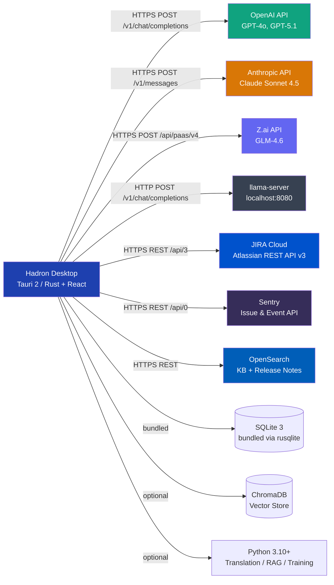
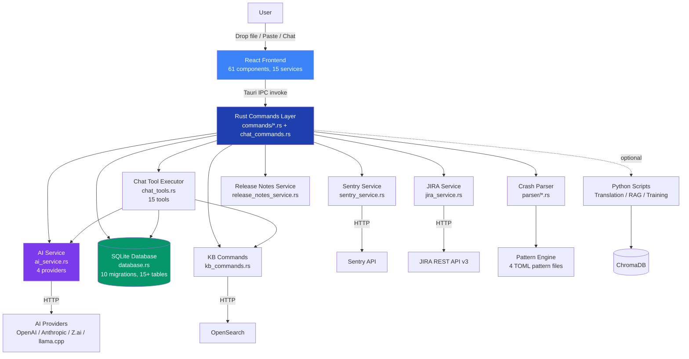
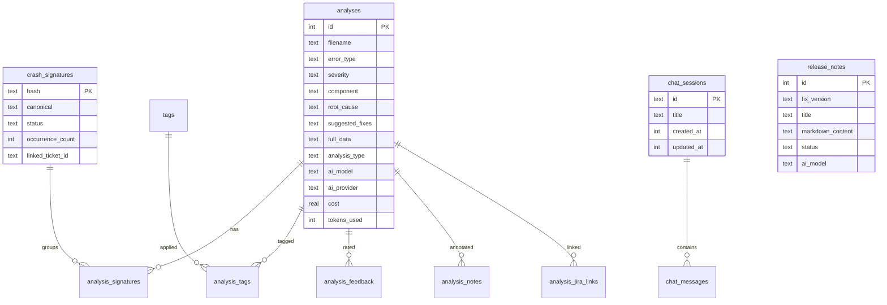
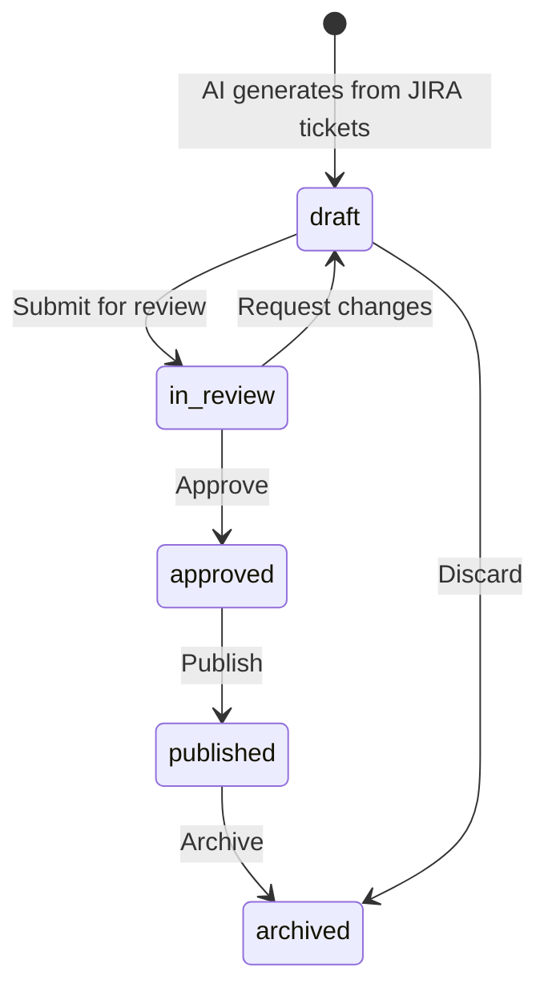
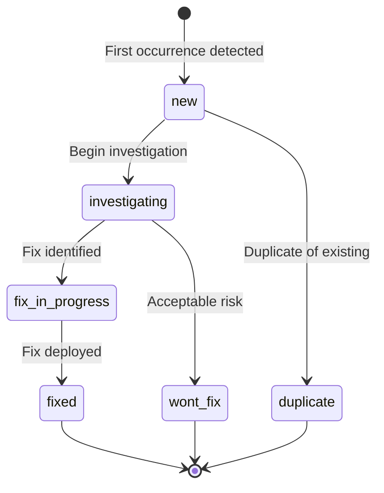

# Hadron 4.0.1 — Forensic System Manual

> **"Analyze the system as a living organism within an ecosystem."**

**Version**: 4.0.1 | **Architecture**: Tauri 2 (Rust) + React 18/TypeScript + Python 3.10+ | **License**: Proprietary (MediaGeniX)

---

## Chapter 1: Onboarding & Environment

### Time-to-Value Guide

Hadron is an AI-powered support assistant for the WHATS'ON broadcast management system. From zero configuration to your first crash analysis takes under 5 minutes.

**Prerequisites**:
- Windows 10/11 (x64), macOS 10.15+ (Intel/Apple Silicon), or Linux (Debian/Ubuntu)
- 4 GB RAM minimum, 8 GB recommended
- Internet connection (unless using llama.cpp for offline mode)

### Step 1: Install

| Platform | Package | Command |
|----------|---------|---------|
| **Windows** | `.msi` installer | Double-click, follow wizard |
| **macOS Intel** | `_x64.dmg` | Drag to Applications, right-click > Open first time |
| **macOS ARM** | `_aarch64.dmg` | Drag to Applications, right-click > Open first time |
| **Linux (deb)** | `_amd64.deb` | `sudo dpkg -i hadron-desktop_4.0.1_amd64.deb` |
| **Linux (AppImage)** | `_amd64.AppImage` | `chmod +x *.AppImage && ./*.AppImage` |

### Step 2: Configure AI Provider

1. Launch Hadron. The splash screen appears, then the main interface.
2. Click **Settings** (gear icon, top-right) or press `Ctrl+,`.
3. Select an AI provider and enter your API key.

### Authentication & Credential Flows

Hadron uses **OS-level encrypted storage** (macOS Keychain / Windows Credential Manager / Linux Secret Service) for all API keys. Keys are never logged or transmitted to Hadron servers.

| Credential | Flow | Where to Obtain |
|------------|------|-----------------|
| **OpenAI API Key** | Stored encrypted via Tauri Store plugin | [platform.openai.com/api-keys](https://platform.openai.com/api-keys) |
| **Anthropic API Key** | Stored encrypted via Tauri Store plugin | [console.anthropic.com](https://console.anthropic.com) |
| **Z.ai API Key** | Stored encrypted via Tauri Store plugin | [z.ai](https://z.ai) |
| **llama.cpp** | No key needed (local) | Run `llama-server -m model.gguf --host 127.0.0.1 --port 8080` |
| **JIRA API Token** | Basic Auth (email + token), stored encrypted | [id.atlassian.com/manage-profile/security/api-tokens](https://id.atlassian.com/manage-profile/security/api-tokens) |
| **Sentry Auth Token** | Bearer token, stored encrypted | Sentry > Settings > Auth Tokens (scope: `project:read`, `event:read`) |
| **OpenSearch** | Username + password, stored encrypted | Your OpenSearch cluster admin |

!!! Warning "Security"
API keys are cleared from memory after use via the `zeroize` crate. They are never written to log files.

### Configuration Reference

All settings are managed through the **Settings** panel (no `.env` files for end users). The Rust backend reads settings from frontend requests or encrypted Tauri Store.

#### AI Provider Settings

| Setting | Default | Description | Required |
|---------|---------|-------------|----------|
| `provider` | `openai` | AI provider: `openai`, `anthropic`, `zai`, `llamacpp` | Y |
| `api_key` | (none) | Provider API key (not needed for llamacpp) | Y* |
| `model` | Provider default | Model identifier (e.g., `gpt-4o`, `claude-sonnet-4-5-20250929`) | Y |

#### JIRA Settings

| Setting | Default | Description | Required |
|---------|---------|-------------|----------|
| `jira_base_url` | (none) | e.g., `https://yourcompany.atlassian.net` | Y |
| `jira_email` | (none) | Atlassian account email | Y |
| `jira_api_token` | (none) | API token from Atlassian | Y |
| `jira_project_key` | (none) | Default project key (e.g., `PSI`) | N |

#### Sentry Settings

| Setting | Default | Description | Required |
|---------|---------|-------------|----------|
| `sentry_base_url` | `https://sentry.io` | Sentry instance URL | Y |
| `sentry_auth_token` | (none) | Bearer auth token | Y |
| `sentry_org` | (none) | Organization slug | Y |
| `sentry_project` | (none) | Project slug | Y |

#### OpenSearch (Knowledge Base) Settings

| Setting | Default | Description | Required |
|---------|---------|-------------|----------|
| `opensearch_url` | (none) | OpenSearch endpoint URL | Y |
| `opensearch_username` | (none) | Username for Basic Auth | N |
| `opensearch_password` | (none) | Password | N |

#### Python Environment Variables (Advanced/Development)

| Variable | Default | Description |
|----------|---------|-------------|
| `HADRON_EMBEDDING_MODEL` | `text-embedding-3-small` | OpenAI embedding model |
| `HADRON_EMBEDDING_DIMENSION` | `1536` | Embedding vector dimension |
| `HADRON_CHROMA_DIR` | `~/.hadron/chroma` | Chroma vector store directory |
| `HADRON_CHROMA_COLLECTION` | `hadron_analyses` | Collection name |
| `HADRON_DATABASE_PATH` | OS-specific app data | SQLite database path |
| `HADRON_API_PORT` | `8000` | Python API server port |
| `HADRON_API_MASTER_KEY` | (none) | Master key for Python API admin access |
| `HADRON_OFFLINE_MODE` | `hybrid` | Offline mode: `disabled`, `hybrid`, `full` |
| `LLAMACPP_HOST` | `http://localhost:8080` | llama.cpp server URL |

### External Dependencies



**Version requirements**:
- Rust stable (latest), Node.js >= 18, Python >= 3.10 (optional)
- SQLite: bundled via `rusqlite 0.30` (no external install)
- ChromaDB >= 1.0 (optional, for RAG vector storage)
- llama.cpp `llama-server` (optional, for offline mode)

---

## Chapter 2: System Architecture & Ontology

### Glossary of Terms

| Term | Implementation Definition |
|------|--------------------------|
| **Analysis** | A crash log processing result stored in SQLite. Contains error_type, severity, root_cause, suggested_fixes, component, stack_trace, and full AI response (full_data JSON). |
| **Quick Analysis** | Fast crash-focused analysis (5-10s). Identifies crash, root cause, and fix. |
| **Comprehensive (WHATS'ON) Analysis** | Full deep-scan analysis (30-60s). 10-part structured report with user scenario, impact, test scenarios, reproduction steps. |
| **Crash Signature** | A 12-character SHA-256 hash derived from error_type + component + top stack frames. Used for deduplication and grouping. |
| **Gold Analysis** | Expert-verified analysis promoted from the feedback system. Used as ground truth for RAG retrieval. |
| **Ask Hadron** | Agentic AI chatbot with a tool-calling loop. The LLM decides which tools to invoke (up to 8 iterations). |
| **Tool** | A function the Ask Hadron agent can call: `search_analyses`, `search_kb`, `search_jira`, etc. (15 tools total). |
| **RRF (Reciprocal Rank Fusion)** | Multi-query search merging algorithm. Generates query variants, runs them in parallel, merges results by reciprocal rank. |
| **RAG (Retrieval-Augmented Generation)** | Enhances AI analysis by retrieving similar past cases from Chroma vector store + SQLite FTS5. |
| **Knowledge Base (KB)** | WHATS'ON documentation and release notes indexed in OpenSearch, searchable via KNN vectors. |
| **Circuit Breaker** | Frontend resilience pattern. If a provider fails 3 times, it's disabled for 60 seconds and traffic fails over to the next provider. |
| **Feedback Loop** | User accept/reject/rating signals on analyses. Positive feedback boosts search ranking; negative feedback suppresses. |
| **Release Notes** | AI-generated release notes from JIRA fix versions. Lifecycle: `draft` -> `in_review` -> `approved` -> `published`. |
| **Pattern Detection** | Automated analysis of Sentry issues for known anti-patterns: Deadlocks, N+1 Queries, Memory Leaks, Unhandled Promises. |

### Visual Topology



### Database Schema (10 Migrations)



**Tables by migration**:

| Migration | Tables Created | Purpose |
|-----------|---------------|---------|
| 001 | `analyses`, `analyses_fts` | Core crash analyses with FTS5 full-text search |
| 003 | `translations`, `translations_fts` | Code/error explanations |
| 004 | `crash_signatures`, `analysis_signatures`, `signature_relationships` | Crash deduplication and grouping |
| 005 | `tags`, `analysis_tags`, `translation_tags`, `archived_analyses`, `analysis_notes` | History enhancements |
| 006 | `analysis_feedback`, `gold_analyses`, `retrieval_chunks` | Intelligence platform (feedback, RAG) |
| 007 | `analysis_jira_links` | JIRA ticket linking |
| 008 | `chat_feedback` | Ask Hadron response ratings |
| 009 | `chat_sessions`, `chat_messages` | Persistent chat sessions |
| 010 | `release_notes` | AI-generated release notes |

### State Analysis — Release Notes Lifecycle



### State Analysis — Crash Signature Status



### Architectural Rationale

- **Tauri 2 over Electron**: Chosen for sub-50MB installer size and native Rust performance. The Rust backend handles all AI calls, parsing, and database operations — no JavaScript on the critical path.
- **SQLite with FTS5**: Embedded database eliminates infrastructure requirements. FTS5 provides BM25-ranked full-text search without external search services. The `porter unicode61` tokenizer handles technical terms well.
- **Multi-provider AI with ProviderConfig**: The `ProviderConfig` struct abstracts provider differences. `AuthStyle::Bearer` (OpenAI, Anthropic), `AuthStyle::ZaiHeader` (Z.ai), `AuthStyle::None` (llama.cpp). `ResponseStyle::OpenAI` is reused by llama.cpp since it exposes an OpenAI-compatible API — a key architectural simplification.
- **Agentic tool-calling loop**: The Ask Hadron chatbot uses a `while` loop (max 8 iterations). Each iteration: call LLM with tools -> if LLM returns tool_calls, execute them, append results -> repeat. This gives the LLM agency to decide what information it needs.
- **Circuit Breaker pattern**: The frontend wraps API calls in a circuit breaker. After 3 consecutive failures, the provider is marked "open" for 60 seconds, allowing automatic failover to backup providers.
- **Feedback-boosted retrieval**: User accept/reject signals modify search ranking. Accepted analyses get a 1.2x score multiplier; rejected get 0.7x. This creates a learning loop where the system gets better at surfacing relevant results over time.

---

## Chapter 3: Recipe Gallery (How-To Guides)

### How to Analyze a Crash Log

1. **Drag and drop** a `.log`, `.txt`, or `.crash` file onto the main window (or click **Choose File** / **Paste Log Text**).
2. Select analysis type:
   - **Quick Analysis** — 5-10 seconds, crash-focused
   - **Comprehensive (WHATS'ON)** — 30-60 seconds, full 10-part report
3. Watch the progress bar. The analysis pipeline: Parse -> Pattern Match -> AI Analysis -> Store.
4. Review results: Summary, Root Cause, Suggested Fixes, Severity, Component.
5. Optionally: **Export** (Markdown/HTML/JSON), **Create JIRA Ticket**, or **Re-analyze** with a different provider.

### How to Use Ask Hadron (Agentic Chatbot)

1. Click the **Ask Hadron** tab in the sidebar.
2. Type a question or select a **starter prompt**:
   - "What are the most common crashes this week?"
   - "Find crashes related to database timeouts"
   - "What components have the most issues?"
   - "Summarize recent crash trends"
3. If you have an analysis selected, **contextual starters** appear:
   - "Explain this crash in simple terms"
   - "Find similar crashes to this one"
   - "What JIRA tickets relate to this crash?"
   - "Suggest a fix for this issue"
4. Watch the **tool activity** panel to see which tools the agent invokes.
5. **Rate responses** with thumbs up/down to improve future retrieval.

### How to Connect JIRA

1. Go to **Settings** > scroll to **JIRA Integration**.
2. Enter:
   - **Base URL**: `https://yourcompany.atlassian.net` (include `https://`)
   - **Email**: Your Atlassian account email
   - **API Token**: Generate at [Atlassian API Tokens](https://id.atlassian.com/manage-profile/security/api-tokens)
   - **Project Key** (optional): Default project for ticket creation (e.g., `PSI`)
3. Click **Test Connection** — should show "Connected successfully."
4. JIRA tools become available in Ask Hadron: `search_jira`, `create_jira_ticket`.

### How to Connect Sentry

1. Go to **Settings** > scroll to **Sentry Integration**.
2. Enter:
   - **Base URL**: `https://sentry.io` (or your self-hosted URL)
   - **Auth Token**: Generate at Sentry > Settings > Auth Tokens (needs `project:read`, `event:read`)
   - **Organization**: Your org slug
   - **Project**: Your project slug
3. Click **Test Connection**.
4. Switch to the **Sentry Analyzer** tab to browse and analyze production errors.

### How to Generate Release Notes

1. Ensure JIRA is configured (release notes pull from JIRA fix versions).
2. Click the **Release Notes** tab in the sidebar.
3. In the **Generate** sub-tab, select a JIRA fix version.
4. Click **Generate** — AI creates draft release notes from the tickets.
5. Switch to the **Review** sub-tab to edit, check against the style guide, and review AI insights.
6. Move through the lifecycle: Draft -> In Review -> Approved -> Published.

### How to Use llama.cpp for Offline Mode

1. Download a GGUF model (e.g., `llama-3.2-3b-instruct.Q4_K_M.gguf`).
2. Start the server:
   ```bash
   llama-server -m model.gguf --host 127.0.0.1 --port 8080
   ```
3. In Hadron Settings, select **llama.cpp (Local)** as the provider.
4. No API key is needed — the app connects to `http://127.0.0.1:8080/v1/chat/completions`.

### How to Set Up RAG (Retrieval-Augmented Generation)

1. Install Python dependencies: `pip install -r python/requirements.txt`
2. Ensure `OPENAI_API_KEY` is set (for embedding generation).
3. The RAG system uses Chroma (vector store at `~/.hadron/chroma`) + SQLite FTS5.
4. Enable **Use RAG** in the analysis options to enhance crash analysis with similar past cases.

### How to Rotate API Keys

1. Go to **Settings** > select the provider.
2. Clear the existing key.
3. Paste the new key.
4. Click **Save Settings**. The old key is immediately cleared from memory.

!!! Note "Key Rotation"
There is no key versioning — the new key replaces the old one immediately.

### Security & i18n Audit

!!! Warning "Security: Sensitive Variable Logging"
The codebase uses `zeroize` for API key clearing and never logs API keys. However, the Python `analyze_json.py` receives API keys via command-line arguments or stdin JSON — ensure the process list is not visible to untrusted users in shared environments.

!!! Note "Internationalization (i18n)"
The UI is English-only. No locale files or i18n framework is present. All user-facing strings are hardcoded in React components. ARIA labels are present on interactive elements (buttons, inputs) via semantic HTML and lucide-react icons with `title` attributes.

---

## Chapter 4: Technical Reference & Fragility Map

### AI Service — Provider Configuration

| Provider | Endpoint | Auth Style | Response Format | Cost Model |
|----------|----------|------------|-----------------|------------|
| **OpenAI** | `https://api.openai.com/v1/chat/completions` | Bearer token | OpenAI JSON | Per-token pricing |
| **Anthropic** | `https://api.anthropic.com/v1/messages` | x-api-key header | Anthropic JSON | Per-token pricing |
| **Z.ai** | `https://api.z.ai/api/paas/v4/chat/completions` | Authorization header | OpenAI JSON | Flat-rate ($3/mo) |
| **llama.cpp** | `http://127.0.0.1:8080/v1/chat/completions` | None | OpenAI JSON | Free (local) |

### Ask Hadron — Complete Tool Reference

| Tool | Parameters | Side Effects | Purpose |
|------|------------|--------------|---------|
| `search_analyses` | `query` (str), `severity` (opt str) | Reads DB | Multi-query RRF search across crash analyses |
| `search_kb` | `query` (str) | HTTP to OpenSearch | Search WHATS'ON knowledge base |
| `get_analysis_detail` | `id` (int) | Reads DB | Fetch full analysis by ID |
| `find_similar_crashes` | `analysis_id` (int), `limit` (opt int) | Reads DB | Find similar crashes by signature and error type |
| `get_crash_signature` | `analysis_id` (int) | Reads DB | Get signature hash, canonical form, occurrence count |
| `get_top_signatures` | `limit` (opt int) | Reads DB | Top crash signatures by frequency |
| `get_trend_data` | `days` (opt int) | Reads DB | Severity trends over time |
| `get_error_patterns` | `limit` (opt int) | Reads DB | Most common error patterns |
| `get_statistics` | (none) | Reads DB | Total analyses, severity breakdown, top components |
| `correlate_crash_to_jira` | `analysis_id` (int) | Reads DB | Find linked JIRA tickets for a crash |
| `get_crash_timeline` | `analysis_id` (int) | Reads DB | Timeline of related crashes |
| `compare_crashes` | `analysis_id_a`, `analysis_id_b` (int) | Reads DB | Side-by-side crash comparison |
| `get_component_health` | `component` (str) | Reads DB | Component crash stats, trends, linked JIRA tickets |
| `search_jira` | `query` (str), `max_results` (opt int) | HTTP to JIRA | Search JIRA issues by JQL or text |
| `create_jira_ticket` | `project_key`, `summary`, `description`, `issue_type`, `priority` | HTTP POST to JIRA | Create a new JIRA ticket |

### Volatility Index

#### Pure Functions (Safe to refactor)
| Function | Module | Notes |
|----------|--------|-------|
| `map_priority_to_id()` | `jira_service.rs` | Maps priority string to JIRA ID |
| `create_auth_header()` | `jira_service.rs` | Base64 encodes credentials |
| `truncate()` | `chat_tools.rs` | String truncation utility |
| `normalize_query()` | `sentry_service.rs` | Normalizes SQL queries for N+1 detection |
| `cosine_similarity()` | `python/rag/embeddings.py` | Pure math, no I/O |
| `generate_query_variants()` | `chat_tools.rs` | Generates search variants (calls AI, but stateless) |
| `reciprocal_rank_fusion()` | `chat_tools.rs` | Merges ranked result lists |

#### High Volatility (Landmines - touch with care)
| Function | Module | Side Effects |
|----------|--------|--------------|
| `run_migrations()` | `migrations.rs` | Mutates database schema, runs in transaction |
| `call_provider_streaming()` | `ai_service.rs` | HTTP streaming, emits SSE events to frontend |
| `execute_tool()` | `chat_tools.rs` | Dispatches to 15 different handlers with DB/HTTP side effects |
| `save_analysis()` | `database.rs` | Writes to SQLite + triggers FTS5 sync |
| `create_jira_ticket()` | `jira_service.rs` | Creates a ticket in external JIRA system (irreversible) |
| `chat_send_message()` | `chat_commands.rs` | Agentic loop: up to 8 LLM calls + tool executions per invocation |
| `detect_sentry_patterns()` | `sentry_service.rs` | Reads global state (event data), pattern matching heuristics |

### Sentry Pattern Detection Engine

| Pattern | Detection Method | Confidence |
|---------|-----------------|------------|
| **Deadlock** | Keywords: "deadlock", "lock timeout", "40p01" in title/message/exceptions/tags | 0.7-0.9 |
| **N+1 Query** | 3+ repeated DB query patterns in breadcrumbs, or "n+1" in title | 0.6-0.85 |
| **Memory Leak** | Keywords: "out of memory", "oom", "heap exhausted", "gc overhead limit" | 0.6-0.9 |
| **Unhandled Promise** | Keywords: "unhandledrejection", "unhandled promise" in title/exceptions | 0.65-0.9 |

### Crash Log Parser

The Rust parser (`parser/`) extracts structured data from Smalltalk/VisualWorks crash logs:

| Section | What It Extracts |
|---------|-----------------|
| **Header** | Version, timestamp, OS info |
| **Exception** | Error type, error message |
| **Stack Trace** | Method calls, class names, line numbers |
| **Memory** | Memory state, heap info |
| **Database** | DB connection state |
| **Context** | Environment variables, runtime info |

**TOML Pattern Files** (`src-tauri/data/patterns/`):
- `null_errors.toml` — 106 lines of null/nil reference patterns
- `collection_errors.toml` — 98 lines of collection/array error patterns
- `database_errors.toml` — 149 lines of DB connection/query patterns
- `whatson_specific.toml` — 193 lines of WHATS'ON-specific patterns

### Deprecation Radar

| Item | Status | Migration Path |
|------|--------|---------------|
| Ollama provider | **Removed in 4.0** | Use `llamacpp` provider instead (OpenAI-compatible API) |
| `analysis_type: "complete"` | Legacy alias | Use `"comprehensive"` or `"quick"` |
| `analysis_type: "whatson"` | Legacy alias | Use `"comprehensive"` |
| `analysis_type: "specialized"` | Legacy alias | Use `"quick"` |
| localStorage chat sessions | **Removed in 4.0** | Sessions now stored in SQLite |
| `APP_VERSION` constant | Fixed in 4.0.1 | Now reads `4.0.1` from `src/constants/version.ts` |

---

## Chapter 5: Operations & Observability

### Database Location

```
Windows: %APPDATA%/com.hadron.desktop/analysis.db
macOS:   ~/Library/Application Support/com.hadron.desktop/analysis.db
Linux:   ~/.local/share/com.hadron.desktop/analysis.db
```

### Log Files

```
Windows: %APPDATA%/com.hadron.desktop/logs/
macOS:   ~/Library/Logs/com.hadron.desktop/
Linux:   ~/.local/share/com.hadron.desktop/logs/
```

**Python logs** (when running the API server):
- Structured JSON format with 10MB rotation, 5 backups
- Includes: analysis tracking, cost tracking, API call durations

### Health Check & Console

Press `Ctrl+Y` to open the **Console Viewer**, which shows:
- API requests and responses
- Parsing progress
- Error details and stack traces
- AI token usage and cost estimates

### Performance Analysis

**Potential Bottlenecks**:

| Area | Risk | Mitigation |
|------|------|------------|
| Large crash logs (>1MB) | Slow parsing + high token cost | Smart truncation: keeps first 50% + last 25%, adds notice |
| Multi-query RRF search | N+1 DB queries (one per variant) | Runs queries in parallel via `tokio::task::spawn_blocking` |
| Agentic loop (Ask Hadron) | Up to 8 sequential LLM calls | Each iteration uses non-streaming for tool parsing; only final response is streamed |
| SQLite FTS5 re-indexing | Slow on large datasets | Triggers maintain FTS in sync with base table; no manual rebuild needed |
| Chroma vector search | Memory-intensive for large collections | HNSW index with cosine similarity; pagination via `top_k` parameter |

### Keyboard Shortcuts

| Shortcut | Action |
|----------|--------|
| `Ctrl+N` | New analysis |
| `Ctrl+H` | Open History |
| `Ctrl+,` | Open Settings |
| `Ctrl+Y` | Open Console Viewer |
| `Esc` | Close current panel/modal |

### Export Formats

| Format | Use Case | Includes |
|--------|----------|----------|
| **Markdown** | Documentation, wikis, GitHub issues | Full analysis with formatting |
| **HTML** | Browser viewing, email sharing | Styled report with syntax highlighting |
| **JSON** | Integrations, automation | Raw structured data |

### Troubleshooting Quick Reference

| Symptom | Likely Cause | Fix |
|---------|-------------|-----|
| "All AI providers failed" | Missing or invalid API key | Settings > re-enter API key |
| WHATS'ON analysis shows empty | AI response parsing failed | Retry; check Console (`Ctrl+Y`) for details |
| "Python script not found" | Missing Python bundle | Reinstall; core features work without Python |
| App doesn't start | Corrupted config | Delete `%APPDATA%/com.hadron.desktop/`, restart |
| History empty | Database missing or corrupted | Settings > Database Administration > Verify/Repair |
| JIRA "Connection failed" | URL missing `https://` or wrong token | Check JIRA Settings, test connection |
| Sentry "Access denied" | Token missing required scopes | Regenerate token with `project:read`, `event:read` |
| Slow performance | Large history, system resources | Cleanup old records, use Quick Analysis for triage |

### Institutional Gaps

The following features are referenced in the codebase but not yet fully implemented:

| Gap | Evidence | Status |
|-----|----------|--------|
| Auto-updater | `updater.active: false` in tauri.conf.json, no pubkey configured | Disabled; requires code signing setup |
| Keeper Secrets Manager | `keeper-secrets-manager-core` in Cargo.toml, `keeper_secrets.py` | SDK integrated but no production deployment guide |
| Python API server | `python/api/main.py` — full FastAPI service | Functional but not started automatically by the desktop app |
| RAG embedding pipeline | Chroma store + embeddings code complete | Requires manual setup (`pip install chromadb`) |
| Training pipeline | QLoRA fine-tuning scripts present | Requires GPU hardware and manual execution |
| `APP_VERSION` constant | `src/constants/version.ts` updated to `4.0.1` | Resolved |

---

## Appendix: Technology Stack

| Layer | Technology | Version |
|-------|-----------|---------|
| Desktop framework | Tauri | 2.x |
| Backend language | Rust | 2021 edition |
| Frontend framework | React | 18.2 |
| Frontend language | TypeScript | 5.2 |
| CSS framework | Tailwind CSS | 3.3 |
| Build tool | Vite | 6.4 |
| Database | SQLite (bundled) | via rusqlite 0.30 |
| HTTP client | reqwest | 0.11 |
| Serialization | serde + serde_json | 1.0 |
| Template engine | MiniJinja | 2.0 |
| Icon library | Lucide React | 0.294 |
| Markdown renderer | react-markdown + remark-gfm | 10.1 / 4.0 |
| Python AI clients | openai, anthropic | >= 1.0, >= 0.9 |
| Vector store | ChromaDB | >= 1.0 |
| Embeddings | OpenAI text-embedding-3-small | 1536 dims |

---

*Generated for Hadron 4.0.1 — AI Support Assistant*
*Last updated: 2026-02-13*
