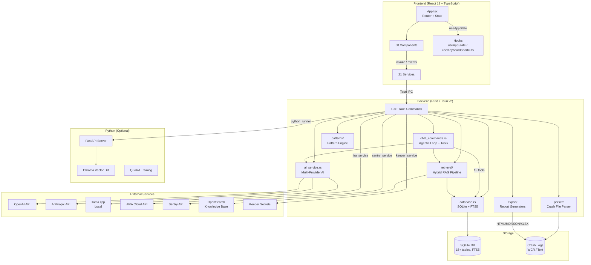
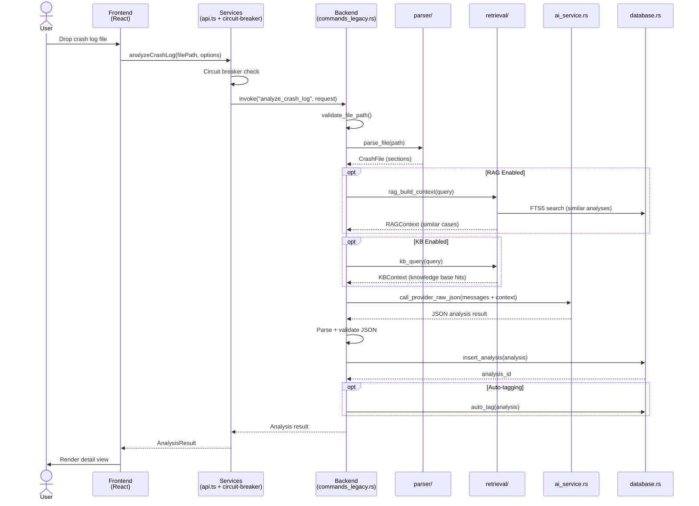
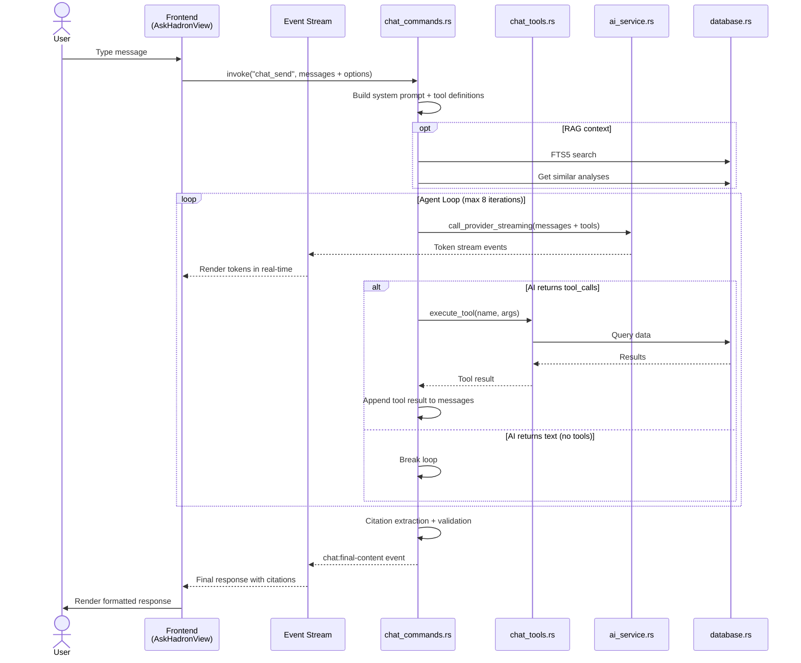

# Hadron Desktop — Technical Specification

**Version:** 4.2.0
**Stack:** Rust/Tauri v2 + React 18/TypeScript + Python 3.10+ (optional)
**Generated:** 2025-02-24

---

## 1. Directory Tree

```
hadron-desktop/
├── src/                              (Frontend — React 18 + TypeScript)
│   ├── App.tsx                       # Root orchestrator: routing, state, lazy loading
│   ├── main.tsx                      # Vite entry point (main window)
│   ├── widget.tsx                    # Vite entry point (widget window)
│   ├── components/                   # 68 UI components
│   │   ├── widget/                   #   Floating widget subsystem (FAB, panel, chat)
│   │   ├── jira/                     #   JIRA integration views (10 components)
│   │   ├── sentry/                   #   Sentry integration views (12 components)
│   │   ├── release-notes/            #   Release notes lifecycle (8 components)
│   │   ├── whatson/                   #   Enhanced crash analysis tabs (9 components)
│   │   ├── ui/                       #   Reusable primitives (Button, Modal, TabBar)
│   │   └── *.tsx                     #   Core views (FileDropZone, HistoryView, etc.)
│   ├── services/                     # 21 service modules
│   │   ├── api.ts                    #   Tauri invoke wrappers (all backend commands)
│   │   ├── chat.ts                   #   Ask Hadron streaming chat
│   │   ├── circuit-breaker.ts        #   Provider failover with error-rate tracking
│   │   ├── cache.ts                  #   TTL-based result caching
│   │   ├── jira.ts                   #   JIRA config & ticket management
│   │   ├── sentry.ts                #   Sentry issue fetching
│   │   ├── rag.ts                    #   RAG context retrieval
│   │   ├── secure-storage.ts         #   Encrypted API key storage
│   │   └── *.ts                      #   Logger, updater, signatures, etc.
│   ├── hooks/                        # Custom React hooks
│   │   ├── useAppState.ts            #   Centralized useReducer state (40+ actions)
│   │   ├── useKeyboardShortcuts.ts   #   Global hotkeys (Ctrl+N/H/,/Y)
│   │   └── useDebounce.ts            #   Input debouncing
│   ├── types/                        # TypeScript type definitions
│   ├── constants/                    # App version, config keys
│   └── utils/                        # Error detection, severity, parsing helpers
│
├── src-tauri/                        (Backend — Rust + Tauri v2)
│   └── src/
│       ├── main.rs                   # Entry point: Tauri builder, plugin/command registration
│       ├── error.rs                  # HadronError enum + CommandResult<T> type alias
│       ├── database.rs              # SQLite wrapper (50+ query methods, WAL mode)
│       ├── migrations.rs            # 13-version schema migration system
│       ├── ai_service.rs            # Multi-provider AI (OpenAI, Anthropic, Z.ai, llama.cpp)
│       ├── chat_commands.rs         # Ask Hadron agentic loop (tool calling, streaming)
│       ├── chat_tools.rs            # 15 chat tool definitions + executors
│       ├── commands/                # Modular command handlers (20 files)
│       │   ├── crud.rs              #   CRUD operations
│       │   ├── search.rs            #   FTS5 full-text search
│       │   ├── tags.rs              #   Tag management + auto-tagging
│       │   ├── archive.rs           #   Soft archive/restore
│       │   ├── export.rs            #   Multi-format report generation
│       │   ├── jira.rs              #   JIRA ticket linking
│       │   ├── sentry.rs            #   Sentry integration commands
│       │   ├── intelligence.rs      #   Gold analysis + feedback tracking
│       │   ├── performance.rs       #   Performance trace analysis
│       │   ├── release_notes.rs     #   Release notes lifecycle
│       │   └── *.rs                 #   Patterns, signatures, bulk ops, etc.
│       ├── commands_legacy.rs       # Legacy command handlers (being migrated)
│       ├── parser/                  # Crash log parsing engine
│       │   ├── crash_file.rs        #   Main parser (WCR + text formats)
│       │   └── sections/            #   Section parsers (header, exception, stack, etc.)
│       ├── patterns/                # Pattern matching engine
│       │   ├── engine.rs            #   Match orchestrator
│       │   ├── library/builtin.rs   #   30+ built-in crash patterns
│       │   └── matchers/            #   Exception, stack, context, DB matchers
│       ├── retrieval/               # Hybrid search/RAG pipeline
│       │   ├── hybrid_analysis.rs   #   FTS5 analysis search
│       │   ├── hybrid_kb.rs         #   OpenSearch KB + release notes
│       │   ├── query_planner.rs     #   LLM-driven query rewriting
│       │   ├── rrf.rs               #   Reciprocal Rank Fusion
│       │   ├── citation.rs          #   Citation extraction + validation
│       │   ├── evidence_gate.rs     #   Evidence sufficiency scoring
│       │   └── cache.rs             #   Embedding cache (LRU, 24h TTL)
│       ├── export/                  # Report generation
│       │   └── generators/          #   HTML, Markdown, JSON, TXT, XLSX
│       ├── jira_service.rs          # JIRA REST API v2/v3 client
│       ├── sentry_service.rs        # Sentry REST API client
│       ├── keeper_service.rs        # Keeper Secrets Manager SDK
│       ├── release_notes_service.rs # AI-powered release notes
│       ├── widget_commands.rs       # Widget window operations (serialized via WidgetLock)
│       ├── signature.rs             # Crash signature hashing/deduplication
│       ├── python_runner.rs         # Python subprocess execution
│       └── *.rs                     # Deep scan, chunker, token budget, etc.
│
├── python/                           (Optional Python modules)
│   ├── api/                          # FastAPI server (health, analyze, search, feedback)
│   ├── rag/                          # Chroma vector DB + hybrid BM25 retrieval
│   ├── offline/                      # llama.cpp offline analysis service
│   ├── training/                     # QLoRA fine-tuning pipeline
│   └── prompts/                      # Analysis prompt templates
│
├── docs/                             (Documentation)
├── index.html                        (Main window entry)
├── widget.html                       (Widget window entry)
├── package.json                      (Frontend dependencies)
├── vite.config.ts                    (Vite multi-page build config)
├── tailwind.config.js                (Tailwind CSS config)
└── tsconfig.json                     (TypeScript config)
```

---

## 2. Architecture Diagram



---

## 3. Data Flow

### 3a. Crash Analysis Flow



### 3b. Ask Hadron Chat Flow



---

## 4. API / Function Reference

### 4a. Tauri Commands — Analysis & CRUD

| Feature | File | Function/Route | Inputs | Outputs |
|---------|------|----------------|--------|---------|
| Analyze crash log | `commands_legacy.rs` | `analyze_crash_log` | `AnalyzeRequest` (file_path, api_key, model, provider, analysis_type, verbosity, redact_pii) | `Analysis` |
| Analyze JIRA ticket | `commands_legacy.rs` | `analyze_jira_ticket` | `JiraTicketAnalyzeRequest` | `Analysis` |
| Save external analysis | `commands_legacy.rs` | `save_external_analysis` | `ExternalAnalysisRequest` | `Analysis` |
| Get all analyses | `commands/crud.rs` | `get_all_analyses` | — | `Vec<Analysis>` |
| Get paginated | `commands/crud.rs` | `get_analyses_paginated` | `limit?, offset?` | `Vec<Analysis>` |
| Get by ID | `commands/crud.rs` | `get_analysis_by_id` | `id: i64` | `Analysis` |
| Get count | `commands/crud.rs` | `get_analyses_count` | — | `i64` |
| Delete analysis | `commands/crud.rs` | `delete_analysis` | `id: i64` | `()` |
| Toggle favorite | `commands_legacy.rs` | `toggle_favorite` | `id: i64` | `bool` |
| Get favorites | `commands_legacy.rs` | `get_favorites` | — | `Vec<Analysis>` |
| Get recent | `commands_legacy.rs` | `get_recent` | `limit: i32` | `Vec<Analysis>` |
| Search (FTS5) | `commands/search.rs` | `search_analyses` | `query, severity_filter?` | `Vec<Analysis>` |
| Filtered search | `commands_legacy.rs` | `get_analyses_filtered` | `query, date_from?, date_to?, severity?, type?, component?` | `Vec<Analysis>` |
| DB statistics | `commands_legacy.rs` | `get_database_statistics` | — | `DatabaseStatistics` |

### 4b. Tauri Commands — Tags

| Feature | File | Function/Route | Inputs | Outputs |
|---------|------|----------------|--------|---------|
| Create tag | `commands/tags.rs` | `create_tag` | `name, color` | `Tag` |
| Update tag | `commands/tags.rs` | `update_tag` | `id, name?, color?` | `Tag` |
| Delete tag | `commands/tags.rs` | `delete_tag` | `id: i64` | `()` |
| Get all tags | `commands/tags.rs` | `get_all_tags` | — | `Vec<Tag>` |
| Add tag to analysis | `commands/tags.rs` | `add_tag_to_analysis` | `analysis_id, tag_id` | `()` |
| Remove tag | `commands/tags.rs` | `remove_tag_from_analysis` | `analysis_id, tag_id` | `()` |
| Auto-tag all | `commands/tags.rs` | `auto_tag_analyses` | — | `{ tagged, skipped }` |

### 4c. Tauri Commands — Chat (Ask Hadron)

| Feature | File | Function/Route | Inputs | Outputs |
|---------|------|----------------|--------|---------|
| Send message | `chat_commands.rs` | `chat_send` | `messages, options (useRag, useKb, requestId, verbosity)` | `String` |
| Save session | `commands/summaries.rs` | `chat_save_session` | `ChatSession` | `i64` |
| List sessions | `commands/summaries.rs` | `chat_list_sessions` | — | `Vec<ChatSession>` |
| Get messages | `commands/summaries.rs` | `chat_get_messages` | `session_id` | `Vec<ChatMessage>` |
| Delete session | `commands/summaries.rs` | `chat_delete_session` | `session_id` | `()` |
| Submit feedback | `commands_legacy.rs` | `chat_submit_feedback` | `session_id, message_id, type, reason?` | `()` |

### 4d. Chat Tools (15 tools in chat_tools.rs)

| Tool | Purpose | Data Source |
|------|---------|-------------|
| `search_analyses` | FTS5 search over past analyses | SQLite |
| `search_kb` | Knowledge base semantic search | OpenSearch |
| `search_jira` | Search JIRA issues by JQL | JIRA API |
| `create_jira_ticket` | Create a new JIRA issue | JIRA API |
| `find_similar_crashes` | Find analyses with similar signatures | SQLite |
| `get_analysis_detail` | Load full analysis by ID | SQLite |
| `get_trend_data` | Error trends over time | SQLite |
| `get_top_error_patterns` | Most frequent errors | SQLite |
| `get_crash_signatures` | Signature deduplication data | SQLite |
| `search_release_notes` | Search release notes | SQLite |
| `get_gold_answers` | Retrieve verified Q&A pairs | SQLite |
| `calculate` | Evaluate math expressions | In-memory |
| `get_current_date` | Return current date/time | System |
| `search_sentry_issues` | Search Sentry issues | Sentry API |
| `get_database_stats` | Database statistics | SQLite |

### 4e. Tauri Commands — Integrations

| Feature | File | Function/Route | Inputs | Outputs |
|---------|------|----------------|--------|---------|
| Test JIRA connection | `commands/jira.rs` | `test_jira_connection` | `base_url, email, api_token` | `JiraTestResponse` |
| List JIRA projects | `commands/jira.rs` | `list_jira_projects` | `base_url, email, api_token` | `Vec<JiraProjectInfo>` |
| Create JIRA ticket | `commands/jira.rs` | `create_jira_ticket` | `JiraCreateRequest` | `JiraCreateResponse` |
| Search JIRA issues | `commands/jira.rs` | `search_jira_issues` | `base_url, email, api_token, jql` | `Vec<JiraIssue>` |
| Test Sentry connection | `commands/sentry.rs` | `test_sentry_connection` | `org_slug, auth_token` | `SentryTestResponse` |
| List Sentry projects | `commands/sentry.rs` | `list_sentry_projects` | `org_slug, auth_token` | `Vec<SentryProject>` |
| List Sentry issues | `commands/sentry.rs` | `list_sentry_issues` | `project_id, auth_token` | `Vec<SentryIssue>` |
| Analyze Sentry issue | `commands/sentry.rs` | `analyze_sentry_issue` | `SentryAnalyzeRequest` | `Analysis` |
| Initialize Keeper | `commands/keeper.rs` | `initialize_keeper` | `url, client_id, client_secret` | `()` |
| List Keeper secrets | `commands/keeper.rs` | `list_keeper_secrets` | — | `KeeperSecretsListResult` |

### 4f. Tauri Commands — Export & Reports

| Feature | File | Function/Route | Inputs | Outputs |
|---------|------|----------------|--------|---------|
| Generate report | `commands/export.rs` | `generate_report` | `analysis_id, format, audience?, sections?` | `ReportResult` |
| Multi-format export | `commands/export.rs` | `generate_report_multi` | `analysis_id, formats[]` | `Vec<ReportResult>` |
| Preview report | `commands/export.rs` | `preview_report` | `analysis_id` | `String (HTML)` |
| Check PII | `commands/export.rs` | `check_sensitive_content` | `content` | `SensitiveContentResult` |
| Sanitize content | `commands/export.rs` | `sanitize_content` | `content, audience` | `String` |
| Get export formats | `commands/export.rs` | `get_export_formats` | — | `Vec<ExportFormat>` |

### 4g. Tauri Commands — Widget

| Feature | File | Function/Route | Inputs | Outputs |
|---------|------|----------------|--------|---------|
| Toggle widget | `widget_commands.rs` | `toggle_widget` | — | `()` |
| Show widget | `widget_commands.rs` | `show_widget` | — | `()` |
| Hide widget | `widget_commands.rs` | `hide_widget` | — | `()` |
| Resize widget | `widget_commands.rs` | `resize_widget` | `width, height` | `()` |
| Move widget | `widget_commands.rs` | `move_widget` | `x, y` | `()` |
| Get position | `widget_commands.rs` | `get_widget_position` | — | `WidgetPosition` |
| Focus main window | `widget_commands.rs` | `focus_main_window` | — | `()` |
| Is main visible | `widget_commands.rs` | `is_main_window_visible` | — | `bool` |

### 4h. Tauri Commands — Intelligence Platform

| Feature | File | Function/Route | Inputs | Outputs |
|---------|------|----------------|--------|---------|
| Submit feedback | `commands/intelligence.rs` | `submit_analysis_feedback` | `analysis_id, type, field_name?, values?, rating?, reason?` | `()` |
| Promote to gold | `commands/intelligence.rs` | `promote_to_gold` | `analysis_id` | `()` |
| Verify gold | `commands/intelligence.rs` | `verify_gold_analysis` | `gold_id` | `()` |
| Reject gold | `commands/intelligence.rs` | `reject_gold_analysis` | `gold_id, reason` | `()` |
| Export gold JSONL | `commands/intelligence.rs` | `export_gold_jsonl` | — | `String (JSONL)` |
| Save gold answer | `commands/gold_answers.rs` | `save_gold_answer` | `question, answer, component?, severity?` | `i64` |
| Search gold answers | `commands/gold_answers.rs` | `search_gold_answers_cmd` | `query` | `Vec<GoldAnswer>` |

### 4i. Tauri Commands — Release Notes

| Feature | File | Function/Route | Inputs | Outputs |
|---------|------|----------------|--------|---------|
| Generate release notes | `commands/release_notes.rs` | `generate_release_notes` | `jira_version, config` | `ReleaseNotes` |
| Preview tickets | `commands/release_notes.rs` | `preview_release_notes_tickets` | `jira_version` | `Vec<JiraIssue>` |
| Get release notes | `commands/release_notes.rs` | `get_release_notes` | `id` | `ReleaseNotes` |
| List release notes | `commands/release_notes.rs` | `list_release_notes` | — | `Vec<ReleaseNotes>` |
| Update status | `commands/release_notes.rs` | `update_release_notes_status` | `id, status` | `()` |
| Export release notes | `commands/release_notes.rs` | `export_release_notes` | `id, format` | `String` |

### 4j. Tauri Commands — Database Maintenance

| Feature | File | Function/Route | Inputs | Outputs |
|---------|------|----------------|--------|---------|
| Optimize FTS | `commands_legacy.rs` | `optimize_fts_index` | — | `()` |
| Check integrity | `commands_legacy.rs` | `check_database_integrity` | — | `bool` |
| Compact (VACUUM) | `commands_legacy.rs` | `compact_database` | — | `()` |
| Checkpoint WAL | `commands_legacy.rs` | `checkpoint_wal` | — | `()` |
| Get DB info | `commands_legacy.rs` | `get_database_info` | — | `DatabaseInfo` |

---

## 5. Developer Deep-Dive (Per Module)

### 5a. Frontend — Core

#### `App.tsx`
- **Purpose:** Root component that orchestrates all views, state, and modals.
- **Dependencies:** All lazy-loaded views, `useAppState`, `useKeyboardShortcuts`, all services.
- **Exports:** Default component rendered by `main.tsx`.
- **Key Logic:** Uses `useAppState` (useReducer) for centralized state with 40+ action types. Routes views via `currentView` state. Lazy-loads detail views (AnalysisDetailView, WhatsOnDetailView, AskHadronView) with Suspense boundaries. Listens for widget events (`widget:open-in-main`) to transfer conversations.

#### `hooks/useAppState.ts`
- **Purpose:** Centralized application state management via `useReducer`.
- **Dependencies:** React, service types.
- **Exports:** `useAppState()` hook returning state + 30+ memoized action creators.
- **Key Logic:** Single reducer handles navigation, analysis lifecycle, batch processing, code analysis, error display, theme, and export dialogs. Each action is a distinct type with typed payload. State includes `isInitializing`, `currentView`, `analyzing`, `analysisResult`, `selectedAnalysis`, `batchProgress`, `error`, etc.

#### `services/api.ts`
- **Purpose:** Tauri IPC wrapper for all backend commands.
- **Dependencies:** `@tauri-apps/api/core` (invoke).
- **Exports:** 40+ async functions: `analyzeCrashLog`, `getAllAnalyses`, `searchAnalyses`, `getDatabaseStatistics`, etc.
- **Key Logic:** Each function calls `invoke()` with the corresponding Tauri command name and parameters. Handles type conversion between frontend types and Rust types. Provider/model management via `getStoredProvider()` / `getStoredModel()` using localStorage.

#### `services/circuit-breaker.ts`
- **Purpose:** Automatic provider failover when API calls fail.
- **Dependencies:** Internal state tracking.
- **Exports:** `circuitBreaker.call()`, `circuitBreaker.getState()`.
- **Key Logic:** Tracks error rates per provider (50% threshold). States: closed (normal), open (failing, skip), half-open (testing recovery). Automatic fallback to alternative providers. 5-minute timeout for deep scan operations.

#### `services/chat.ts`
- **Purpose:** Ask Hadron chat session management and event streaming.
- **Dependencies:** `@tauri-apps/api/core`, `@tauri-apps/api/event`.
- **Exports:** `sendChatMessage`, `cancelChat`, `subscribeToChatStream`, `subscribeToChatToolUse`, `subscribeToChatDiagnostics`, `subscribeToChatFinalContent`, session CRUD functions.
- **Key Logic:** `sendChatMessage` invokes `chat_send` while frontend subscribes to Tauri events for real-time streaming. Events: `chat:stream` (tokens), `chat:tool-use` (tool invocations), `chat:diagnostics` (retrieval stats), `chat:final-content` (complete response). Each subscription is scoped to a `requestId` to prevent cross-talk.

### 5b. Frontend — Widget System

#### `components/widget/WidgetApp.tsx`
- **Purpose:** Root component for the secondary Tauri widget window.
- **Dependencies:** `withWidgetLock`, `invoke`, `listen`, all widget sub-components.
- **Exports:** Default component rendered by `widget.tsx`.
- **Key Logic:** Two states: FAB (44x44 floating button) and expanded (400x520 panel). Smart expand positioning: detects screen quadrant and expands away from edges. Saves/restores FAB position via localStorage. Listens for `settings:hover-button-changed` to auto-hide. All window operations serialized via `withWidgetLock` to prevent wry/WebView2 crashes.

#### `components/widget/widgetLock.ts`
- **Purpose:** Frontend concurrency control for widget window operations.
- **Dependencies:** None (pure TypeScript).
- **Exports:** `withWidgetLock(fn)`.
- **Key Logic:** Promise-based queue ensuring only one widget operation (show/hide/resize/move) runs at a time. Prevents concurrent Tauri window API calls that cause ILLEGAL_INSTRUCTION crashes on Windows.

### 5c. Backend — Core

#### `main.rs`
- **Purpose:** Application entry point — Tauri builder configuration.
- **Dependencies:** All command modules, all Tauri plugins.
- **Exports:** `main()` function.
- **Key Logic:** Registers 100+ Tauri commands, 10+ plugins (log, dialog, store, updater, process, notification, window-state, global-shortcut, clipboard). Manages shared state: `Database` (Arc), `PatternEngine` (RwLock), `EmbeddingCache`, `WidgetLock`. Sets up crash handler, widget window creation, and global hotkey (Alt+H for widget toggle). Conditional log level: Debug in dev, Info in release.

#### `error.rs`
- **Purpose:** Unified error handling across the entire backend.
- **Dependencies:** rusqlite, reqwest, serde_json, tauri.
- **Exports:** `HadronError` enum, `CommandResult<T>` type alias.
- **Key Logic:** 20+ error variants covering Database, IO, Security, AI, Parse, Http, Jira, Keeper, Config, Validation, etc. Implements `Serialize` for Tauri IPC transport. `to_ipc_string()` sanitizes internal details from security errors. Auto-converts from rusqlite, reqwest, serde_json, and tauri errors.

#### `database.rs`
- **Purpose:** SQLite database wrapper with 50+ query methods.
- **Dependencies:** rusqlite, parking_lot, serde_json.
- **Exports:** `Database` struct with all query/mutation methods.
- **Key Logic:** Connection protected by `parking_lot::Mutex` (never poisons). WAL mode for concurrent reads. Parameterized queries for SQL injection prevention. FTS5 virtual tables with BM25 ranking (weighted: error_type×10, root_cause×8, component×7). Soft deletes via `deleted_at` column. 50+ methods covering analyses, translations, tags, signatures, JIRA links, chat sessions, gold analyses, release notes, and feedback.

#### `migrations.rs`
- **Purpose:** 13-version database schema migration system.
- **Dependencies:** rusqlite.
- **Exports:** `run_migrations(conn)`.
- **Key Logic:** Each migration runs once inside a transaction. Versions: v1 (initial schema + FTS5), v2 (analysis_type), v3 (translations), v4 (crash_signatures), v5 (tags + archive + notes), v6 (intelligence platform), v7 (JIRA linking), v8 (chat feedback), v9 (chat sessions), v10 (release notes), v11 (feedback reason field), v12 (gold answers), v13 (JIRA link_type canonicalization).

#### `ai_service.rs`
- **Purpose:** Multi-provider AI integration layer.
- **Dependencies:** reqwest, serde_json, tokio, futures.
- **Exports:** `call_provider_raw_json`, `call_provider_streaming`, `call_provider_quick`, `call_provider_chat`, `parse_tool_calls`, `response_wants_tools`, `extract_text_from_response`, analysis functions.
- **Key Logic:** Supports 4 providers: OpenAI (JSON mode, tool calling), Anthropic (tool use, streaming), Z.ai (OpenAI-compatible), llama.cpp (local, streaming only). Builds provider-specific request formats. Parses tool calls from responses. Handles streaming via `BoxStream<ChatStreamEvent>`. Cost estimation per provider/model. Token budget management for large crash logs.

#### `chat_commands.rs`
- **Purpose:** Ask Hadron agentic chat loop with tool calling.
- **Dependencies:** ai_service, chat_tools, retrieval, database.
- **Exports:** `chat_send` command.
- **Key Logic:** Builds system prompt with tool definitions (15 tools). Runs agent loop (max 8 iterations): send to AI → parse tool calls → execute tools → append results → repeat. Supports streaming responses via Tauri events. RAG context injection from FTS5 search, knowledge base, and similar analyses. Citation extraction and validation post-processing. Evidence synthesis using XML source tags. Falls back to non-streaming on stream failure.

### 5d. Backend — Parser

#### `parser/crash_file.rs`
- **Purpose:** Main crash log parser for WCR and text formats.
- **Dependencies:** Section parsers, regex, chrono.
- **Exports:** `parse_file(path)`, `parse_content(content, filename)`, `parse_files_batch(paths)`.
- **Key Logic:** Splits crash log by section headers (delimiter detection). Delegates to specialized parsers for each section: header (timestamp, product, version), exception (type, message, code), stack trace (frames, symbols), context (registers, heap), environment (system info), database (query history), processes (running at crash time), memory (layout), windows (UI state). Returns `CrashFile` struct with all parsed sections.

### 5e. Backend — Pattern Matching

#### `patterns/engine.rs`
- **Purpose:** Pattern matching orchestrator.
- **Dependencies:** Pattern definitions, matchers.
- **Exports:** `PatternEngine` struct with `find_best_match`, `match_all`.
- **Key Logic:** Iterates all patterns (built-in + custom) against a parsed `CrashFile`. Each pattern has multiple matchers (exception, stack_top, context, database, environment). Match strength scored 0.0–1.0. Version filtering: patterns can specify applicable version ranges. Returns `PatternMatchResult` with matched pattern, confidence score, and matched sections. 30+ built-in patterns covering: NIL_RECEIVER, MESSAGE_NOT_UNDERSTOOD, SUBSCRIPTION_OUT_OF_BOUNDS, DEADLOCK, DATABASE_TIMEOUT, MEMORY_PRESSURE, GC_COLLECTION, etc.

### 5f. Backend — Retrieval/RAG

#### `retrieval/hybrid_analysis.rs`
- **Purpose:** FTS5-based analysis search with query variant generation.
- **Dependencies:** database, ai_service (for query rewriting).
- **Exports:** `search_analyses_hybrid`, `sanitize_fts5_query`.
- **Key Logic:** Uses AI to generate query variants for broader recall. Runs multiple FTS5 searches in parallel. Deduplicates and scores results. `sanitize_fts5_query` strips FTS5 operators to prevent syntax errors/injection.

#### `retrieval/hybrid_kb.rs`
- **Purpose:** Multi-source knowledge base retrieval via OpenSearch.
- **Dependencies:** opensearch client, embedding cache.
- **Exports:** `query_kb_native`.
- **Key Logic:** Searches KB indices using both KNN (vector) and BM25 (text). Also searches release notes indices. Uses Reciprocal Rank Fusion (RRF) to merge ranked lists from different sources. Supports customer-specific content filtering.

#### `retrieval/rrf.rs`
- **Purpose:** Reciprocal Rank Fusion algorithm for merging ranked results.
- **Dependencies:** None (pure algorithm).
- **Exports:** `reciprocal_rank_fusion(ranked_lists, k)`.
- **Key Logic:** RRF formula: `score = sum(1 / (k + rank))` across all source lists. Normalizes scores from dissimilar sources (FTS5 BM25, vector cosine, OpenSearch). Returns top-k fused results.

#### `retrieval/citation.rs`
- **Purpose:** Citation extraction, validation, and postprocessing.
- **Dependencies:** regex.
- **Exports:** `extract_citations`, `validate_citations`, `postprocess_citations`.
- **Key Logic:** Extracts markdown links `[text](url)` from LLM responses. Validates citations against actual tool results to detect hallucinated references. Normalizes internal URLs (`hadron://analysis/ID`). Generates numbered reference list. Logs invalid citations for diagnostics.

### 5g. Backend — External Services

#### `jira_service.rs`
- **Purpose:** JIRA Cloud REST API client.
- **Dependencies:** reqwest, serde.
- **Exports:** `test_jira_connection`, `list_jira_projects`, `create_jira_ticket`, `search_jira_issues`, `post_jira_comment`, `list_fix_versions`.
- **Key Logic:** Basic Auth with email + API token. Uses Atlassian REST API v2/v3. Supports project listing, issue creation (with all fields), JQL search with pagination, fix version listing for release notes.

#### `sentry_service.rs`
- **Purpose:** Sentry REST API client for issue monitoring.
- **Dependencies:** reqwest, serde.
- **Exports:** `test_sentry_connection`, `list_sentry_projects`, `list_sentry_issues`, `fetch_sentry_issue`, `fetch_sentry_latest_event`.
- **Key Logic:** Bearer token auth. Fetches issues with event details. Supports org-level and project-level queries.

#### `keeper_service.rs`
- **Purpose:** Keeper Secrets Manager SDK integration.
- **Dependencies:** Keeper SDK (C FFI).
- **Exports:** `initialize_keeper`, `get_secret_string`, `list_keeper_secrets`, `get_keeper_status`.
- **Key Logic:** Initializes SDK with client credentials. Retrieves API keys from Keeper vault. Thread-safe singleton pattern. Graceful fallback when SDK not available.

### 5h. Backend — Export

#### `export/generators/`
- **Purpose:** Multi-format report generation.
- **Dependencies:** minijinja (templates), xlsxwriter.
- **Exports:** HTML, interactive HTML, Markdown, JSON, TXT, XLSX generators.
- **Key Logic:** Each generator takes a `CrashAnalysisReport` struct and produces formatted output. HTML generators use Jinja2-style templates. XLSX uses xlsxwriter for structured spreadsheets. All generators support audience-aware content (technical, management, executive). PII sanitization available via `sanitizer.rs`.

### 5i. Python Modules

#### `python/rag/`
- **Purpose:** Vector-based retrieval using Chroma + OpenAI embeddings.
- **Dependencies:** chromadb, openai, tiktoken, tenacity.
- **Key Logic:** `embeddings.py` generates OpenAI embeddings (text-embedding-3-small, 1536d) with retry logic. `local_embeddings.py` provides fallback via llama.cpp or sentence-transformers. `chroma_store.py` manages persistent Chroma collections (cosine similarity). `chunks.py` splits text into 500-token chunks with 50-token overlap. `retrieval.py` combines vector search (α=0.7) with BM25 (α=0.3). `cli.py` provides JSON stdin/stdout IPC for Tauri subprocess calls.

#### `python/offline/`
- **Purpose:** Fully offline analysis via llama.cpp.
- **Dependencies:** httpx (for llama-server API).
- **Key Logic:** `service.py` connects to local llama-server (OpenAI-compatible API). Builds WHATS'ON analysis prompt with local RAG context. Parses JSON responses with regex fallback. Three modes: DISABLED, HYBRID (cloud + local fallback), FULL (local only).

#### `python/training/`
- **Purpose:** QLoRA fine-tuning pipeline for local model deployment.
- **Dependencies:** torch, transformers, peft, bitsandbytes, datasets, trl.
- **Key Logic:** 4-bit quantization (nf4, bfloat16) of base model (Llama-3.1-8B-Instruct). QLoRA config: r=16, alpha=32, dropout=0.05. Training: 3 epochs, batch 4, lr=2e-4. `package_gguf.py` converts trained model to GGUF format for llama.cpp deployment.

---

## 6. Ambiguity Report

### 6a. TODO/FIXME Comments

| Location | Comment | Impact |
|----------|---------|--------|
| `App.tsx:150` | `// TODO: pass _event.payload.messages to AskHadronView for conversation carry-over` | Widget→main chat transfer drops conversation context |
| `commands_legacy.rs:4455` | `avg_rating: None, // TODO: Calculate from feedback` | Gold analysis export statistics missing average rating |

### 6b. Placeholder / Incomplete Implementations

| Location | Issue |
|----------|-------|
| `DocumentationViewer.tsx` | `showDocs` state exists in `App.tsx` but **no UI button opens it** — documentation viewer is unreachable |
| `commands_legacy.rs` | Legacy commands file (~4500 lines) coexists with new `commands/` module system — migration incomplete |
| `python/training/` | Training pipeline requires GPU hardware (16GB VRAM) — no CPU fallback documented |
| `python/offline/config.py` | Offline mode validation checks hardware requirements but does not auto-detect GPU presence |

### 6c. Missing Error Handling / Undocumented Side Effects

| Location | Issue |
|----------|-------|
| `ai_service.rs:2122` | Falls back to raw text when no JSON found in AI response — may produce unparseable results downstream |
| `chat_commands.rs:1030` | Agent loop hitting max iterations (8) forces a final answer — may produce incomplete responses for complex queries |
| `commands_legacy.rs:280` | Analysis insertion logs warning but continues when `full_data` serialization fails — analysis saved without full context |
| `rag_commands.rs:675` | Remote mode silently falls back to Python subprocess when OpenSearch config is missing |
| `retrieval/hybrid_kb.rs:141` | Warns but continues when release-notes index is not found in OpenSearch |

### 6d. Imports / References to Missing Modules

| Location | Reference | Status |
|----------|-----------|--------|
| `python/api/keeper_secrets.py` | `keeper_secrets_manager_core` SDK | Optional — graceful fallback when not installed |
| `python/training/train.py` | `torch`, `peft`, `bitsandbytes` | Optional — dependency check at start with descriptive error |
| `App.tsx:150` | `widget:open-in-main` event payload | Event emitted by widget but messages not consumed by AskHadronView |

### 6e. Architectural Concerns

| Area | Concern |
|------|---------|
| **Dual command systems** | `commands_legacy.rs` and `commands/` module both define commands — risk of duplicate or conflicting handlers |
| **Python subprocess IPC** | JSON stdin/stdout protocol has no schema validation — malformed JSON causes silent failures |
| **Widget ↔ Main window** | Event-based communication has no acknowledgment — fire-and-forget semantics may lose messages |
| **FTS5 query planning** | AI-generated query variants may produce unexpected search terms — no sanitization on variants |
| **Polling disabled** | Main window visibility polling (`WidgetApp.tsx:107-124`) disabled due to crash investigation — widget auto-show/hide not functional |
